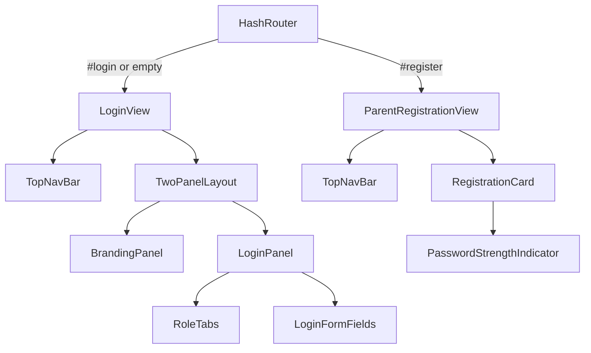

# Design Document: Auth Screens Redesign

## Overview

This design describes how to rebuild the Login and Parent Registration screens of the ChikuMiku LearnVerse web application to match the official design mockups. The existing implementation uses generic indigo colors (`#4f46e5`), a single-column layout, and radio-button role selection. The redesign introduces:

- A **two-panel login layout** with a left branding panel and a right login form panel
- A **top navigation bar** (36px, dark background) replacing the current `Header` component on auth screens
- **Styled role tabs** (pill-shaped toggle) replacing radio-button role selection
- A **password strength indicator** on the registration form
- **Pixel-accurate adherence** to the ChikuMiku LearnVerse design system tokens

The work is scoped to `packages/platform-web/app/src/` and affects components, views, styles, and the design token layer. No backend or API changes are required.

## Architecture

### Current Architecture

```
HomeView
├── Header (logo + Register button)
├── BackgroundWatermark (fixed, centered, 5% opacity)
├── RoleSelector (fieldset + radio buttons)
└── LoginForm (username/password + submit)

RegistrationView
├── Back to Login link
└── RoleChoiceScreen → ParentRegistrationForm / ParentLoginGate → StudentRegistrationForm
```

Views are created programmatically (no framework), mounted via `HashRouter` into a single `#app` element. Styles live in `src/styles/home.css` using CSS custom properties.

### Proposed Architecture

```
LoginView (new)
├── TopNavBar (new component)
├── TwoPanelLayout (new wrapper)
│   ├── BrandingPanel (new component)
│   │   ├── Logo watermark (75% width, 5% opacity)
│   │   ├── Title + Subtitle
│   │   └── StatBadges
│   └── LoginPanel
│       ├── Heading + Subtitle
│       ├── RoleTabs (new — pill-shaped toggle, replaces RoleSelector)
│       ├── LoginFormFields (reuses validation logic)
│       ├── LoginButton (pill-shaped CTA)
│       └── ForgotPasswordLink
└── (responsive: stacks vertically below 768px)

ParentRegistrationView (refactored)
├── TopNavBar (shared instance)
├── RegistrationCard
│   ├── Heading + Subtitle
│   ├── Form Fields (with design tokens)
│   ├── PasswordStrengthIndicator (new component)
│   └── SubmitButton (pill-shaped CTA)
```

### Key Architectural Decisions

1. **New `LoginView` replaces `HomeView` for auth**: The current `HomeView` mixes role-selection, login, and welcome cards. A dedicated `LoginView` cleanly implements the two-panel mockup. `HomeView` remains for authenticated users.

2. **`TopNavBar` is a shared component**: Both Login and Registration screens render the same navigation bar. It is a standalone function (`createTopNavBar()`) that both views import.

3. **`RoleTabs` replaces `RoleSelector`**: The radio-button fieldset is replaced with a pill-shaped tab component. Same `UserRole` type, same `onRoleSelected` callback contract.

4. **Design tokens via CSS custom properties**: A new `src/styles/design-tokens.css` file defines the token layer. `home.css` is refactored to import and use these tokens. This keeps the token definitions DRY and reusable.

5. **Responsive strategy**: CSS flexbox with `flex-direction: row` → `column` at 768px breakpoint. No JavaScript-driven layout changes.



## Components and Interfaces

### 1. Design Tokens (`src/styles/design-tokens.css`)

```css
:root {
  /* Colors */
  --cm-color-primary: #E94F9B;
  --cm-color-secondary: #9B59B6;
  --cm-color-background: #F8F5FF;
  --cm-color-dark: #2C2341;
  --cm-color-border: #E0D8EC;
  --cm-color-error: #E74C3C;
  --cm-color-success: #27AE60;
  --cm-color-white: #FFFFFF;
  --cm-color-text-muted: #6B7280;

  /* Typography */
  --cm-font-title: 26px;
  --cm-font-heading: 16px;
  --cm-font-heading-lg: 18px;
  --cm-font-body: 13px;
  --cm-font-body-sm: 12px;
  --cm-font-button: 13px;
  --cm-font-button-sm: 11px;
  --cm-font-label: 11px;
  --cm-font-label-sm: 10px;

  /* Spacing & Radii */
  --cm-radius-card: 16px;
  --cm-radius-button: 22px;
  --cm-radius-input: 8px;
  --cm-shadow-card: 0 4px 20px rgba(0, 0, 0, 0.08);
  --cm-navbar-height: 36px;

  /* Watermark */
  --cm-watermark-width: 75%;
  --cm-watermark-opacity: 0.05;

  /* Content */
  --cm-content-min-width: 960px;
}
```

### 2. `TopNavBar` Component

```typescript
// src/components/TopNavBar.ts

export interface TopNavBarOptions {
  onNavigate: (route: string) => void;
}

export function createTopNavBar(options: TopNavBarOptions): HTMLElement;
```

**Behavior:**
- Renders a `<nav>` at 36px height, background `#2C2341`
- Logo on the left (max-height equal to bar height, alt="ChikuMiku LearnVerse")
- Navigation links: Dashboard, Subjects, Revision, Progress (11-13px SemiBold white)
- Avatar circle with letter "A" on the right
- All links are focusable, keyboard-navigable (Tab/Shift+Tab)
- Hover/focus produces underline or background-color change
- Click/Enter triggers hash navigation via `onNavigate`

### 3. `BrandingPanel` Component

```typescript
// src/components/BrandingPanel.ts

export function createBrandingPanel(): HTMLElement;
```

**Renders:**
- Title: "ChikuMiku LearnVerse" (26px Bold `#2C2341`)
- Subtitle: "Where Curiosity Comes Alive ✨"
- Three stat badges: "7+ Subjects", "LKG-12 Grades", "AI Powered"
- Logo watermark behind content (75% width, 5% opacity, centered, `pointer-events: none`)

### 4. `RoleTabs` Component

```typescript
// src/components/RoleTabs.ts

export interface RoleTabsOptions {
  defaultRole?: UserRole;
  onRoleSelected: (role: UserRole) => void;
}

export function createRoleTabs(options: RoleTabsOptions): HTMLElement;
```

**Behavior:**
- Two pill-shaped buttons: "Parent" | "Learner"
- Active tab: background `#E94F9B`, text `#FFFFFF`
- Inactive tab: transparent background, text `#2C2341`
- Border-radius: 20-22px
- Defaults to "Parent" active on load
- ARIA: `role="tablist"`, each tab has `role="tab"` + `aria-selected`

### 5. `LoginPanel` Component

```typescript
// src/components/LoginPanel.ts

export interface LoginPanelOptions {
  onSubmit: (username: string, password: string, role: UserRole) => Promise<void>;
  onForgotPassword: () => void;
}

export function createLoginPanel(options: LoginPanelOptions): HTMLElement;
```

**Renders:**
- Heading: "Welcome Back!" (16-18px Bold `#2C2341`)
- Subtitle: "Log in to continue learning" (12-14px Regular `#6B7280`)
- `RoleTabs` (default: Parent)
- Username field (label 10-11px SemiBold, input border-radius 8px, border `#E0D8EC`)
- Password field (same styling)
- Login button (pill-shaped, full-width, `#E94F9B`, 11-13px SemiBold)
- "Forgot Password?" link (10-12px `#E94F9B`, center-aligned)
- Card wrapper: 16px radius, shadow `0 4px 20px rgba(0,0,0,.08)`

Reuses existing `validateLoginUsername` and `validateLoginPassword` logic from `LoginForm.ts`.

### 6. `PasswordStrengthIndicator` Component

```typescript
// src/components/PasswordStrengthIndicator.ts

export interface PasswordCriteria {
  uppercase: boolean;
  lowercase: boolean;
  number: boolean;
  symbol: boolean;
  minLength: boolean;
}

export function evaluatePasswordStrength(password: string): PasswordCriteria;
export function createPasswordStrengthIndicator(): {
  element: HTMLElement;
  update: (password: string) => void;
};
```

**Behavior:**
- Displays five criteria labels: "Uppercase", "Lowercase", "Number", "Symbol", "8+ chars"
- Each criterion shows green checkmark (`#27AE60`) when satisfied, neutral/gray when not
- `update(password)` re-evaluates and updates DOM in real-time
- Visible when password field has focus or contains text; hidden otherwise

### 7. `LoginView` (View)

```typescript
// src/views/LoginView.ts

export function createLoginView(): HTMLElement;
```

Composes: `TopNavBar` + two-panel layout (`BrandingPanel` left, `LoginPanel` right). Background `#F8F5FF`. Responsive stack at 768px.

### 8. Refactored `ParentRegistrationView`

```typescript
// src/views/ParentRegistrationView.ts

export function createParentRegistrationView(): HTMLElement;
```

Composes: `TopNavBar` + registration card with updated field styling, `PasswordStrengthIndicator`, and pill-shaped submit button.

## Data Models

No new data models are introduced. The existing types remain unchanged:

- `UserRole = 'parent' | 'student'` — used by `RoleTabs` (note: "Learner" is the display label for `'student'`)
- `LoginRequest`, `ParentRegistrationRequest` — unchanged API contracts
- `ValidationResult`, `ValidatorFn` — reused from `ValidationEngine.ts`

### Design Token Model (CSS-only)

Tokens are defined as CSS custom properties in `design-tokens.css` and consumed by component styles. No runtime JavaScript token model is needed.

### Component State

| Component | State | Type |
|-----------|-------|------|
| RoleTabs | activeRole | `UserRole` |
| LoginPanel | isLoading, errorMessage | `boolean`, `string \| null` |
| PasswordStrengthIndicator | criteria | `PasswordCriteria` |
| TopNavBar | (stateless) | — |
| BrandingPanel | (stateless) | — |


## Correctness Properties

*A property is a characteristic or behavior that should hold true across all valid executions of a system — essentially, a formal statement about what the system should do. Properties serve as the bridge between human-readable specifications and machine-verifiable correctness guarantees.*

### Property 1: Role Tab Mutual Exclusivity

*For any* sequence of role tab selections (Parent or Learner, in any order and any count), exactly one tab SHALL have the active visual state at any point in time, and the other tab SHALL be in the inactive state.

**Validates: Requirements 3.4, 3.5**

### Property 2: Password Strength Evaluation Correctness

*For any* password string, `evaluatePasswordStrength(password)` SHALL return `true` for a given criterion if and only if the password satisfies that criterion's rule:
- `uppercase` is true iff the string contains at least one uppercase letter (`/[A-Z]/`)
- `lowercase` is true iff the string contains at least one lowercase letter (`/[a-z]/`)
- `number` is true iff the string contains at least one digit (`/[0-9]/`)
- `symbol` is true iff the string contains at least one non-alphanumeric character (`/[^a-zA-Z0-9]/`)
- `minLength` is true iff the string length is ≥ 8

**Validates: Requirements 7.3, 7.4**

### Property 3: Password Strength Indicator Visibility

*For any* non-empty string value in the password input field, the Password Strength Indicator element SHALL be visible (display is not `none`). For an empty string value, the indicator SHALL be hidden.

**Validates: Requirements 7.1**

## Error Handling

### Login Errors

| Scenario | Behavior |
|----------|----------|
| Empty username/password | Inline validation error below respective field (existing `ValidationEngine` logic) |
| Invalid credentials (API 401) | Error message displayed below the form in `#E74C3C` styled container |
| Network failure | Generic "Unable to connect. Please try again." error message |
| Loading state | Button disabled, text changes to "Signing in..." |

### Registration Errors

| Scenario | Behavior |
|----------|----------|
| Field validation failure | Inline error in `#E74C3C` below the specific field, short-circuits on first error per field |
| Username already exists (API 409) | Inline error below username field: "Username already taken" |
| Network failure | Generic error message above the submit button |
| Loading state | Button disabled, text changes to "Registering..." |

### Watermark Image Failure

If the logo watermark image fails to load (fires `error` event), the watermark container is hidden via `display: none`. The login form remains fully functional — this is a graceful degradation.

### Navigation Link Errors

Navigation links use hash-based routing. If an unrecognized hash is encountered, the `HashRouter` falls back to the default view. No error UI is shown for navigation failures.

## Testing Strategy

### Unit Tests (Example-Based)

Focus on component rendering and specific behaviors:

- **TopNavBar**: Verify correct DOM structure (logo img alt text, four navigation links in order, avatar element, correct CSS classes)
- **BrandingPanel**: Verify title text, subtitle text, three stat badges present
- **LoginPanel**: Verify heading, subtitle, RoleTabs default state, input labels, button text, forgot-password link
- **RoleTabs**: Verify default "Parent" active, clicking "Learner" switches active state
- **PasswordStrengthIndicator**: Verify five criteria labels render, visibility toggle on input events
- **LoginView**: Verify two-panel structure (branding + login siblings), background class
- **ParentRegistrationView**: Verify TopNavBar present, card structure, form fields with correct placeholders
- **Watermark**: Verify pointer-events:none, opacity, error-hides behavior

### Property-Based Tests

Using `fast-check` (already available in the project's test infrastructure via Vitest):

| Property | Generator | Assertions |
|----------|-----------|------------|
| Role Tab Mutual Exclusivity | `fc.array(fc.constantFrom('parent', 'student'), { minLength: 1, maxLength: 50 })` | After applying each selection in sequence, exactly one tab has the active CSS class |
| Password Strength Correctness | `fc.string({ minLength: 0, maxLength: 30 })` | Each criterion in `evaluatePasswordStrength(s)` matches the corresponding regex test on `s` |
| Password Indicator Visibility | `fc.string({ minLength: 0, maxLength: 30 })` | Non-empty → visible, empty → hidden |

**Configuration:**
- Minimum 100 iterations per property test
- Tag format: `Feature: auth-screens-redesign, Property {N}: {title}`

### Visual/Snapshot Tests

For styling-heavy requirements (Req 9.1–9.10, Req 1.6, Req 2.6, etc.):
- CSS token values verified via reading the computed styles or checking the design-tokens.css file contents
- Component snapshot tests to catch unintentional DOM structure changes

### Integration Tests

- **Full login flow**: Mount `LoginView`, select role, enter credentials, submit — verify hash navigation occurs on success
- **Registration flow**: Mount `ParentRegistrationView`, fill form, trigger validation errors, submit successfully
- **Responsive layout**: Verify the two-panel layout stacks at viewport <768px (requires a DOM environment with viewport simulation)
