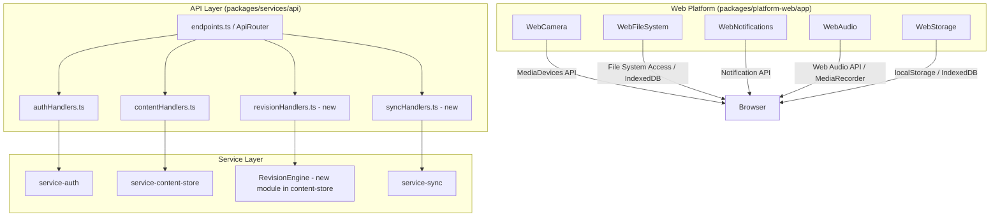

# Design Document: Backend Stub Implementations

## Overview

This design covers replacing all stubbed/placeholder API handlers and web platform adapters in the ChikuMiku LearnVerse application with working implementations. The work spans five domains:

1. **Authentication & Accounts** — Wire `handleRegisterParent`, `handleRegisterStudent`, `handleForgotPassword` to the existing `service-auth` logic; add reset-password, token refresh, and JWT signature verification.
2. **Content Management** — Implement chapter CRUD handlers against `ContentStore`, legacy subject-chapters route, and progress read/write.
3. **Revision & Assessment** — Implement revision session lifecycle (start, submit answer, get summary) backed by a `RevisionEngine`.
4. **Sync & Offline** — Implement push/pull handlers using the `SyncEngine` and its server adapter interface.
5. **Web Platform Capabilities** — Replace stub classes in `packages/platform-web/app/src/index.ts` with real browser API implementations (camera, filesystem, audio, notifications, device storage).

The design preserves the existing layered architecture — API handlers delegate to service packages; platform adapters implement contracts. No new packages are introduced; all changes target existing files or add siblings within existing packages.

## Architecture



### Key Design Decisions

1. **JWT Implementation**: Use HMAC-SHA256 via Node.js `crypto.createHmac`. The signing secret is configurable via environment variable (`JWT_SECRET`), defaulting to a random 256-bit key generated at startup for local development.

2. **Reset Tokens**: Stored in an in-memory Map with 1-hour TTL. Production would use DynamoDB TTL. Tokens are 32-byte random hex strings generated with `crypto.randomBytes`.

3. **Notification Service**: Abstracted behind an interface (`NotificationChannel`). For local dev, a console-logging implementation is used. Production would inject SES/SNS adapters.

4. **RevisionEngine**: Housed in `service-content-store` as a new module (`revisionEngine.ts`). Uses chapter content to generate recall/understanding/application questions via the Subject Module's `questionGenerationStrategy`.

5. **Web Platform Adapters**: Each stub class is replaced in-place within `index.ts`. No separate files are created since the contracts are simple and each adapter is ~50-100 lines. If complexity grows, they can be extracted later.

6. **Login Username Lookup**: The `handleLogin` handler will first attempt `findLearnerByContact(username)`. If no learner is found, it will look up the username in both `parentAccountStore` and `studentAccountStore` to support parent/student accounts that were registered through the new registration flow (which stores accounts separately from the legacy learner store).

## Components and Interfaces

### Authentication Components

#### JWT Module (`packages/services/auth/src/jwt.ts` — new)

```typescript
interface JwtConfig {
  secret: string;
  accessTokenExpiry: number;   // ms, default 30 days
  refreshTokenExpiry: number;  // ms, default 60 days
  issuer: string;
  audience: string;
}

interface TokenPair {
  accessToken: string;
  refreshToken: string;
  expiresAt: number; // Unix ms
}

interface DecodedToken {
  sub: string;
  iat: number;
  exp: number;
  iss: string;
  aud: string;
  roles: string[];
  type: 'access' | 'refresh';
}

function signToken(payload: Omit<DecodedToken, 'iat'>, config: JwtConfig): string;
function verifyToken(token: string, config: JwtConfig): DecodedToken | null;
function createTokenPair(userId: string, roles: string[], config: JwtConfig): TokenPair;
```

#### Reset Token Store (`packages/services/auth/src/resetToken.ts` — new)

```typescript
interface ResetTokenEntry {
  token: string;
  username: string;
  accountType: 'parent' | 'student';
  expiresAt: Date;
  used: boolean;
}

function generateResetToken(username: string, accountType: 'parent' | 'student'): string;
function validateResetToken(token: string): ResetTokenEntry | null;
function consumeResetToken(token: string): boolean;
function clearResetTokenStore(): void;
```

#### Notification Channel Interface (`packages/services/auth/src/notifications.ts` — new)

```typescript
interface NotificationChannel {
  sendEmail(to: string, subject: string, body: string): Promise<boolean>;
  sendSms(to: string, message: string): Promise<boolean>;
}

// Console-logging implementation for local dev
class ConsoleNotificationChannel implements NotificationChannel { ... }
```

### Content Handler Updates

#### Chapter CRUD Handlers (`packages/services/api/src/contentHandlers.ts`)

- `handleCreateChapter` at `POST /api/v1/chapters` — validates body (subjectId, name, textbookId), delegates to `ContentStore.saveChapter()`
- `handleGetChapter` at `GET /api/v1/chapters/:chapterId` — extracts path param, calls `ContentStore.getChapter()`
- `handleListSubjectChapters` at `GET /api/v1/subjects/:subjectId/chapters` — extracts pagination params, calls `ContentStore.listChapters()`

#### Progress Handlers (`packages/services/api/src/progressHandlers.ts` — new)

```typescript
function handleGetProgress(req: ApiRequest): Promise<ApiResponse>;
function handleUpdateProgress(req: ApiRequest): Promise<ApiResponse>;
```

### Revision Components

#### RevisionEngine (`packages/services/content-store/src/revisionEngine.ts` — new)

```typescript
interface RevisionSession {
  id: string;
  learnerId: string;
  chapterId: string;
  questions: RevisionQuestion[];
  answers: RevisionAnswer[];
  status: 'active' | 'completed';
  startedAt: Date;
  completedAt: Date | null;
}

interface RevisionQuestion {
  id: string;
  text: string;
  category: 'recall' | 'understanding' | 'application';
  expectedAnswer: string;
}

interface RevisionAnswer {
  questionId: string;
  answerText: string;
  score: number;
  feedback: string;
  submittedAt: Date;
}

interface RevisionSummary {
  sessionId: string;
  totalQuestions: number;
  answeredQuestions: number;
  correctAnswers: number;
  percentageScore: number;
  timeTakenMs: number;
  weakAreas: string[];
  perQuestionResults: { questionId: string; score: number; category: string }[];
}

function startRevisionSession(learnerId: string, chapterId: string): RevisionSession | null;
function submitAnswer(sessionId: string, questionId: string, answer: string): RevisionAnswer | null;
function getSessionSummary(sessionId: string): RevisionSummary | null;
```

### Sync Handlers

#### Sync API Handlers (`packages/services/api/src/syncHandlers.ts` — new)

```typescript
function handleSyncPush(req: ApiRequest): Promise<ApiResponse>;
function handleSyncPull(req: ApiRequest): Promise<ApiResponse>;
```

The push handler deserializes queued actions from the request body and delegates to `syncQueuedActions()` with an in-memory `SyncServerAdapter`. The pull handler reads a `since` query parameter and returns changes from the in-memory change log.

### Web Platform Adapters

Each stub class is replaced with a real implementation. Key patterns:

| Adapter | Primary API | Fallback |
|---------|------------|----------|
| WebCamera | `navigator.mediaDevices.getUserMedia` | None (sets `CAMERA_UNAVAILABLE`) |
| WebFileSystem | File System Access API (`showOpenFilePicker`) | `<input type="file">` / IndexedDB |
| WebNotifications | `Notification` API | None (sets `NOT_SUPPORTED`) |
| WebAudio | `MediaRecorder` + `AudioContext` | None (sets `MICROPHONE_UNAVAILABLE`) |
| WebStorage | `localStorage` | IndexedDB |

All adapters follow the error-code pattern defined in `@learnverse/platform-contracts` — they set `lastError` with the appropriate code and return a graceful failure value rather than throwing.

## Data Models

### New Data: Reset Token Store

```typescript
// In-memory Map<string, ResetTokenEntry>
// Key: token string (32-byte hex)
// TTL: 1 hour from creation
{
  token: string;          // crypto.randomBytes(32).toString('hex')
  username: string;       // parent or student username
  accountType: 'parent' | 'student';
  expiresAt: Date;        // creation + 1 hour
  used: boolean;          // true after successful reset
}
```

### New Data: Refresh Token Registry

```typescript
// In-memory Map<string, RefreshTokenEntry>
// Key: refresh token string (JWT)
{
  token: string;
  userId: string;
  issuedAt: Date;
  expiresAt: Date;
  revoked: boolean;
}
```

### New Data: Revision Session Store

```typescript
// In-memory Map<string, RevisionSession>
// Key: session ID (UUID)
{
  id: string;
  learnerId: string;
  chapterId: string;
  questions: RevisionQuestion[];    // 5-20 questions
  answers: RevisionAnswer[];
  status: 'active' | 'completed';
  startedAt: Date;
  completedAt: Date | null;
}
```

### New Data: Sync Change Log

```typescript
// In-memory array of Change records for pull endpoint
// Filtered by learnerId and timestamp
{
  id: string;
  resourceId: string;
  resourceType: string;
  changeType: 'create' | 'update' | 'delete';
  data: unknown;
  timestamp: Date;
  learnerId: string;
}
```

### Existing Data (unchanged)

- `parentAccountStore` (Map<id, ParentAccount>) in `registration.ts`
- `studentAccountStore` (Map<id, StudentAccount>) in `registration.ts`
- `learnerStore` (Map<id, Learner>) in `session.ts`
- `sessionStore` (Map<token, Session>) in `session.ts`
- `ContentStore` class with chapters, progressRecords Maps
- Sync offline queue (Map<learnerId, QueuedAction[]>) in `offlineQueue.ts`


## Correctness Properties

*A property is a characteristic or behavior that should hold true across all valid executions of a system — essentially, a formal statement about what the system should do. Properties serve as the bridge between human-readable specifications and machine-verifiable correctness guarantees.*

### Property 1: Parent registration round-trip

*For any* valid parent registration input (name ≤100 chars, username 5-15 chars alphanumeric+_+-, 10-digit phone, valid email, password 8-20 with uppercase+lowercase+digit+special), calling `handleRegisterParent` SHALL return HTTP 201 with the registered username, and the account SHALL be retrievable from the parent account store by username.

**Validates: Requirements 1.1, 1.4**

### Property 2: Parent registration rejects invalid input

*For any* parent registration payload where at least one field violates its validation rule, calling `handleRegisterParent` SHALL return HTTP 400 with an errors array containing a field-specific message for every invalid field.

**Validates: Requirements 1.2**

### Property 3: Parent registration detects duplicates

*For any* successfully registered parent account, attempting to register a new account with the same username, email, or phone number SHALL return HTTP 409 with a conflict error.

**Validates: Requirements 1.3**

### Property 4: Student registration persists, links, and auto-authenticates

*For any* valid student registration input with an existing parent username, calling `handleRegisterStudent` SHALL return HTTP 201 with non-empty session tokens (accessToken, refreshToken, expiresAt in the future), the student account SHALL be linked to the parent's `linkedStudentIds`, and `findLearnerByContact(studentUsername)` SHALL return a valid learner record.

**Validates: Requirements 2.1, 2.2, 2.4**

### Property 5: Student registration rejects non-existent parent

*For any* student registration payload where the `parentUsername` does not exist in the parent account store, calling `handleRegisterStudent` SHALL return HTTP 400 with an error on the `parentUsername` field.

**Validates: Requirements 2.3**

### Property 6: Student registration detects duplicate username

*For any* already-registered student username, attempting to register another student with that same username SHALL return HTTP 409.

**Validates: Requirements 2.5**

### Property 7: Forgot-password always returns 200

*For any* string provided as the username in a forgot-password request (whether it matches a registered account or not, and whether the notification service succeeds or fails), the handler SHALL return HTTP 200.

**Validates: Requirements 3.4, 3.5**

### Property 8: Reset token generation for valid username

*For any* registered parent or student username, calling the forgot-password handler SHALL result in a reset token stored with a 1-hour expiry and the correct username association.

**Validates: Requirements 3.1**

### Property 9: Password reset updates hash

*For any* valid, non-expired reset token and a new password satisfying the password rules, calling the reset-password handler SHALL update the associated account's password hash such that login succeeds with the new password and fails with the old password.

**Validates: Requirements 4.1**

### Property 10: Invalid reset tokens are rejected

*For any* string that is not a currently-valid reset token (random hex strings, UUID-shaped strings, empty strings), calling the reset-password handler SHALL return HTTP 400 with an invalid-token error.

**Validates: Requirements 4.3**

### Property 11: Reset token single-use enforcement

*For any* reset token that has been successfully used, attempting to use it again SHALL return HTTP 400 with an invalid-token error — `consumeResetToken` is idempotent in rejecting reuse.

**Validates: Requirements 4.4**

### Property 12: Reset password validates new password

*For any* new password that violates the registration password rules (too short, too long, missing uppercase, missing lowercase, missing digit, missing special char), calling the reset-password handler with a valid token SHALL return HTTP 400 with a password validation error.

**Validates: Requirements 4.5**

### Property 13: Token refresh issues new pair

*For any* valid, non-revoked refresh token, calling the refresh handler SHALL return HTTP 200 with new accessToken and refreshToken that are both non-empty and different from the old tokens.

**Validates: Requirements 5.1**

### Property 14: Invalid refresh tokens return 401

*For any* string that is not a valid, non-revoked refresh token (random strings, expired tokens, previously-used tokens), calling the refresh handler SHALL return HTTP 401.

**Validates: Requirements 5.2**

### Property 15: Refresh token single-use enforcement

*For any* refresh token that has been successfully exchanged for a new pair, attempting to use the old refresh token again SHALL return HTTP 401.

**Validates: Requirements 5.3**

### Property 16: Access token minimum 30-day expiry

*For any* newly issued access token (via login, registration, or refresh), the token's `exp` claim minus `iat` claim SHALL be at least 30 days (2,592,000 seconds).

**Validates: Requirements 5.4**

### Property 17: Forged JWT tokens are rejected

*For any* JWT token signed with a different secret or with its payload bytes modified after signing, presenting it to any protected route SHALL result in HTTP 401 before the route handler is invoked.

**Validates: Requirements 6.1, 6.2, 6.3**

### Property 18: Expired JWT tokens are rejected

*For any* JWT token whose `exp` claim is in the past, presenting it to any protected route SHALL result in HTTP 401 with a "Token expired" error.

**Validates: Requirements 7.1, 7.2**

### Property 19: Chapter creation and retrieval round-trip

*For any* valid chapter creation payload (name 1-200 chars, valid textbookId and subjectId), creating the chapter via POST and then retrieving it via GET by the returned ID SHALL yield the same name, textbookId, and subjectId.

**Validates: Requirements 8.1, 8.3, 9.1, 9.3**

### Property 20: Chapter creation rejects invalid input

*For any* chapter creation payload missing one or more required fields (name, textbookId, subjectId), the handler SHALL return HTTP 400 with field-specific validation errors.

**Validates: Requirements 8.2**

### Property 21: Non-existent chapter returns 404

*For any* chapter ID that has not been created, calling GET `/api/v1/chapters/:chapterId` SHALL return HTTP 404.

**Validates: Requirements 9.2**

### Property 22: Subject chapters are filtered correctly with pagination

*For any* set of chapters distributed across multiple subjects, querying chapters by subjectId SHALL return only chapters belonging to that subject, and the returned page slice SHALL respect the page and pageSize parameters.

**Validates: Requirements 10.1, 10.3**

### Property 23: Progress update round-trip

*For any* valid progress update payload (chapterId, activityType, score 0-100), posting it and then retrieving progress SHALL include the updated activity score for that chapter and activity type.

**Validates: Requirements 12.1, 12.3**

### Property 24: Completion percentage recalculation

*For any* chapter with N applicable activity types and M recorded activities, the completion percentage SHALL equal `round(M / N * 100)`.

**Validates: Requirements 12.4**

### Property 25: Progress rejects invalid input

*For any* progress update payload missing chapterId, activityType, or score, the handler SHALL return HTTP 400 with validation errors.

**Validates: Requirements 12.2**

### Property 26: Weak activity identification

*For any* progress record, activities with scores below 60 SHALL appear in the `weakActivities` array, and activities with scores ≥ 60 SHALL NOT.

**Validates: Requirements 11.1, 11.2**

### Property 27: Revision session question count bounds

*For any* chapter with sufficient content, starting a revision session SHALL produce between 5 and 20 questions inclusive.

**Validates: Requirements 13.1, 13.4**

### Property 28: Revision question category distribution

*For any* revision session, the generated questions SHALL include at least one question from each of the three categories: recall, understanding, and application.

**Validates: Requirements 13.2**

### Property 29: Answer submission produces score

*For any* active revision session and any answer text, submitting an answer SHALL return a score (0-100), a correctness boolean, and non-empty feedback text.

**Validates: Requirements 14.1, 14.3**

### Property 30: Answer to non-existent session returns 404

*For any* session ID that does not exist in the revision session store, submitting an answer SHALL return HTTP 404.

**Validates: Requirements 14.2**

### Property 31: Completed session rejects new answers

*For any* revision session in `completed` status, attempting to submit a new answer SHALL return HTTP 400 with a "Session already completed" error.

**Validates: Requirements 14.4**

### Property 32: Session summary computation

*For any* revision session with at least one submitted answer, the summary's `percentageScore` SHALL equal `round(correctAnswers / totalQuestions * 100)`, and `timeTakenMs` SHALL be non-negative.

**Validates: Requirements 15.1, 15.3**

### Property 33: Sync push categorizes all items exclusively

*For any* set of queued actions pushed to the sync endpoint, every action ID SHALL appear in exactly one of the three result arrays (synced, conflicts, or failed).

**Validates: Requirements 16.1, 16.3**

### Property 34: Sync conflict resolution — most-recent-wins

*For any* two changes to the same resource with different timestamps, the sync engine SHALL resolve the conflict by retaining the change with the later timestamp, and the overwritten data SHALL be preserved in the conflict record.

**Validates: Requirements 16.2, 16.4**

### Property 35: Sync pull filters by timestamp

*For any* set of recorded changes and a `since` timestamp, pulling changes SHALL return only changes whose timestamp is strictly after `since`.

**Validates: Requirements 17.1**

### Property 36: Sync pull change objects have required fields

*For any* change returned by the sync pull endpoint, it SHALL contain non-null values for changeType, resourceType, resourceId, and timestamp.

**Validates: Requirements 17.3**

### Property 37: Device storage CRUD round-trip

*For any* key-value pair, after calling `setItem(key, value)`, calling `getItem(key)` SHALL return `value`. After calling `removeItem(key)`, calling `getItem(key)` SHALL return `null`.

**Validates: Requirements 22.1, 22.2, 22.3**

### Property 38: Device storage prefix isolation

*For any* mix of LearnVerse-prefixed and non-prefixed keys stored in localStorage, calling `clear()` SHALL remove all and only LearnVerse-prefixed keys, and calling `getAllKeys()` SHALL return all and only LearnVerse-prefixed keys.

**Validates: Requirements 22.4, 22.5**

## Error Handling

### API Error Response Format

All error responses follow the existing `ApiErrorBody` interface:

```typescript
{
  code: string;           // Machine-readable error code
  message: string;        // Human-readable description (child-friendly language)
  field?: string;         // For single-field errors
  errors?: FieldError[];  // For multi-field validation errors
  suggestedAction?: string;
  retryable: boolean;
}
```

### Error Classification by Domain

| Domain | Error Code | HTTP Status | Retryable |
|--------|-----------|-------------|-----------|
| Auth - validation | `VALIDATION_ERROR` | 400 | No |
| Auth - duplicate | `CONFLICT` | 409 | No |
| Auth - lockout | `ACCOUNT_LOCKED` | 429 | Yes |
| Auth - invalid creds | `INVALID_CREDENTIALS` | 401 | No |
| Auth - invalid token | `INVALID_TOKEN` | 401 | No |
| Auth - expired token | `TOKEN_EXPIRED` | 401 | No |
| Auth - expired reset | `RESET_TOKEN_EXPIRED` | 400 | No |
| Auth - invalid reset | `INVALID_RESET_TOKEN` | 400 | No |
| Content - not found | `NOT_FOUND` | 404 | No |
| Content - validation | `VALIDATION_ERROR` | 400 | No |
| Revision - no content | `INSUFFICIENT_CONTENT` | 400 | No |
| Revision - completed | `SESSION_COMPLETED` | 400 | No |
| Sync - partial failure | (per-item in `failed` array) | 200 | Per-item |
| Platform - permission | Sets `lastError` code | N/A | No |
| Platform - unavailable | Sets `lastError` code | N/A | No |

### Graceful Degradation Strategy

1. **Notification failures**: Logged but never surfaced to the user (forgot-password always returns 200).
2. **Platform API unavailability**: `isAvailable()` returns false; methods set `lastError` with the appropriate code.
3. **Storage quota exceeded**: WebStorage falls back to IndexedDB; if both fail, error is surfaced via `lastError`.
4. **Sync failures**: Individual failed items are collected in the `failed` array; successfully synced items are committed. Processing continues unless a non-retryable failure occurs.

## Testing Strategy

### Testing Approach

This feature uses a **dual testing approach**:

- **Property-based tests** (fast-check, 100+ iterations) for universal correctness properties — these cover the 38 properties defined above.
- **Unit tests** for specific examples, edge cases, integration points, and browser API mocking.

### Property-Based Testing Configuration

- **Library**: fast-check 3.22 (already installed)
- **Minimum iterations**: 100 per property
- **Test file naming**: `*.property.test.ts`
- **Tag format**: Comments referencing design properties, e.g.:
  ```typescript
  // Feature: backend-stub-implementations, Property 1: Parent registration round-trip
  ```

### Test Organization

| Domain | Test Location | Type |
|--------|--------------|------|
| Auth handlers | `packages/services/api/src/__tests__/authHandlers.property.test.ts` | Property |
| JWT module | `packages/services/auth/src/__tests__/jwt.property.test.ts` | Property |
| Reset tokens | `packages/services/auth/src/__tests__/resetToken.property.test.ts` | Property |
| Content handlers | `packages/services/api/src/__tests__/contentHandlers.property.test.ts` | Property |
| Progress handlers | `packages/services/api/src/__tests__/progressHandlers.property.test.ts` | Property |
| Revision engine | `packages/services/content-store/src/__tests__/revisionEngine.property.test.ts` | Property |
| Sync handlers | `packages/services/api/src/__tests__/syncHandlers.property.test.ts` | Property |
| Web storage | `packages/platform-web/app/src/__tests__/webStorage.property.test.ts` | Property |
| Web camera | `packages/platform-web/app/src/__tests__/webCamera.test.ts` | Unit (mocked) |
| Web audio | `packages/platform-web/app/src/__tests__/webAudio.test.ts` | Unit (mocked) |
| Web filesystem | `packages/platform-web/app/src/__tests__/webFileSystem.test.ts` | Unit (mocked) |
| Web notifications | `packages/platform-web/app/src/__tests__/webNotifications.test.ts` | Unit (mocked) |

### Why PBT is Appropriate Here

The backend handlers and service modules are primarily **pure functions with clear input/output behavior**:
- Registration/login take structured input and return structured results
- JWT sign/verify is a classic round-trip
- Content CRUD is a round-trip (create → retrieve)
- Sync conflict resolution is a deterministic algorithm
- Device storage has clear round-trip semantics

The **web platform adapters** (camera, audio, filesystem, notifications) are NOT suitable for PBT because they are integration wrappers around browser APIs — they're tested with mocked unit tests instead.

### Edge Cases Covered by Generators

The following edge cases should be included in fast-check generators:
- Usernames at min/max length boundaries (5 and 15 chars)
- Passwords with all rule-satisfying combos at min/max length
- Unicode characters in display names
- Phone numbers with various formatting
- Empty/whitespace-only strings
- Very long strings exceeding max lengths
- Score values at boundaries (0, 59, 60, 100)
- Timestamps at epoch, far-future, and near-expiry

