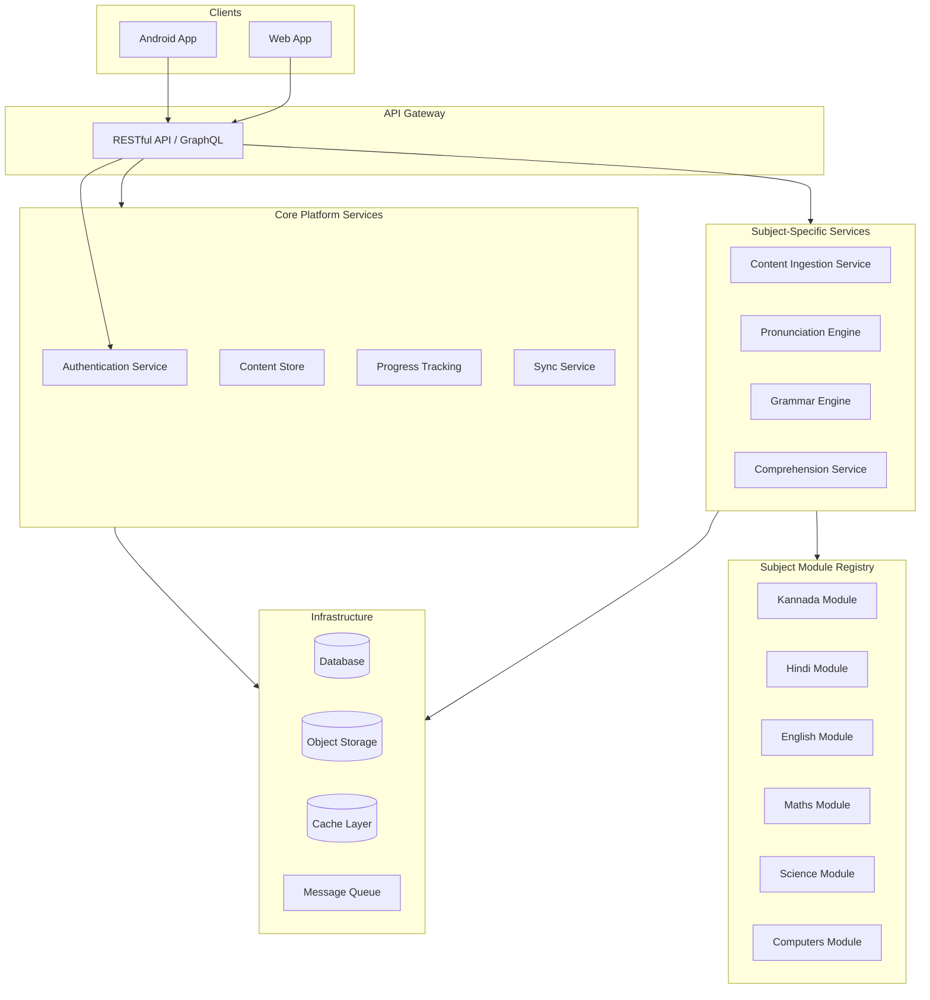

# Design Document: ChikuMiku LearnVerse

## Overview

ChikuMiku LearnVerse is a multi-subject learning platform for children, delivered as a SaaS application on Android and web. The system enables learners to ingest textbook content via photos, practice pronunciation and grammar for language subjects, answer chapter-based questions, and revise for tests. The architecture is designed around pluggable Subject Modules that define subject-specific behavior (extraction rules, question generation, rendering) while core platform services (auth, storage, progress tracking) remain subject-agnostic.

The platform uses a client-server architecture with:
- A reactive frontend (Android + Web) using shared business logic
- A cloud-hosted backend with serverless/auto-scaling compute
- A pluggable Subject Module system for extensibility
- Offline-first capabilities with background sync

## Architecture



### Key Architectural Decisions

1. **Subject Module Plugin Architecture**: Subject-specific logic (extraction rules, question generation, grammar rules, pronunciation assets) is encapsulated in deployable modules. Core services invoke modules via a registry pattern, enabling new subjects without redeploying core services.

2. **Offline-First with Optimistic UI**: Clients cache content locally and apply optimistic updates. A sync queue processes pending actions when connectivity is restored, with conflict resolution favoring the most recent save.

3. **Serverless Backend**: Auto-scaling compute (e.g., AWS Lambda or Cloud Functions) ensures cost efficiency at low usage and scalability at peak demand.

4. **Platform-Agnostic API**: RESTful/GraphQL APIs with JSON payloads ensure any client (Android, Web, future iOS) can consume services without platform-specific SDKs.

5. **Tiered Storage**: Hot storage for recently accessed content (< 30 days), cold storage for older content, reducing costs while maintaining accessibility.

## Components and Interfaces

### 1. Authentication Service

**Responsibility**: User registration, login, session management, parental account linking.

**Interface**:
```typescript
interface AuthenticationService {
  register(input: RegistrationInput): Promise<RegistrationResult>;
  login(credentials: LoginCredentials): Promise<Session>;
  refreshSession(token: RefreshToken): Promise<Session>;
  lockAccount(learnerId: string, duration: number): Promise<void>;
  linkParentAccount(parentId: string, learnerId: string): Promise<void>;
  resetPassword(parentId: string, learnerId: string, newPassword: string): Promise<void>;
}

interface RegistrationInput {
  contactType: 'email' | 'phone';
  contactValue: string;
  password: string; // 8-128 chars, at least 1 letter + 1 digit
  grade: Grade; // 1-12
  displayName: string;
}

interface Session {
  token: string;
  refreshToken: string;
  expiresAt: Date; // minimum 30 days from creation
  learnerId: string;
}
```

### 2. Content Ingestion Service

**Responsibility**: Image capture/upload, OCR text extraction via Subject Module pipelines, chapter assembly.

**Interface**:
```typescript
interface ContentIngestionService {
  uploadImage(image: ImageInput, subjectId: string): Promise<ExtractionResult>;
  confirmExtraction(extractionId: string, editedText: string): Promise<Chapter>;
  addPageToChapter(chapterId: string, image: ImageInput): Promise<ExtractionResult>;
  reorderPages(chapterId: string, pageOrder: string[]): Promise<Chapter>;
  extractQuestions(image: ImageInput, chapterId: string): Promise<QuestionExtractionResult>;
}

interface ImageInput {
  data: Blob;
  format: 'jpeg' | 'png' | 'heic';
  sizeBytes: number; // max 10MB
}

interface ExtractionResult {
  extractionId: string;
  extractedText: string;
  confidence: number;
  partialRegions?: Region[]; // regions that couldn't be processed
  processingTimeMs: number;
}
```

### 3. Pronunciation Engine

**Responsibility**: Audio playback of correct pronunciations, speech recognition for learner attempts, syllable breakdown.

**Interface**:
```typescript
interface PronunciationEngine {
  playPronunciation(characterOrWord: string, subjectId: string): Promise<AudioPlayback>;
  recordAttempt(audio: AudioRecording, target: string, subjectId: string): Promise<PronunciationScore>;
  getSyllableBreakdown(word: string, subjectId: string): Promise<SyllableBreakdown>;
  getAlphabetSet(subjectId: string): Promise<AlphabetEntry[]>;
}

interface PronunciationScore {
  overallScore: number; // 0-100
  syllableScores: SyllableScore[];
  feedback: string;
}

interface AlphabetEntry {
  character: string;
  transliteration: string; // English transliteration
  audioAvailable: boolean;
}
```

### 4. Grammar Engine

**Responsibility**: Sentence analysis, grammar exercise generation, scoring.

**Interface**:
```typescript
interface GrammarEngine {
  analyzeSentence(sentence: string, subjectId: string, grade: Grade): Promise<GrammarAnalysis>;
  generateExercises(subjectId: string, learnerId: string, count?: number): Promise<GrammarExercise[]>;
  scoreExercise(exerciseId: string, answers: Answer[]): Promise<ExerciseScore>;
}

interface GrammarAnalysis {
  isCorrect: boolean;
  errors: GrammarError[];
}

interface GrammarError {
  position: TextRange;
  rule: string;
  correction: string;
  explanation: string; // grade-appropriate vocabulary
}

interface ExerciseScore {
  percentage: number; // 0-100
  weakAreas: string[]; // rules scoring below 60%
}
```

### 5. Comprehension Service

**Responsibility**: Question generation from chapter content, answer evaluation, revision mode, timed tests.

**Interface**:
```typescript
interface ComprehensionService {
  generateModelAnswer(questionId: string, chapterId: string): Promise<ModelAnswer>;
  evaluateAnswer(questionId: string, learnerAnswer: string): Promise<AnswerEvaluation>;
  provideHint(questionId: string, stepNumber: number): Promise<Hint>;
  generateRevisionQuestions(chapterIds: string[], subjectId: string): Promise<RevisionSession>;
  startTimedTest(chapterIds: string[], timeLimitMinutes: number): Promise<TimedTestSession>;
  endSession(sessionId: string): Promise<PerformanceSummary>;
  savePartialProgress(sessionId: string, answers: PartialAnswer[]): Promise<void>;
}

interface AnswerEvaluation {
  score: number; // percentage
  missingPoints: string[];
  factualErrors: string[];
}

interface PerformanceSummary {
  overallScore: number;
  perChapterScores: ChapterScore[];
  strengths: string[]; // topics >= 70%
  weakAreas: string[]; // topics < 70%
  questionBreakdown: QuestionResult[];
}
```

### 6. Content Store

**Responsibility**: Persistent storage of chapters, progress tracking, revision material organization.

**Interface**:
```typescript
interface ContentStore {
  saveChapter(chapter: Chapter): Promise<void>;
  getChapter(chapterId: string): Promise<Chapter>;
  listChapters(learnerId: string, subjectId: string): Promise<ChapterSummary[]>;
  trackProgress(learnerId: string, chapterId: string, activity: ActivityProgress): Promise<void>;
  getProgress(learnerId: string, subjectId?: string): Promise<ProgressSummary>;
  archiveGradeContent(learnerId: string, grade: Grade): Promise<void>;
  deleteGradeContent(learnerId: string, grade: Grade): Promise<void>;
  recordRevisionSession(session: RevisionSessionResult): Promise<void>;
}
```

### 7. Subject Module Registry

**Responsibility**: Registration and lookup of subject-specific modules.

**Interface**:
```typescript
interface SubjectModuleRegistry {
  registerModule(module: SubjectModule): Promise<void>;
  getModule(subjectId: string): SubjectModule;
  listModules(): SubjectModule[];
}

interface SubjectModule {
  subjectId: string;
  name: string;
  contentTypes: ContentType[];
  extractionPipeline: ExtractionPipeline;
  questionGenerationStrategy: QuestionGenerationStrategy;
  grammarRules?: GrammarRuleSet; // only for language subjects
  pronunciationAssets?: PronunciationAssetConfig; // only for language subjects
  renderingConfig: RenderingConfig;
}
```

### 8. Sync Service

**Responsibility**: Cross-platform data synchronization, conflict resolution, offline queue management.

**Interface**:
```typescript
interface SyncService {
  pushChanges(changes: Change[]): Promise<SyncResult>;
  pullChanges(since: Timestamp): Promise<Change[]>;
  resolveConflict(conflictId: string, resolution: 'local' | 'remote'): Promise<void>;
  getQueuedActions(learnerId: string): Promise<QueuedAction[]>;
}

interface SyncResult {
  synced: string[];
  conflicts: Conflict[];
  failed: FailedSync[];
}
```

## Data Models

### Core Entities

```typescript
type Grade = 1 | 2 | 3 | 4 | 5 | 6 | 7 | 8 | 9 | 10 | 11 | 12;

interface Learner {
  id: string;
  displayName: string;
  contactType: 'email' | 'phone';
  contactValue: string;
  passwordHash: string;
  grade: Grade;
  enrolledSubjects: string[]; // max 10
  parentAccountId?: string;
  createdAt: Date;
  updatedAt: Date;
}

interface Chapter {
  id: string;
  learnerId: string;
  subjectId: string;
  textbookName: string;
  chapterNumber: number;
  pages: Page[]; // max 50
  extractedText: string;
  createdAt: Date;
  updatedAt: Date;
  lastAccessedAt: Date;
}

interface Page {
  id: string;
  orderIndex: number;
  originalImageUrl: string;
  compressedImageUrl: string;
  extractedText: string;
  confidence: number;
  partialRegions?: Region[];
}

interface Question {
  id: string;
  chapterId: string;
  subjectId: string;
  text: string;
  type: 'fill-in-the-blank' | 'short-answer' | 'match-the-following' | 'descriptive';
  modelAnswer?: string;
  difficulty: 'recall' | 'understanding' | 'application';
}

interface ProgressRecord {
  learnerId: string;
  chapterId: string;
  subjectId: string;
  completionPercentage: number;
  activityScores: ActivityScore[];
  lastAccessedAt: Date;
}

interface ActivityScore {
  activityType: 'comprehension' | 'pronunciation' | 'grammar' | 'revision';
  score: number; // 0-100
  completedAt: Date;
}

interface RevisionSession {
  id: string;
  learnerId: string;
  subjectId: string;
  chapterIds: string[];
  questions: RevisionQuestion[];
  timeLimitMinutes?: number; // 5-120 if timed
  startedAt: Date;
  completedAt?: Date;
  isPartial: boolean;
  perChapterScores: Record<string, number>;
}

interface GradeArchive {
  learnerId: string;
  grade: Grade;
  archivedAt: Date;
  totalChaptersCompleted: number;
  overallScoresPerSubject: Record<string, number>;
  revisionSessionCount: number;
  isReadOnly: true;
}
```

### Storage Tiers

```typescript
interface StorageTierConfig {
  hotStorageThresholdDays: 30; // content accessed within 0-29 days
  coldStorageMigrationDays: 30; // content not accessed for 30+ days
  clientCacheMaxMB: 500;
  clientCacheExpirationDays: 7;
}
```

### Offline Queue

```typescript
interface QueuedAction {
  id: string;
  learnerId: string;
  action: 'save_answer' | 'mark_progress' | 'save_chapter' | 'update_score';
  payload: unknown;
  createdAt: Date;
  order: number; // sequential ordering for replay
}
// Max 50 queued actions per learner
```


## Correctness Properties

*A property is a characteristic or behavior that should hold true across all valid executions of a system — essentially, a formal statement about what the system should do. Properties serve as the bridge between human-readable specifications and machine-verifiable correctness guarantees.*

### Property 1: Chapter page combination respects ordering and limits

*For any* sequence of pages uploaded to a chapter, the Content Ingestion Service SHALL combine pages in sequential upload order, accept up to 50 pages, and reject any pages beyond the 50-page limit. Appending pages to an existing chapter SHALL preserve all existing pages and add new pages at the end.

**Validates: Requirements 1.3, 1.4**

### Property 2: Page reorder preserves all content

*For any* chapter with N pages and any valid permutation of page indices, reordering pages SHALL result in a chapter that still contains exactly N pages with identical content, differing only in order matching the requested permutation.

**Validates: Requirements 1.5**

### Property 3: Image upload validation

*For any* image input, the Content Ingestion Service SHALL accept the image if and only if its format is one of JPEG, PNG, or HEIC and its size is at most 10 MB. All other inputs SHALL be rejected with an appropriate error message.

**Validates: Requirements 1.7, 1.9**

### Property 4: Subject Module routing correctness

*For any* subject identifier, the system SHALL select and invoke the correct Subject Module's extraction pipeline, question generation strategy, and pronunciation/grammar rules (where applicable) matching that subject's registered configuration.

**Validates: Requirements 1.11, 2.8, 10.4**

### Property 5: Syllable breakdown round-trip

*For any* word in a supported language, breaking the word into syllables and concatenating those syllables SHALL produce the original word.

**Validates: Requirements 2.4**

### Property 6: Pronunciation score validity

*For any* pronunciation attempt recording compared against a target, the Pronunciation Engine SHALL produce a score in the range 0 to 100 inclusive, and syllable-level feedback SHALL reference only syllables that exist in the target word's breakdown.

**Validates: Requirements 2.2**

### Property 7: Grammar exercise generation constraints

*For any* request for grammar exercises given stored chapter content, the Grammar Engine SHALL generate between 5 and 10 exercises inclusive, and all exercise vocabulary SHALL be drawn from the stored chapter content for the selected language subject.

**Validates: Requirements 3.3**

### Property 8: Grammar scoring with weak area identification

*For any* completed grammar exercise, the Grammar Engine SHALL produce a score between 0 and 100 inclusive, and SHALL identify as weak areas exactly those grammar rules where the learner scored below 60 percent.

**Validates: Requirements 3.5**

### Property 9: Hints do not reveal full answer

*For any* question with a model answer, each hint step provided by the Comprehension Service SHALL NOT contain the complete model answer text, ensuring guidance builds toward the answer without revealing it directly.

**Validates: Requirements 4.4**

### Property 10: Performance summary correctness

*For any* set of question results for a chapter, the Comprehension Service SHALL calculate the percentage score as (correct answers / total questions) × 100, correctly count correct versus total, and identify as weak exactly those questions scoring below 60 percent.

**Validates: Requirements 4.5**

### Property 11: Data persistence round-trip

*For any* valid Chapter or Revision Session, saving to the Content Store and then retrieving by ID SHALL produce an object equivalent to the original.

**Validates: Requirements 5.1, 6.6**

### Property 12: Chapter organization by subject, textbook, and number

*For any* set of chapters belonging to a learner, listing chapters for a specific subject SHALL return only chapters for that subject, and they SHALL be organized by textbook and chapter number.

**Validates: Requirements 5.2, 10.2**

### Property 13: Revision options based on subject type

*For any* subject, when presenting revision material the system SHALL offer comprehension questions for all subjects, and SHALL additionally offer pronunciation practice and grammar exercises only when the subject is a language subject.

**Validates: Requirements 5.3**

### Property 14: Completion percentage calculation

*For any* chapter with a set of applicable activity types, the completion percentage SHALL equal the proportion of completed activities to total applicable activities, expressed as a value from 0 to 100.

**Validates: Requirements 5.4**

### Property 15: Weak activity identification at 60% threshold

*For any* set of activity scores for a chapter, the system SHALL identify as needing review exactly those activity types where the learner scored below 60 percent.

**Validates: Requirements 5.5**

### Property 16: Revision question count and difficulty distribution

*For any* set of selected chapters in revision mode, the Comprehension Service SHALL generate between 5 and 20 questions per chapter, and each chapter SHALL have at least one question at each difficulty level (recall, understanding, application).

**Validates: Requirements 6.2, 6.3**

### Property 17: Timed test time limit validation

*For any* timed test configuration, the Comprehension Service SHALL accept time limits between 5 and 120 minutes inclusive and reject values outside this range.

**Validates: Requirements 6.4**

### Property 18: Revision performance strength/weakness classification

*For any* revision session results, topics with scores at or above 70 percent SHALL be classified as strengths, and topics with scores below 70 percent SHALL be classified as areas needing improvement.

**Validates: Requirements 6.5**

### Property 19: Partial progress preservation

*For any* revision session that is exited before completion, the saved partial progress SHALL contain exactly the questions that were answered, with their responses preserved, and unanswered questions SHALL remain unattempted.

**Validates: Requirements 6.7, 6.8**

### Property 20: Registration input validation

*For any* registration input, the Authentication Service SHALL accept passwords between 8 and 128 characters containing at least one letter and one digit, SHALL validate email format or phone number format for the contact field, and SHALL accept grade values from 1 to 12 only. All invalid inputs SHALL be rejected with field-specific error messages.

**Validates: Requirements 8.1, 8.8, 9.1**

### Property 21: Session validity duration

*For any* session created at time T, the session SHALL remain valid for at least 30 days from T. After 30 days, the session SHALL be considered expired.

**Validates: Requirements 8.4**

### Property 22: Account lockout after consecutive failures

*For any* sequence of login attempts, the Authentication Service SHALL lock the account for 15 minutes after exactly 3 consecutive failed attempts, and SHALL reset the failure counter upon a successful authentication.

**Validates: Requirements 8.5**

### Property 23: Local backup retention

*For any* locally preserved progress backup created at time T, the backup SHALL be retained for a maximum of 7 days from T and purged thereafter.

**Validates: Requirements 8.7**

### Property 24: Archived content is read-only

*For any* content archived after a grade promotion with "keep" selected, the archived content SHALL be readable but all modification operations SHALL be rejected.

**Validates: Requirements 9.4**

### Property 25: Grade promotion resets new grade progress while preserving history

*For any* grade promotion, the new grade SHALL have zero progress for all subjects, while cumulative achievement history (total chapters completed, overall scores per subject, revision session count) from all previous grades SHALL be preserved.

**Validates: Requirements 9.5**

### Property 26: Academic year notification timing

*For any* configured academic year end date, the system SHALL trigger a parent notification exactly when the current date is 30 days before the academic year end date.

**Validates: Requirements 9.6**

### Property 27: Subject enrollment limit and isolation

*For any* learner, the system SHALL allow enrollment in at most 10 subjects, and operations on one subject (enrolling, progressing, removing) SHALL NOT alter the content, scores, or progress of any other enrolled subject.

**Validates: Requirements 10.1, 10.2**

### Property 28: Aggregate progress calculation

*For any* learner enrolled in multiple subjects, the dashboard aggregate progress SHALL correctly summarize per-subject progress data without cross-contamination between subjects.

**Validates: Requirements 10.7**

### Property 29: Conflict resolution favors most recent

*For any* synchronization conflict where the same content was modified on both platforms, the system SHALL retain the version with the most recent timestamp.

**Validates: Requirements 7.6**

### Property 30: Platform state restoration

*For any* saved application state (active subject, chapter, exercise position, unsaved input), switching platforms and restoring SHALL produce a state equivalent to the one that was saved.

**Validates: Requirements 7.4**

### Property 31: Client cache eviction

*For any* set of cached items on a device, the cache SHALL evict items when total size exceeds 500 MB (removing least recently accessed first) and SHALL expire items not accessed for more than 7 days.

**Validates: Requirements 12.2**

### Property 32: Tiered storage assignment

*For any* stored content, content last accessed within the past 30 days SHALL reside in high-performance storage, and content last accessed 30 or more days ago SHALL be migrated to lower-cost storage.

**Validates: Requirements 12.3**

### Property 33: Image compression output size

*For any* uploaded image, the Content Ingestion Service SHALL compress it to at most 1 MB before transmission.

**Validates: Requirements 12.5**

### Property 34: Offline action queue limit and ordering

*For any* sequence of actions performed while offline, the system SHALL queue up to 50 actions and reject further actions beyond this limit. When connectivity is restored, queued actions SHALL be synchronized in the exact order they were performed.

**Validates: Requirements 13.4, 13.5**

### Property 35: Optimistic update rollback on rejection

*For any* optimistically applied local state change, if the server rejects the corresponding action upon synchronization, the local state SHALL be reverted to its value before the optimistic update was applied.

**Validates: Requirements 13.7**


## Error Handling

### Error Categories

| Category | Examples | Strategy |
|----------|----------|----------|
| Input Validation | Invalid image format, oversized file, invalid password | Reject immediately with field-specific error messages; preserve valid form data |
| Extraction Failure | OCR cannot read image, partial extraction | Display error with corrective actions (retake photo, better lighting); allow manual completion for partial results |
| Resource Unavailable | Microphone access denied, audio playback failure, missing pronunciation assets | Display specific error, suggest corrective action, gracefully degrade (skip unavailable assets) |
| Persistence Failure | Chapter save fails, sync failure | Retain data locally, allow retry, queue for later sync |
| Content Insufficiency | Not enough chapter content for answer generation | Indicate what's missing, guide learner to add more content |
| Authentication Failure | Invalid credentials, expired session, account locked | Clear error messages, lockout after 3 failures, redirect to login on expiry |
| Capacity/Network | Offline, server at capacity, sync conflict | Queue actions (max 50), optimistic UI, conflict resolution with most-recent-wins |

### Error Response Format

```typescript
interface ErrorResponse {
  code: string;           // Machine-readable error code
  message: string;        // Human-readable message appropriate for children
  field?: string;         // Specific field that caused the error (for validation)
  suggestedAction?: string; // What the learner can do to fix it
  retryable: boolean;     // Whether the operation can be retried
}
```

### Graceful Degradation Principles

1. **Partial functionality over total failure**: If some pronunciation assets fail to load, allow practice with available ones
2. **Local-first resilience**: Always preserve data locally before attempting server operations
3. **Informative errors**: All errors include what went wrong and what the learner can do
4. **No data loss**: Failed saves retain content locally; failed syncs queue for retry

## Testing Strategy

### Dual Testing Approach

This project uses both unit/example-based tests and property-based tests for comprehensive coverage.

### Property-Based Testing

**Library**: fast-check (TypeScript/JavaScript) — chosen for its mature ecosystem, excellent shrinking, and TypeScript support.

**Configuration**:
- Minimum 100 iterations per property test
- Each property test references its design document property
- Tag format: `Feature: learnverse, Property {number}: {property_text}`

**Applicable Properties** (35 properties defined above covering):
- Content ingestion validation and page management (Properties 1-4)
- Pronunciation and grammar engine logic (Properties 5-8)
- Comprehension and scoring logic (Properties 9-10)
- Data persistence and organization (Properties 11-13)
- Progress tracking and calculations (Properties 14-15)
- Revision mode constraints (Properties 16-19)
- Authentication and session logic (Properties 20-23)
- Grade management (Properties 24-26)
- Multi-subject isolation (Properties 27-28)
- Sync and offline behavior (Properties 29-35)

### Unit/Example-Based Testing

Unit tests cover:
- Specific error handling scenarios (extraction failure, playback failure, etc.)
- UI workflow behaviors (form preservation, loading indicators)
- Edge cases (empty chapters, no stored content, expired sessions)
- Integration points between components

### Integration Testing

Integration tests cover:
- OCR extraction with real/mock images
- Cross-platform synchronization
- Multi-tenant data isolation
- End-to-end authentication flows
- Performance under load (1000 concurrent users)

### Test Organization

```
tests/
├── unit/                    # Example-based unit tests
│   ├── auth/
│   ├── content-ingestion/
│   ├── pronunciation/
│   ├── grammar/
│   ├── comprehension/
│   └── content-store/
├── property/                # Property-based tests
│   ├── content-ingestion.property.ts
│   ├── pronunciation.property.ts
│   ├── grammar.property.ts
│   ├── comprehension.property.ts
│   ├── content-store.property.ts
│   ├── auth.property.ts
│   ├── grade-management.property.ts
│   ├── sync.property.ts
│   └── offline-queue.property.ts
└── integration/             # Integration tests
    ├── ocr/
    ├── sync/
    └── e2e/
```
