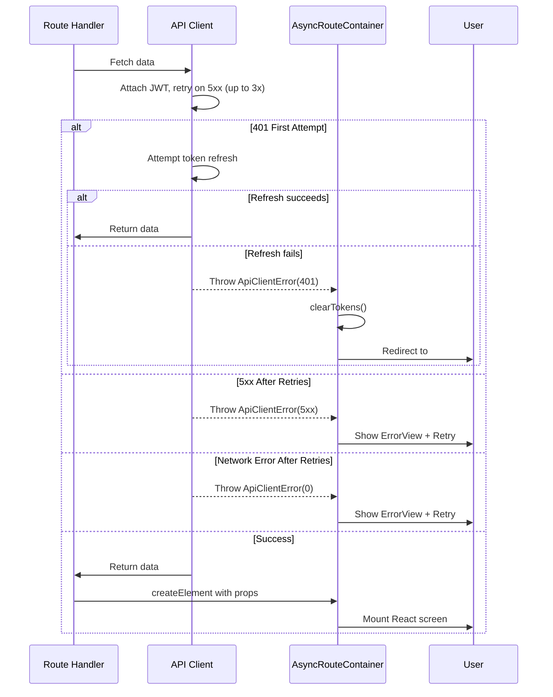

# Design Document: End-to-End UI Integration

## Overview

This design covers the integration layer that wires all existing React screen components into the ChikuMiku LearnVerse web application's vanilla-DOM hash router. The screens already exist as standalone React TSX files; the backend Lambda handlers are fully implemented. This work bridges the gap by:

1. Creating a **React-to-DOM Bridge** utility that mounts/unmounts React components in the hash router lifecycle
2. Registering all **route patterns** with handlers that extract URL parameters, fetch initial data from the API client, and mount screens with the correct props
3. Building a **Subject Landing Page** that conditionally renders exercise-type links based on subject category
4. Adding **shared Loading/Error state components** for consistent UX across all data-fetching routes
5. Ensuring **inter-screen navigation** links connect related screens without dead ends

### Key Design Decisions

| Decision | Rationale |
|----------|-----------|
| Bridge creates fresh `createRoot` per navigation | Prevents stale React state from leaking between route transitions; simpler than reconciliation |
| MutationObserver-based unmount detection | Reliably detects when the router replaces mount content without requiring router changes |
| Route handlers own data fetching | Keeps screen components pure/testable; bridge receives a fully-hydrated React element |
| Subject Landing as a vanilla-DOM view (not React) | Consistency with existing dashboard pattern; simpler for purely navigational pages |
| Shared `createLoadingView` / `createErrorView` factories | Reuse across all route handlers; consistent design-system styling |

## Architecture

### Integration Layer Architecture

```mermaid
graph TB
    subgraph Hash Router - main.ts
        HR[createRouter<br/>hashchange listener]
    end

    subgraph React Bridge - utils/reactBridge.ts
        RB[renderReactRoute<br/>createRoot + MutationObserver]
    end

    subgraph Route Handlers
        RH1[#scan / #ingest]
        RH2[#upload/:chapterId]
        RH3[#transcript/:chapterId]
        RH4[#explain/:chapterId]
        RH5[#exercises/:chapterId]
        RH6[#pronunciation/:subjectId]
        RH7[#grammar/:subjectId]
        RH8[#quiz/:subjectId]
        RH9[#maths/:subjectId]
        RH10[#computers/:subjectId]
        RH11[#evs/:subjectId]
        RH12[#progress]
        RH13[#edit-subjects/:learnerId]
        RH14[#subject-:name]
    end

    subgraph Shared UI
        LV[createLoadingView]
        EV[createErrorView]
        SL[SubjectLandingView]
    end

    subgraph React Screens - screens/*.tsx
        S1[ContentIngestionScreen]
        S2[PageUploadUI]
        S3[ChapterTranscript]
        S4[ChapterExplanationScreen]
        S5[ExerciseAssistant]
        S6[PronunciationScreen]
        S7[GrammarExerciseScreen]
        S8[QuizScreen]
        S9[MathsPracticeScreen]
        S10[ComputersExerciseScreen]
        S11[EVSVisualizationScreen]
    end

    subgraph API Client - services/api.ts
        API[api object<br/>auth, content, ingestion,<br/>comprehension, progress,<br/>pronunciation, parent]
    end

    HR --> RH1 & RH2 & RH3 & RH4 & RH5 & RH6 & RH7 & RH8 & RH9 & RH10 & RH11 & RH12 & RH13 & RH14
    RH1 --> RB --> S1
    RH2 --> RB --> S2
    RH3 --> RB --> S3
    RH4 --> RB --> S4
    RH5 --> RB --> S5
    RH6 --> RB --> S6
    RH7 --> RB --> S7
    RH8 --> RB --> S8
    RH9 --> RB --> S9
    RH10 --> RB --> S10
    RH11 --> RB --> S11
    RH1 & RH2 & RH3 & RH4 & RH5 & RH6 & RH7 & RH8 & RH9 & RH10 & RH11 & RH12 & RH13 --> API
    RH1 & RH12 --> LV & EV
    RH14 --> SL
```



### Navigation Flow Diagram

```mermaid
graph TD
    DASH[#learner-dashboard] --> |Subject card click| SUBJECT[#subject-{name}]
    
    SUBJECT --> |Pronunciation| PRON[#pronunciation/{subjectId}]
    SUBJECT --> |Grammar| GRAM[#grammar/{subjectId}]
    SUBJECT --> |Quiz| QUIZ[#quiz/{subjectId}]
    SUBJECT --> |Maths| MATHS[#maths/{subjectId}]
    SUBJECT --> |Computers| COMP[#computers/{subjectId}]
    SUBJECT --> |EVS| EVS[#evs/{subjectId}]
    SUBJECT --> |Content Ingestion| SCAN[#scan]

    SCAN --> |Chapter select| UPLOAD[#upload/{chapterId}]
    UPLOAD --> |Extract complete| TRANS[#transcript/{chapterId}]
    TRANS --> |Continue| EXPLAIN[#explain/{chapterId}]
    EXPLAIN --> |Back| TRANS
    EXPLAIN --> |Exercise Help| EXERCISES[#exercises/{chapterId}]
    EXPLAIN --> |Revision Qs generated| REVISION[#revision/{chapterId}]

    QUIZ --> |Complete → View Progress| PROGRESS[#progress]
    QUIZ --> |Complete → Back to Subject| SUBJECT

    PDASH[#dashboard] --> |View learner| EDIT[#edit-subjects/{learnerId}]
    EDIT --> |Save| PDASH

    NAV_PROG[Sidebar/Mobile Me] --> PROGRESS
```

## Components and Interfaces

### React Bridge Utility

**File:** `packages/platform-web/app/src/utils/reactBridge.ts`

```typescript
import { createElement, ReactElement } from 'react';
import { createRoot, Root } from 'react-dom/client';

interface MountedRoute {
  root: Root;
  container: HTMLElement;
  observer: MutationObserver;
}

let currentMount: MountedRoute | null = null;

/**
 * Mounts a React element into an HTMLElement container suitable for the
 * vanilla-DOM hash router. Automatically unmounts the previous React root
 * when the container is removed from the DOM (via MutationObserver).
 *
 * @param element - The React element to render
 * @returns HTMLElement containing the mounted React tree
 */
export function renderReactRoute(element: ReactElement): HTMLElement {
  // Cleanup previous mount if still active
  cleanupCurrentMount();

  const container = document.createElement('div');
  container.className = 'react-route-container';

  const root = createRoot(container);
  root.render(element);

  // Observe parent for removal (router replaces innerHTML)
  const observer = new MutationObserver((mutations) => {
    for (const mutation of mutations) {
      for (const removed of mutation.removedNodes) {
        if (removed === container || removed.contains(container)) {
          cleanupCurrentMount();
          return;
        }
      }
    }
  });

  // Start observing once container is in the DOM
  requestAnimationFrame(() => {
    const parent = container.parentElement;
    if (parent) {
      observer.observe(parent, { childList: true });
    }
  });

  currentMount = { root, container, observer };
  return container;
}

/** Unmounts the current React root and disconnects the observer. */
function cleanupCurrentMount(): void {
  if (!currentMount) return;
  const { root, observer } = currentMount;
  observer.disconnect();
  root.unmount();
  currentMount = null;
}
```

### Route Table

**File:** Updated `packages/platform-web/app/src/main.ts` route registrations

| Pattern | Hash Example | Handler | Screen |
|---------|-------------|---------|--------|
| `^scan$` or `^ingest$` | `#scan`, `#ingest` | Fetch subjects → ContentIngestionScreen | ContentIngestionScreen |
| `^upload/(?<chapterId>[^/]+)$` | `#upload/abc123` | Extract chapterId → PageUploadUI | PageUploadUI |
| `^transcript/(?<chapterId>[^/]+)$` | `#transcript/abc123` | Extract chapterId, fetch transcript → ChapterTranscript | ChapterTranscript |
| `^explain/(?<chapterId>[^/]+)$` | `#explain/abc123` | Extract chapterId → ChapterExplanationScreen | ChapterExplanationScreen |
| `^exercises/(?<chapterId>[^/]+)$` | `#exercises/abc123` | Extract chapterId, fetch exercises → ExerciseAssistant | ExerciseAssistant |
| `^pronunciation/(?<subjectId>[^/]+)$` | `#pronunciation/xyz` | Extract subjectId, fetch first word → PronunciationScreen | PronunciationScreen |
| `^grammar/(?<subjectId>[^/]+)$` | `#grammar/xyz` | Extract subjectId → GrammarExerciseScreen | GrammarExerciseScreen |
| `^quiz/(?<subjectId>[^/]+)$` | `#quiz/xyz` | Extract subjectId → QuizScreen | QuizScreen |
| `^maths/(?<subjectId>[^/]+)$` | `#maths/xyz` | Extract subjectId → MathsPracticeScreen | MathsPracticeScreen |
| `^computers/(?<subjectId>[^/]+)$` | `#computers/xyz` | Extract subjectId → ComputersExerciseScreen | ComputersExerciseScreen |
| `^evs/(?<subjectId>[^/]+)$` | `#evs/xyz` | Extract subjectId → EVSVisualizationScreen | EVSVisualizationScreen |
| `^progress$` | `#progress` | Fetch progress + streak → ProgressView | ProgressView (new vanilla-DOM) |
| `^edit-subjects/(?<learnerId>[^/]+)$` | `#edit-subjects/id1` | Extract learnerId → ParentDashboard (edit mode) | ParentDashboard |
| `^subject-(?<subjectName>[^/]+)$` | `#subject-maths` | Resolve subject → SubjectLandingView | SubjectLandingView (new) |

### Route Handler Pattern (Async Data Fetching)

Each route handler follows a consistent pattern:

```typescript
{
  pattern: /^explain\/(?<chapterId>[^/]+)$/,
  handler: (params) => {
    const { chapterId } = params;
    // 1. Show loading state wrapped in responsive layout
    const container = createAsyncRouteContainer(
      `#explain/${chapterId}`,
      async () => {
        // 2. Fetch required data
        const explanation = await comprehensionApi.getExplanation(chapterId);
        // 3. Return React element with props
        return createElement(ChapterExplanationScreen, {
          chapterId,
          fetchExplanation: comprehensionApi.getExplanation,
          generateAudio: comprehensionApi.generateAudio,
          // ... other API method props
        });
      }
    );
    return container;
  },
}
```

### Async Route Container Utility

**File:** `packages/platform-web/app/src/utils/asyncRoute.ts`

```typescript
import { ReactElement } from 'react';
import { renderReactRoute } from './reactBridge';
import { clearTokens } from '../services/api';

/**
 * Creates an HTMLElement that:
 * 1. Immediately shows a loading indicator inside ResponsiveLayout
 * 2. Calls the async factory to fetch data and create the React element
 * 3. On success: replaces loading with the mounted React screen
 * 4. On 401: clears tokens and redirects to #login
 * 5. On other errors: shows error view with retry button
 */
export function createAsyncRouteContainer(
  activeRoute: string,
  factory: () => Promise<ReactElement>,
  options?: { treeSidebar?: TreeSidebarProps }
): HTMLElement {
  const wrapper = document.createElement('div');
  wrapper.className = 'async-route-wrapper';

  // Show loading initially
  const loadingEl = createLoadingView();
  wrapper.appendChild(
    wrapInResponsiveLayout(loadingEl, activeRoute, options?.treeSidebar)
  );

  // Execute async factory
  factory()
    .then((element) => {
      wrapper.innerHTML = '';
      const rendered = renderReactRoute(element);
      wrapper.appendChild(
        wrapInResponsiveLayout(rendered, activeRoute, options?.treeSidebar)
      );
    })
    .catch((err) => {
      if (err?.status === 401) {
        clearTokens();
        window.location.hash = '#login';
        return;
      }
      wrapper.innerHTML = '';
      const errorEl = createErrorView(err?.message, () => {
        // Retry: replace with fresh async container
        wrapper.innerHTML = '';
        const retryContainer = createAsyncRouteContainer(activeRoute, factory, options);
        wrapper.appendChild(retryContainer);
      });
      wrapper.appendChild(
        wrapInResponsiveLayout(errorEl, activeRoute, options?.treeSidebar)
      );
    });

  return wrapper;
}
```

### Shared Loading View

**File:** `packages/platform-web/app/src/components/LoadingView.ts`

```typescript
/**
 * Creates a centered loading indicator element using design-system tokens.
 * Background: #F8F5FF, spinner accent: #E94F9B, border: #E0D8EC
 */
export function createLoadingView(message = 'Loading...'): HTMLElement {
  const container = document.createElement('div');
  container.className = 'loading-view';
  container.setAttribute('role', 'status');
  container.setAttribute('aria-live', 'polite');
  Object.assign(container.style, {
    display: 'flex',
    flexDirection: 'column',
    alignItems: 'center',
    justifyContent: 'center',
    padding: '3rem 2rem',
    minHeight: '200px',
    backgroundColor: '#F8F5FF',
    borderRadius: '14px',
    border: '1px solid #E0D8EC',
  });

  // Spinner
  const spinner = document.createElement('div');
  spinner.className = 'loading-spinner';
  // CSS animation defined in design-tokens.css
  container.appendChild(spinner);

  // Message
  const msg = document.createElement('p');
  msg.textContent = message;
  Object.assign(msg.style, {
    marginTop: '1rem',
    fontSize: '0.9rem',
    color: '#6B7280',
    fontWeight: '500',
  });
  container.appendChild(msg);

  return container;
}
```

### Shared Error View

**File:** `packages/platform-web/app/src/components/ErrorView.ts`

```typescript
/**
 * Creates an error display with message and retry button.
 * Error red: #E74C3C, background: #F8F5FF, border: #E0D8EC
 */
export function createErrorView(
  message = 'Something went wrong. Please try again.',
  onRetry?: () => void
): HTMLElement {
  const container = document.createElement('div');
  container.className = 'error-view';
  container.setAttribute('role', 'alert');
  Object.assign(container.style, {
    display: 'flex',
    flexDirection: 'column',
    alignItems: 'center',
    padding: '3rem 2rem',
    backgroundColor: '#F8F5FF',
    borderRadius: '14px',
    border: '1px solid #E0D8EC',
    textAlign: 'center',
  });

  // Error icon
  const icon = document.createElement('div');
  icon.textContent = '⚠️';
  icon.style.fontSize = '2.5rem';
  container.appendChild(icon);

  // Message
  const msg = document.createElement('p');
  msg.textContent = message;
  Object.assign(msg.style, {
    marginTop: '1rem',
    fontSize: '0.95rem',
    color: '#E74C3C',
    fontWeight: '600',
  });
  container.appendChild(msg);

  // Retry button
  if (onRetry) {
    const btn = document.createElement('button');
    btn.type = 'button';
    btn.textContent = 'Retry';
    btn.setAttribute('aria-label', 'Retry loading');
    Object.assign(btn.style, {
      marginTop: '1.5rem',
      padding: '0.6rem 1.5rem',
      fontSize: '0.85rem',
      fontWeight: '600',
      color: '#FFFFFF',
      backgroundColor: '#E94F9B',
      border: 'none',
      borderRadius: '22px',
      cursor: 'pointer',
    });
    btn.addEventListener('click', onRetry);
    container.appendChild(btn);
  }

  return container;
}
```

### Subject Landing Page

**File:** `packages/platform-web/app/src/views/SubjectLandingView.ts`

The Subject Landing page is a vanilla-DOM view (consistent with the existing dashboard approach) that displays:
- Subject header (name, icon, color, progress percentage)
- Grid of exercise-type navigation cards, conditionally rendered by subject category

```typescript
/** Subject categories determine which exercise links are shown. */
const LANGUAGE_SUBJECTS = ['kannada', 'hindi', 'english'];
const SUBJECT_EXERCISE_MAP: Record<string, ExerciseLink[]> = {
  // Language subjects get pronunciation + grammar + quiz + content ingestion
  language: [
    { label: 'Pronunciation Practice', icon: '🎙️', route: 'pronunciation' },
    { label: 'Grammar Exercises', icon: '📝', route: 'grammar' },
    { label: 'Take Quiz', icon: '⏱️', route: 'quiz' },
    { label: 'Content Ingestion', icon: '📷', route: 'scan' },
  ],
  maths: [
    { label: 'Maths Practice', icon: '📐', route: 'maths' },
    { label: 'Take Quiz', icon: '⏱️', route: 'quiz' },
    { label: 'Content Ingestion', icon: '📷', route: 'scan' },
  ],
  computers: [
    { label: 'Computers Exercises', icon: '🖥️', route: 'computers' },
    { label: 'Take Quiz', icon: '⏱️', route: 'quiz' },
    { label: 'Content Ingestion', icon: '📷', route: 'scan' },
  ],
  evs: [
    { label: 'EVS Visualizations', icon: '🌿', route: 'evs' },
    { label: 'Take Quiz', icon: '⏱️', route: 'quiz' },
    { label: 'Content Ingestion', icon: '📷', route: 'scan' },
  ],
  default: [
    { label: 'Take Quiz', icon: '⏱️', route: 'quiz' },
    { label: 'Content Ingestion', icon: '📷', route: 'scan' },
  ],
};

interface ExerciseLink {
  label: string;
  icon: string;
  route: string; // e.g., 'pronunciation' → navigates to #pronunciation/{subjectId}
}

/**
 * Determines the exercise links available for a given subject name.
 */
export function getExerciseLinksForSubject(subjectName: string): ExerciseLink[] {
  const normalized = subjectName.toLowerCase();
  if (LANGUAGE_SUBJECTS.includes(normalized)) return SUBJECT_EXERCISE_MAP.language;
  if (normalized === 'maths') return SUBJECT_EXERCISE_MAP.maths;
  if (normalized === 'computers') return SUBJECT_EXERCISE_MAP.computers;
  if (normalized === 'evs') return SUBJECT_EXERCISE_MAP.evs;
  return SUBJECT_EXERCISE_MAP.default;
}

/**
 * Creates the Subject Landing view with exercise links appropriate to the subject.
 */
export function createSubjectLandingView(
  subjectName: string,
  subjectId: string,
  color: string,
  icon: string,
  progressPercent: number
): HTMLElement { ... }
```

### API Integration Patterns Per Screen

| Route | API Calls | Props Passed |
|-------|-----------|-------------|
| `#scan` / `#ingest` | `contentApi.getSubjects()` | `subjects`, `fetchBooks`, `createBook`, `fetchChapters`, `createChapter`, `onChapterSelect` |
| `#upload/{chapterId}` | None (lazy) | `chapterId`, `onExtractText` (wraps `ingestionApi.uploadPages` + `ingestionApi.extractText`) |
| `#transcript/{chapterId}` | `ingestionApi.getTranscript(chapterId)` | `pages`, `onSaveTranscript` (wraps `ingestionApi.saveTranscript`) |
| `#explain/{chapterId}` | None (screen fetches internally) | `chapterId`, `fetchExplanation`, `generateAudio`, `generateRevisionQuestions`, `fetchRevisionQuestions`, `generateSummary`, `fetchSummary`, `translateExplanation`, `onNavigateToRevision` |
| `#exercises/{chapterId}` | `contentApi.getExercises({ chapterId })` | `chapterId`, `exercises`, `fetchHint`, `evaluateAnswer` |
| `#pronunciation/{subjectId}` | `pronunciationApi.getReferenceAudio(firstWordId)` (needs word list first) | `word`, `fetchReferenceAudio`, `submitRecording`, `onNext` |
| `#grammar/{subjectId}` | None (screen fetches internally) | `fetchExercises` (wraps `contentApi.getExercises`), `validateAnswer` (wraps `comprehensionApi.evaluate`) |
| `#quiz/{subjectId}` | None (screen manages session) | `createSession`, `submitAnswer`, `skipQuestion`, `getResult`, `onComplete` |
| `#maths/{subjectId}` | None (screen fetches internally) | `fetchExercises`, `checkAnswer`, `onComplete` |
| `#computers/{subjectId}` | None (screen fetches internally) | `fetchExercise`, `onValidateMatches`, `onComplete` |
| `#evs/{subjectId}` | None (screen fetches internally) | `fetchExerciseData`, `validateOrder` |
| `#progress` | `progressApi.getProgress(studentId)`, `progressApi.getStreak(studentId)` | Progress data rendered in vanilla DOM |
| `#edit-subjects/{learnerId}` | `parentApi.getLearners()` | Learner data + `parentApi.updateLearnerSubjects` |
| `#subject-{name}` | `contentApi.getSubjects()` (to resolve name→id+metadata) | Subject metadata, rendered in vanilla DOM |

## Data Models

### Route Parameter Types

```typescript
/** Parameters extracted from hash URL patterns */
interface ChapterRouteParams {
  chapterId: string;
}

interface SubjectRouteParams {
  subjectId: string;
}

interface SubjectNameRouteParams {
  subjectName: string; // lowercase subject name from URL
}

interface LearnerRouteParams {
  learnerId: string;
}
```

### Subject Landing View Model

```typescript
/** Data needed to render the Subject Landing page */
interface SubjectLandingData {
  subjectId: string;
  subjectName: string;
  color: string;
  icon: string;
  progressPercent: number;
  exerciseLinks: ExerciseLink[];
}
```

### Navigation Link Model

```typescript
/** A navigation link rendered on a screen */
interface NavigationLink {
  label: string;
  hash: string;  // Full hash including # (e.g., "#explain/abc123")
  icon?: string;
}
```


## Correctness Properties

*A property is a characteristic or behavior that should hold true across all valid executions of a system — essentially, a formal statement about what the system should do. Properties serve as the bridge between human-readable specifications and machine-verifiable correctness guarantees.*

### Property 1: React Bridge Props Round-Trip

*For any* React component and arbitrary props object, mounting the component via `renderReactRoute(createElement(Component, props))` SHALL produce an HTMLElement where the component receives exactly the provided props.

**Validates: Requirements 1.1, 1.3**

### Property 2: React Bridge Lifecycle — Fresh Root Per Navigation

*For any* sequence of N navigations (N ≥ 1), the React Bridge SHALL create exactly N React roots total, unmounting each previous root before creating the next. After the final navigation, exactly one root SHALL remain active.

**Validates: Requirements 1.2, 1.4**

### Property 3: Route Parameter Extraction

*For any* parameterized route pattern (e.g., `explain/{id}`, `upload/{id}`, `pronunciation/{id}`) and any valid ID string, the route handler SHALL extract the correct ID value from the URL hash and pass it as the corresponding prop to the screen component.

**Validates: Requirements 2.5, 2.6, 3.2, 4.2, 5.2, 6.2, 7.2, 8.2, 9.2, 10.2, 12.3**

### Property 4: Action-Triggered Navigation Dispatch

*For any* screen action that triggers navigation (chapter select, upload complete, revision generation complete), the resulting `window.location.hash` SHALL equal the expected target pattern with the correct parameterized ID substituted.

**Validates: Requirements 2.2, 2.3, 3.3, 12.4**

### Property 5: Chapter-Context Navigation Links

*For any* chapter-scoped screen (Transcript, Explanation, Exercises) and any chapterId, the screen SHALL render navigation links whose hash targets correctly include the same chapterId (e.g., transcript → `#explain/{chapterId}`, explanation → `#transcript/{chapterId}` and `#exercises/{chapterId}`).

**Validates: Requirements 3.4, 4.3, 15.1, 15.2**

### Property 6: Language-Subject Conditional Exercise Links

*For any* subject, the Subject Landing page SHALL display "Pronunciation Practice" and "Grammar Exercises" links if and only if the subject name is one of ["kannada", "hindi", "english"] (case-insensitive).

**Validates: Requirements 5.4, 6.3**

### Property 7: Subject Landing Page Content Rendering

*For any* subject with a name, icon, color, progress percentage, and subject category, the Subject Landing page SHALL display: (a) the subject name, icon, color indicator, and progress percentage, and (b) exactly the set of exercise links appropriate for that subject's category.

**Validates: Requirements 13.2, 13.3, 13.4, 7.3, 8.3, 9.3, 10.3**

### Property 8: Loading State on Data Fetch

*For any* route handler that performs an async API fetch, the initial rendered output SHALL contain a loading indicator (element with `role="status"`) within the Responsive Layout until the fetch resolves or rejects.

**Validates: Requirements 14.1**

### Property 9: Error State with Retry on Failure

*For any* route handler where the API call fails with a network error or 5xx status, the rendered output SHALL contain an error message (element with `role="alert"`) and a clickable "Retry" button. Clicking retry SHALL re-invoke the original fetch.

**Validates: Requirements 14.2**

### Property 10: Auth Redirect on 401

*For any* route handler where the API call fails with 401 status, the application SHALL clear stored tokens and set `window.location.hash` to `#login`.

**Validates: Requirements 14.3**

### Property 11: Dashboard Card Navigation

*For any* dashboard card (learner subject card or parent learner card) with an associated ID, clicking the card SHALL set `window.location.hash` to the correct parameterized route (subject cards → `#subject-{name}`, parent View → `#edit-subjects/{learnerId}`, quiz complete → `#subject-{name}`).

**Validates: Requirements 12.2, 15.5, 7.4**

### Property 12: Sidebar Subject Highlighting

*For any* exercise route with an associated subject ID, the Responsive Layout sidebar SHALL mark the corresponding subject as the active/highlighted item.

**Validates: Requirements 15.4**

## Error Handling

### Error Categories and Responses

| Error Type | HTTP Status | User Experience | Recovery |
|-----------|-------------|-----------------|----------|
| Network failure | 0 (no response) | Error view with "Unable to connect" message + Retry | Retry button re-invokes handler |
| Server error | 5xx | Error view with "Something went wrong" + Retry | Retry with exponential backoff (handled by API client) |
| Authentication expired | 401 | Redirect to `#login` | User logs in again; token refresh already attempted by API client |
| Not found | 404 | Error view with "Content not found" | Back button or home link |
| Validation error | 4xx | Inline error in screen component | User corrects input |

### Error Propagation Flow



### Specific Error Handling Per Route

- **Pronunciation route**: If word list is empty (no pronunciation data for subject), show friendly "No words available" message instead of error
- **Progress route**: If progress API fails, show partial data from cache if available; otherwise standard error view
- **Edit Subjects route**: On save failure, keep dialog open with error message; do not navigate away

## Testing Strategy

### Dual Testing Approach

This feature is suitable for property-based testing because:
- The React Bridge has clear input/output behavior (element in → HTMLElement out) with universal invariants
- Route parameter extraction is a pure function testable across all valid ID strings
- Subject Landing link rendering is deterministic based on subject category — testable with generated subjects
- Loading/Error state transitions follow universal patterns across all routes

### Property-Based Tests (fast-check)

**Library:** `fast-check` (already available in the monorepo via vitest)

**Configuration:**
- Minimum 100 iterations per property test
- Each test tagged with: `Feature: end-to-end-ui-integration, Property {N}: {description}`

**Test files:**
- `packages/platform-web/app/src/utils/reactBridge.property.test.ts` — Properties 1, 2
- `packages/platform-web/app/src/utils/routeParams.property.test.ts` — Property 3
- `packages/platform-web/app/src/views/SubjectLandingView.property.test.ts` — Properties 6, 7
- `packages/platform-web/app/src/utils/asyncRoute.property.test.ts` — Properties 8, 9, 10

### Unit Tests (vitest)

**Focus areas:**
- Route registration completeness (all 14+ patterns registered)
- Individual route handler prop assembly (mock API, verify correct props)
- Navigation link correctness (specific examples with known IDs)
- Design-system color token usage in loading/error views
- Edge cases: empty chapterId, special characters in subject names, concurrent navigations

### Integration Tests

**Focus areas:**
- Full route lifecycle: navigate → loading → data loaded → screen mounted → navigate away → unmounted
- 401 flow: navigate → API returns 401 → token refresh fails → redirect to #login
- Retry flow: navigate → API fails → click retry → API succeeds → screen mounts
- Subject Landing → exercise screen navigation chain

### Test Commands

```bash
# Run unit tests (excludes property tests)
npm run test:unit

# Run property tests only
npm run test:property
```
