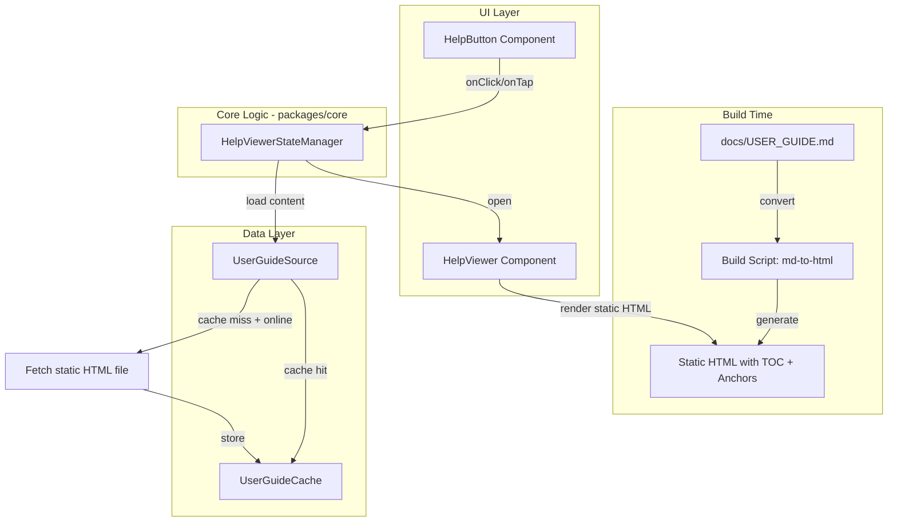

# Design Document: Help Button & User Guide Viewer

## Overview

This feature adds a persistent help button to the LearnVerse LearnVerse platform (both web and Android) that opens an in-app viewer displaying the User Guide. The guide is pre-built as a static HTML file at build time from `docs/USER_GUIDE.md`, eliminating the need for any runtime markdown parsing. The viewer loads and renders the static HTML directly, with a pre-generated table of contents using anchor links.

The design leverages the existing `PlatformProvider` abstraction in `packages/api/src/platformInterface.ts` and the `ClientCache` pattern from `packages/sync/src/clientCache.ts` to deliver a cross-platform solution with offline support.

### Key Design Decision: Static HTML over Runtime Parsing

Instead of parsing markdown at runtime, the User Guide is converted to a static HTML file during the build step. This approach:

- **Eliminates runtime complexity**: No markdown parser or TOC extractor needed in the client bundle
- **Reduces bundle size**: No markdown parsing library shipped to users
- **Guarantees consistent rendering**: HTML is generated once, displayed identically everywhere
- **Improves load performance**: Pre-built HTML renders instantly without parsing overhead
- **Simplifies the viewer**: The HelpViewer simply injects and displays HTML content

## Architecture



### Key Architectural Decisions

1. **Build-time HTML generation**: A build script converts `docs/USER_GUIDE.md` into a self-contained HTML file with embedded TOC navigation and anchor links. This runs as part of the project build, not at runtime.

2. **No runtime markdown parser**: The viewer receives pre-built HTML and injects it directly into the DOM. No parsing, no AST, no tree walking at runtime.

3. **TOC built into the HTML**: The build script generates a `<nav>` element containing an ordered list of links to `id`-anchored headings (H2 and H3 only). The viewer reads this nav element to populate its TOC sidebar.

4. **Core logic in `packages/core`**: State management and caching logic live in the shared `core` package. This keeps business logic platform-independent and testable.

5. **Platform-specific UI components**: The actual button and viewer rendering is handled by platform-specific code (web DOM / Android views), but they consume the same core interfaces.

6. **Offline-first with cache**: The web app caches the static HTML content using a dedicated `UserGuideCache`. The Android app bundles the HTML file in the APK.

7. **State snapshot/restore pattern**: Before opening the help viewer, the platform captures a state snapshot (scroll position, form values, media positions). On close, the snapshot is restored.

## Components and Interfaces

### HelpButton

A fixed-position UI element rendered on all authenticated screens.

```typescript
/** Configuration for the help button component */
export interface HelpButtonConfig {
  /** Accessible label for screen readers */
  ariaLabel: string; // always "Help"
  /** Minimum tap/click target size in dp/CSS pixels */
  minTargetSize: number; // 44
  /** Minimum spacing from adjacent interactive elements in dp */
  minSpacing: number; // 8
  /** Position anchor */
  position: { bottom: number; right: number };
}

/** Help button state */
export interface HelpButtonState {
  isVisible: boolean;
  isHelpViewerOpen: boolean;
}
```

### HelpViewer

An overlay/modal component that displays the pre-built static HTML content with TOC navigation.

```typescript
/** Help viewer configuration */
export interface HelpViewerConfig {
  /** Maximum time to load content before showing error (ms) */
  loadTimeoutMs: number; // 2000
  /** Maximum time for close animation (ms) */
  closeTimeoutMs: number; // 500
  /** Whether to enable focus trapping */
  trapFocus: boolean; // true
}

/** Help viewer state */
export type HelpViewerState =
  | { status: 'closed' }
  | { status: 'loading' }
  | { status: 'open'; htmlContent: string; activeSection?: string }
  | { status: 'error'; message: string; canRetry: boolean };
```

### Build Script (md-to-html)

A build-time script that converts `docs/USER_GUIDE.md` into a static HTML file with embedded TOC and anchor links.

```typescript
/** Build script configuration */
export interface BuildConfig {
  /** Path to the source markdown file */
  inputPath: string; // "docs/USER_GUIDE.md"
  /** Path to the output HTML file */
  outputPath: string; // "packages/core/src/helpButton/user-guide.html"
  /** CSS class prefix for generated elements */
  classPrefix: string; // "ug-"
}

/** Generated HTML structure */
export interface GeneratedHTML {
  /** The full HTML string including TOC nav and content */
  html: string;
  /** Metadata about the generation */
  meta: {
    generatedAt: string;
    sourceHash: string;
    headingCount: number;
  };
}

/**
 * Convert markdown to static HTML with TOC.
 * Runs at build time only — never at runtime.
 */
export function convertMarkdownToHTML(markdown: string, config: BuildConfig): GeneratedHTML;
```

The generated HTML has this structure:

```html
<nav class="ug-toc" aria-label="Table of Contents">
  <ol>
    <li><a href="#welcome" class="ug-toc-h2">Welcome</a></li>
    <li><a href="#getting-started" class="ug-toc-h2">Getting Started</a>
      <ol>
        <li><a href="#creating-an-account" class="ug-toc-h3">Creating an Account</a></li>
        <li><a href="#logging-in" class="ug-toc-h3">Logging In</a></li>
      </ol>
    </li>
    <!-- ... -->
  </ol>
</nav>
<article class="ug-content">
  <h2 id="welcome">Welcome</h2>
  <p>...</p>
  <h2 id="getting-started">Getting Started</h2>
  <h3 id="creating-an-account">Creating an Account</h3>
  <!-- ... -->
</article>
```

### HelpViewerStateManager

Manages the lifecycle of the help viewer, including state capture/restore.

```typescript
/** Captured application state before opening help viewer */
export interface AppStateSnapshot {
  scrollPosition: { x: number; y: number };
  activeElementId?: string;
  formValues: Record<string, string>;
  mediaPositions: Record<string, number>; // elementId -> seconds
  currentRoute: string;
}

/** State manager interface */
export interface HelpViewerStateManager {
  /** Capture current application state */
  captureState(): AppStateSnapshot;
  /** Restore previously captured state */
  restoreState(snapshot: AppStateSnapshot): boolean;
  /** Open the help viewer */
  open(): Promise<void>;
  /** Close the help viewer */
  close(): Promise<void>;
}
```

### UserGuideCache

Handles caching of the static HTML content for offline access.

```typescript
/** Cache interface for user guide HTML content */
export interface UserGuideCache {
  /** Get cached HTML content, or null if not cached */
  get(): string | null;
  /** Store HTML content in cache, replacing any previous version */
  set(content: string): void;
  /** Check if cached content exists */
  has(): boolean;
  /** Clear cached content */
  clear(): void;
}
```

### UserGuideSource

Orchestrates content loading with cache-first strategy. Loads the static HTML file.

```typescript
/** Content loading result */
export type LoadResult =
  | { status: 'success'; content: string; fromCache: boolean }
  | { status: 'error'; message: string; canRetry: boolean };

/** User guide content source */
export interface UserGuideSource {
  /** Load user guide HTML content (cache-first, then fetch static file) */
  load(): Promise<LoadResult>;
  /** Check if device is online */
  isOnline(): boolean;
}
```

## Data Models

### Content Storage

| Platform | Storage Mechanism | Content Format | Location |
|----------|------------------|----------------|----------|
| Android  | Bundled asset in APK | Static HTML | `assets/user_guide.html` |
| Web      | Cache API / localStorage | Static HTML | Key: `learnverse:user-guide:html` |
| Build output | File system | Static HTML | `packages/core/src/helpButton/user-guide.html` |

### Cache Entry Structure (Web)

```typescript
interface UserGuideCacheEntry {
  content: string; // HTML string
  cachedAt: number; // Unix timestamp
  version: string; // hash of content for change detection
}
```

### State Snapshot Storage

State snapshots are held in memory only (not persisted). They exist for the duration of a single help viewer open/close cycle.

### Build Script Output

The build script (`scripts/build-user-guide.ts`) is run as part of the project build process. It:

1. Reads `docs/USER_GUIDE.md`
2. Converts markdown to HTML using a build-time markdown library (e.g., `marked` or `markdown-it`)
3. Generates slug-based `id` attributes for all H2 and H3 headings
4. Builds a `<nav>` TOC element with nested `<ol>` linking to those anchors
5. Wraps content in an `<article>` element
6. Writes the output to `packages/core/src/helpButton/user-guide.html`

This file is then bundled with the app (web) or included as an asset (Android).

## Correctness Properties

*A property is a characteristic or behavior that should hold true across all valid executions of a system — essentially, a formal statement about what the system should do. Properties serve as the bridge between human-readable specifications and machine-verifiable correctness guarantees.*

### Property 1: Build script TOC generation contains only H2 and H3 headings in document order

*For any* valid markdown string containing headings at various levels (H1–H6), the `convertMarkdownToHTML` build function SHALL produce a TOC `<nav>` element containing links only to H2 and H3 headings, and those links SHALL appear in the same relative order as the headings appear in the source document.

**Validates: Requirements 3.1**

### Property 2: Build script preserves semantic element types

*For any* valid markdown string containing at least one heading, one bulleted list, one numbered list, one table, and one bold segment, the `convertMarkdownToHTML` build function SHALL produce HTML containing the corresponding semantic elements (`<h2>`/`<h3>`, `<ul>`, `<ol>`, `<table>`, `<strong>`) such that each markdown construct maps to its correct HTML element.

**Validates: Requirements 2.4**

### Property 3: Help viewer open/close preserves application state

*For any* valid `AppStateSnapshot` (containing arbitrary scroll positions, form values, media positions, and route), capturing state before opening the help viewer and restoring it after closing SHALL produce a state equal to the original snapshot.

**Validates: Requirements 4.1, 4.2, 4.3, 4.4**

### Property 4: User guide cache round-trip

*For any* non-empty HTML string, after calling `UserGuideCache.set(content)`, a subsequent call to `UserGuideCache.get()` SHALL return a string equal to the original content, and `UserGuideCache.has()` SHALL return true.

**Validates: Requirements 6.4**

## Error Handling

| Scenario | Behavior | User-Facing Message |
|----------|----------|---------------------|
| Content load timeout (>2s) | Show error state with retry button | "The User Guide couldn't be loaded. Tap Retry to try again." |
| Offline + no cache (web) | Show informational message | "The User Guide is available after you've used the app online at least once." |
| State restoration failure | Navigate to parent screen, preserve saved progress | "We couldn't restore your previous screen. You've been taken to [parent screen name]." |
| Static HTML file missing/corrupt | Show error state with retry | "The User Guide couldn't be loaded. Tap Retry to try again." |

### Retry Strategy

- On content load failure, the retry button re-triggers `UserGuideSource.load()`
- Maximum 3 automatic retries with exponential backoff (1s, 2s, 4s) before showing the error state
- Manual retry via button has no limit

### Graceful Degradation

- If the static HTML file is missing or corrupt, the error state is shown with retry
- If the TOC nav element is missing from the HTML, the TOC sidebar is hidden
- The viewer still functions without TOC — content is scrollable

## Testing Strategy

### Unit Tests (Example-Based)

Unit tests cover specific interactions and concrete scenarios:

- **HelpButton rendering**: Verify aria-label, icon, dimensions, position
- **HelpViewer open/close**: Verify state transitions on user actions
- **Keyboard accessibility**: Tab navigation, Enter/Space activation, focus trap, focus restore
- **Error states**: Timeout display, retry button, offline message
- **Dismissal methods**: Close button, back button (Android), Escape key (web)
- **TOC navigation**: Click TOC link, verify scroll to anchor
- **Build script**: Verify specific markdown inputs produce expected HTML output

### Property-Based Tests (fast-check)

Property tests verify universal correctness guarantees using the `fast-check` library:

- **Property 1**: Generate random markdown with headings at levels 1–6, verify `convertMarkdownToHTML` produces TOC with only H2/H3 entries in document order
- **Property 2**: Generate random markdown with mixed element types, verify output HTML contains correct semantic elements
- **Property 3**: Generate random `AppStateSnapshot` objects, verify capture/restore round-trip equality
- **Property 4**: Generate random non-empty strings, verify cache set/get round-trip

**Configuration**:
- Minimum 100 iterations per property test
- Each test tagged with: `Feature: help-button-user-guide, Property {N}: {description}`

### Integration Tests

- **Offline behavior**: Mock network state, verify cached HTML content serves correctly
- **Cross-screen persistence**: Navigate between screens, verify help button remains visible
- **Content load timing**: Verify static HTML displays within 2-second threshold
- **Android back button**: Verify system back button closes the viewer
- **Full flow**: Click help → viewer opens → HTML renders → TOC navigation → close → state restored

### Accessibility Tests

- Screen reader label verification
- Color contrast ratio checks (4.5:1 text, 3:1 interactive)
- Focus management validation
- 200% text resize without clipping
