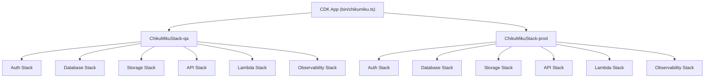
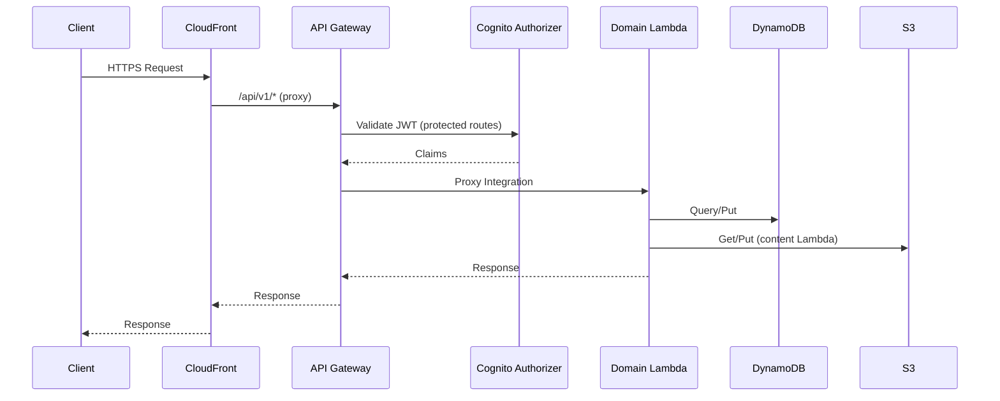
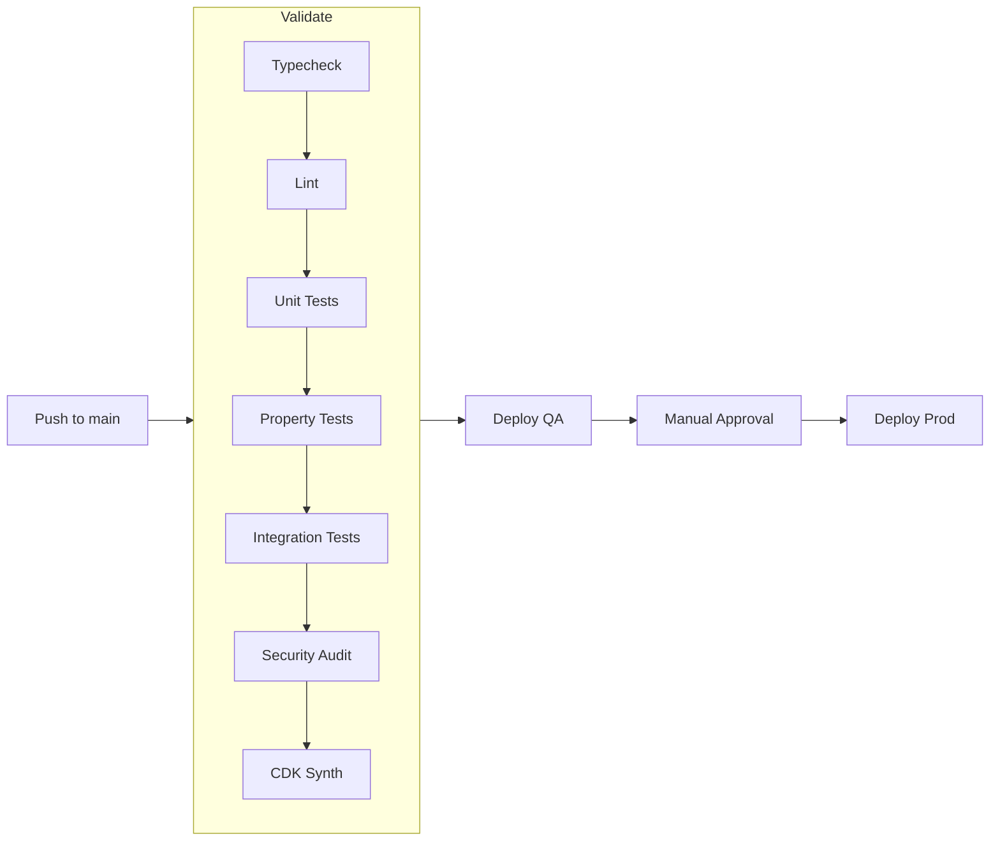

# Design Document: Infrastructure Migration to AWS CDK

## Overview

This design migrates ChikuMiku LearnVerse's infrastructure from Serverless Framework to AWS CDK v2 (TypeScript), following the proven architecture patterns from the BlipZo Shopping project. The migration delivers seven interconnected capabilities:

1. **CDK Stack Composition** — Typed, modular nested stacks replacing `serverless.yml`
2. **Cognito Authentication** — Managed auth replacing custom JWT authorizer Lambda
3. **Lambda Decomposition** — Four domain-specific Lambdas replacing one monolithic handler
4. **GitHub OIDC** — Keyless CI/CD authentication replacing static access keys
5. **Environment Gates** — QA → Prod progressive deployment with manual approval
6. **Turborepo Pipeline** — Parallel cached builds replacing sequential `tsc --build`
7. **Observability IaC** — CloudWatch logs, alarms, dashboard, and SNS notifications

The existing API contract (all 30+ routes under `/api/v1`), the 929 test suite, and local development via `npx tsx` remain fully functional after migration.

### Design Decisions

| Decision | Rationale |
|----------|-----------|
| Nested stacks (not separate apps) | Keeps cross-stack references simple; single `cdk deploy` per environment |
| Cognito User Pool (not custom JWT) | Managed token validation at API Gateway level; removes authorizer Lambda cold starts |
| 4 Lambdas (not 1 per route) | Balance between isolation and operational complexity; matches domain boundaries |
| npm workspaces + Turborepo | Preserves existing package manager; adds caching and parallelism on top |
| Node.js 22 runtime | Matches existing `serverless.yml` runtime; latest LTS |
| `ap-south-1` region | Matches existing deployment; closest to target users |

---

## Architecture

### High-Level Stack Composition



### Request Flow Architecture



### CI/CD Pipeline Flow



### Directory Structure

```
infra/
└── cdk/
    ├── bin/
    │   └── chikumiku.ts              # CDK App entry point
    ├── lib/
    │   ├── ChikuMikuStack.ts         # Root stack (composes nested)
    │   ├── AuthStack.ts              # Cognito User Pool + Client
    │   ├── DatabaseStack.ts          # DynamoDB tables
    │   ├── StorageStack.ts           # S3 buckets + CloudFront
    │   ├── ApiStack.ts               # API Gateway + Cognito Authorizer
    │   ├── LambdaStack.ts            # 4 Lambda functions + IAM
    │   ├── ObservabilityStack.ts     # CloudWatch + SNS
    │   └── constructs/
    │       └── SecureLambda.ts       # Reusable Lambda construct
    ├── cdk.json                      # CDK config
    ├── tsconfig.json                 # CDK-specific TS config
    └── package.json                  # CDK dependencies
turbo.json                            # Turborepo pipeline config
.github/
└── workflows/
    └── ci.yml                        # GitHub Actions CI/CD
```

---

## Components and Interfaces

### 1. CDK App Entry Point (`bin/chikumiku.ts`)

Instantiates one `ChikuMikuStack` per environment with isolated resources.

```typescript
interface ChikuMikuStackProps extends cdk.StackProps {
  readonly stageName: 'qa' | 'prod';
}
```

**Responsibilities:**
- Parse environment from CDK context or environment variable
- Instantiate `ChikuMikuStack-qa` and `ChikuMikuStack-prod`
- Apply stack-level tags: `chikumiku:stage`, `chikumiku:stack`

---

### 2. ChikuMikuStack (Root Stack)

Composes all nested stacks with proper dependency ordering.

```typescript
export class ChikuMikuStack extends cdk.Stack {
  public readonly stageName: string;
  constructor(scope: Construct, id: string, props: ChikuMikuStackProps);
  public resourceName(suffix: string): string; // `chikumiku-{stage}-{suffix}`
}
```

**Composition Order:**
1. `AuthStack` → produces `userPool`, `userPoolClient`
2. `DatabaseStack` → produces `learnersTable`, `accountsTable`, `contentTable`
3. `StorageStack` → produces `contentBucket`, `webAppBucket`, `cloudFrontDistribution`
4. `ApiStack` → consumes `userPool`, produces `api`, `authorizer`
5. `LambdaStack` → consumes tables, bucket, api, authorizer, userPool
6. `ObservabilityStack` → consumes Lambda functions map

---

### 3. AuthStack

```typescript
export interface AuthStackProps extends cdk.NestedStackProps {
  readonly stageName: string;
}

export class AuthStack extends cdk.NestedStack {
  public readonly userPool: cognito.UserPool;
  public readonly userPoolClient: cognito.UserPoolClient;
}
```

**Cognito User Pool Configuration:**
- Sign-in aliases: email + phone
- Password policy: min 8, uppercase, lowercase, digit
- Custom attributes: `userType`, `parentId`, `failedAttempts`, `lockUntil`
- Auto-verify: email, phone
- Account recovery: email only
- Removal policy: RETAIN in prod, DESTROY in qa

**User Pool Client:**
- Auth flows: `ALLOW_USER_PASSWORD_AUTH`, `ALLOW_ADMIN_USER_PASSWORD_AUTH`
- Access/ID token validity: 60 minutes
- Refresh token validity: 30 days
- No client secret (public client for mobile/web)

---

### 4. DatabaseStack

```typescript
export interface DatabaseStackProps extends cdk.NestedStackProps {
  readonly stageName: string;
}

export class DatabaseStack extends cdk.NestedStack {
  public readonly learnersTable: dynamodb.Table;
  public readonly accountsTable: dynamodb.Table;
  public readonly contentTable: dynamodb.Table;
}
```

**Tables:** See Data Models section below.

---

### 5. StorageStack

```typescript
export interface StorageStackProps extends cdk.NestedStackProps {
  readonly stageName: string;
}

export class StorageStack extends cdk.NestedStack {
  public readonly contentBucket: s3.Bucket;
  public readonly webAppBucket: s3.Bucket;
  public readonly distribution: cloudfront.Distribution;
}
```

**Content Bucket:**
- Name: `chikumiku-{stage}-content-{accountId}`
- Block all public access
- CORS: GET, PUT from all origins, max-age 3600
- Lifecycle: STANDARD_IA after 30 days, GLACIER_INSTANT_RETRIEVAL after 90 days
- Removal: RETAIN in prod

**Web App Bucket:**
- Block all public access
- SPA error routing (index.html for 403/404)
- Origin Access Identity for CloudFront

**CloudFront Distribution:**
- HTTPS redirect, HTTP/2 + HTTP/3
- OAI to web app bucket
- `/api/*` behavior → API Gateway origin (caching disabled)

---

### 6. ApiStack

```typescript
export interface ApiStackProps extends cdk.NestedStackProps {
  readonly stageName: string;
  readonly userPool: cognito.IUserPool;
}

export class ApiStack extends cdk.NestedStack {
  public readonly api: apigateway.RestApi;
  public readonly authorizer: apigateway.CognitoUserPoolsAuthorizer;
}
```

**REST API Configuration:**
- Name: `chikumiku-{stage}-api`
- X-Ray tracing enabled
- CloudWatch metrics enabled
- Access logging (JSON format)
- CORS: all origins, all methods
- Gateway responses with CORS headers for 4XX/5XX

**Cognito Authorizer:**
- Identity source: `method.request.header.Authorization`
- Attached to all protected endpoints

**Resource Path Tree:**
All routes are defined under the API root. Methods are wired by LambdaStack.

---

### 7. LambdaStack

```typescript
export interface LambdaStackProps extends cdk.NestedStackProps {
  readonly stageName: string;
  readonly tables: {
    readonly learnersTable: dynamodb.Table;
    readonly accountsTable: dynamodb.Table;
    readonly contentTable: dynamodb.Table;
  };
  readonly contentBucket: s3.Bucket;
  readonly api: apigateway.RestApi;
  readonly authorizer: apigateway.CognitoUserPoolsAuthorizer;
  readonly userPool: cognito.IUserPool;
  readonly userPoolClientId: string;
}

export class LambdaStack extends cdk.NestedStack {
  public readonly functions: Record<string, lambda.Function>;
}
```

**Lambda → Route Mapping:**

| Lambda | Routes | Auth |
|--------|--------|------|
| Auth | POST /auth/login, POST /auth/register/parent, POST /auth/register/student, POST /auth/forgot-password, GET /auth/validate, POST /auth/refresh | None (public) |
| Content | GET /subjects, POST /subjects/{subjectId}/enroll, GET /subjects/{subjectId}/textbooks, POST /subjects/{subjectId}/textbooks, GET /textbooks/{textbookId}/chapters, POST /textbooks/{textbookId}/chapters, POST /chapters/{chapterId}/pages, POST /chapters, GET /chapters/{chapterId}, GET /subjects/{subjectId}/chapters, GET /progress, POST /progress, POST /revision/sessions, POST /revision/sessions/{sessionId}/answers, GET /revision/sessions/{sessionId}/summary | Cognito |
| Learning | POST /learning/start, POST /learning/select-subject, POST /learning/select-chapter, POST /learning/new-chapter, POST /learning/end-chapter, POST /learning/end, GET /learning/session | Cognito |
| Sync | POST /sync/push, GET /sync/pull | Cognito |

**IAM Policies (Least Privilege):**

| Lambda | DynamoDB | S3 | Cognito |
|--------|----------|----|---------| 
| Auth | accounts R/W, learners R/W | — | AdminInitiateAuth, AdminCreateUser, AdminSetUserPassword, AdminUpdateUserAttributes, AdminGetUser |
| Content | content R/W, learners R/W | contentBucket R/W | — |
| Learning | learners R/W, content R | — | — |
| Sync | learners R/W, content R/W | — | — |

---

### 8. ObservabilityStack

```typescript
export interface ObservabilityStackProps extends cdk.NestedStackProps {
  readonly stageName: string;
  readonly functions: Record<string, lambda.Function>;
}

export class ObservabilityStack extends cdk.NestedStack {
  public readonly alarmTopic: sns.Topic;
}
```

**Resources:**
- Log group per Lambda: `/aws/lambda/chikumiku-{stage}-{service}`, 90-day retention
- Alarm: Lambda error rate > 1% per function (5-min period)
- Alarm: API latency p99 > 2000ms (5-min period)
- Dashboard: error rates, invocation counts, API latency
- SNS topic: `chikumiku-{stage}-alarms`
- Prod log groups: RETAIN removal policy

---

### 9. SecureLambda Construct

```typescript
export interface SecureLambdaProps {
  readonly serviceName: string;
  readonly stageName: string;
  readonly codePath: string;
  readonly handler: string;
  readonly environment?: Record<string, string>;
  readonly memorySize?: number;  // default: 256
  readonly timeout?: number;     // default: 30
}

export class SecureLambda extends Construct {
  public readonly function: lambda.Function;
  public readonly logGroup: logs.LogGroup;
}
```

**Features:**
- Node.js 22 runtime (`NODEJS_22_X`)
- X-Ray active tracing
- Structured CloudWatch log group (90-day retention)
- Standard env vars: `STAGE_NAME`, `AWS_NODEJS_CONNECTION_REUSE_ENABLED=1`
- Function name: `chikumiku-{stage}-{serviceName}`

---

### 10. Turborepo Configuration (`turbo.json`)

```json
{
  "ui": "tui",
  "globalDependencies": ["tsconfig.base.json"],
  "tasks": {
    "build": {
      "dependsOn": ["^build"],
      "inputs": ["src/**", "tsconfig.json", "package.json"],
      "outputs": ["dist/**"]
    },
    "typecheck": {
      "dependsOn": ["^build"],
      "inputs": ["src/**", "tsconfig.json", "package.json"],
      "outputs": []
    },
    "lint": {
      "inputs": ["src/**", "eslint.config.*", "package.json"],
      "outputs": []
    },
    "test:unit": {
      "inputs": ["src/**", "tsconfig.json", "package.json", "vitest.config.*"],
      "outputs": ["coverage/**"]
    },
    "test:property": {
      "inputs": ["src/**", "tsconfig.json", "package.json", "vitest.config.*"],
      "outputs": ["coverage/**"]
    },
    "test:integration": {
      "dependsOn": ["build"],
      "inputs": ["src/**", "tsconfig.json", "package.json"],
      "outputs": []
    }
  }
}
```

**Root package.json scripts update:**
```json
{
  "build": "npx turbo build",
  "typecheck": "npx turbo typecheck",
  "lint": "npx turbo lint",
  "test:unit": "npx turbo test:unit",
  "test:property": "npx turbo test:property",
  "test:integration": "npx turbo test:integration",
  "test": "npx turbo test:unit test:property"
}
```

---

### 11. CI/CD Pipeline (`ci.yml`)

```yaml
jobs:
  validate:
    # Typecheck, lint, unit tests, property tests, integration tests, audit, cdk synth
  deploy-qa:
    needs: validate
    if: github.ref == 'refs/heads/main'
    # Configure AWS via OIDC, build, cdk deploy ChikuMikuStack-qa
  deploy-prod:
    needs: deploy-qa
    environment: production  # Manual approval gate
    # Configure AWS via OIDC, build, cdk deploy ChikuMikuStack-prod
    # Sync web assets to S3, invalidate CloudFront
```

**GitHub OIDC Role:**
- Trust policy: GitHub Actions OIDC provider for the repository
- Permissions: CDK deploy, Lambda update, S3 sync, CloudFront invalidation
- No static `AWS_ACCESS_KEY_ID` / `AWS_SECRET_ACCESS_KEY`

---

## Data Models

### DynamoDB Table Schemas

#### Learners Table (`chikumiku-{stage}-learners`)

| Attribute | Type | Description |
|-----------|------|-------------|
| `pk` | String (PK) | `LEARNER#{learnerId}` |
| `sk` | String (SK) | `PROFILE` / `SESSION#{sessionId}` / `PROGRESS#{subjectId}` |
| learnerId | String | UUID |
| parentId | String | Parent account reference |
| subjectsEnrolled | List | Subject IDs |
| createdAt | String | ISO 8601 timestamp |

#### Accounts Table (`chikumiku-{stage}-accounts`)

| Attribute | Type | Description |
|-----------|------|-------------|
| `pk` | String (PK) | `ACCOUNT#{accountId}` |
| `sk` | String (SK) | `METADATA` |
| `username` | String (GSI) | Username index |
| `email` | String (GSI) | Email index |
| userType | String | `parent` or `student` |
| passwordHash | String | bcrypt hash (legacy, migrating to Cognito) |
| failedAttempts | Number | Consecutive failures |
| lockUntil | String | ISO 8601 lockout expiry |
| parentId | String | For student accounts |

**GSIs:**
- `username-index`: PK=`username`, Projection=ALL
- `email-index`: PK=`email`, Projection=ALL

#### Content Table (`chikumiku-{stage}-content`)

| Attribute | Type | Description |
|-----------|------|-------------|
| `pk` | String (PK) | `SUBJECT#{subjectId}` / `TEXTBOOK#{textbookId}` / `CHAPTER#{chapterId}` |
| `sk` | String (SK) | `METADATA` / `CHAPTER#{chapterId}` / `PAGE#{pageNum}` |
| title | String | Display title |
| description | String | Description text |
| s3Key | String | S3 object key for page images |
| createdAt | String | ISO 8601 timestamp |
| updatedAt | String | ISO 8601 timestamp |

### Cognito Custom Attributes

| Attribute | Type | Constraints | Description |
|-----------|------|-------------|-------------|
| `custom:userType` | String | min 1, max 10, mutable | `parent` or `student` |
| `custom:parentId` | String | min 0, max 36, mutable | Parent account UUID (students only) |
| `custom:failedAttempts` | Number | min 0, max 999, mutable | Consecutive login failures |
| `custom:lockUntil` | String | min 0, max 30, mutable | ISO 8601 lockout expiry |

### API Gateway Route Definitions

All routes under `/api/v1` prefix:

| Method | Path | Lambda | Auth | Description |
|--------|------|--------|------|-------------|
| POST | /auth/login | Auth | None | Login |
| POST | /auth/register/parent | Auth | None | Register parent |
| POST | /auth/register/student | Auth | None | Register student |
| POST | /auth/forgot-password | Auth | None | Forgot password |
| GET | /auth/validate | Auth | Cognito | Validate session |
| POST | /auth/refresh | Auth | None | Refresh token |
| GET | /subjects | Content | Cognito | List subjects |
| POST | /subjects/{subjectId}/enroll | Content | Cognito | Enroll |
| GET | /subjects/{subjectId}/textbooks | Content | Cognito | List textbooks |
| POST | /subjects/{subjectId}/textbooks | Content | Cognito | Create textbook |
| GET | /subjects/{subjectId}/chapters | Content | Cognito | List chapters by subject |
| GET | /textbooks/{textbookId}/chapters | Content | Cognito | List chapters |
| POST | /textbooks/{textbookId}/chapters | Content | Cognito | Create chapter |
| POST | /chapters/{chapterId}/pages | Content | Cognito | Add page |
| POST | /chapters | Content | Cognito | Create chapter (legacy) |
| GET | /chapters/{chapterId} | Content | Cognito | Get chapter |
| GET | /progress | Content | Cognito | Get progress |
| POST | /progress | Content | Cognito | Update progress |
| POST | /revision/sessions | Content | Cognito | Start revision |
| POST | /revision/sessions/{sessionId}/answers | Content | Cognito | Submit answer |
| GET | /revision/sessions/{sessionId}/summary | Content | Cognito | Revision summary |
| POST | /learning/start | Learning | Cognito | Start session |
| POST | /learning/select-subject | Learning | Cognito | Select subject |
| POST | /learning/select-chapter | Learning | Cognito | Select chapter |
| POST | /learning/new-chapter | Learning | Cognito | New chapter |
| POST | /learning/end-chapter | Learning | Cognito | End chapter |
| POST | /learning/end | Learning | Cognito | End session |
| GET | /learning/session | Learning | Cognito | Get session |
| POST | /sync/push | Sync | Cognito | Push changes |
| GET | /sync/pull | Sync | Cognito | Pull changes |

---


## Correctness Properties

*A property is a characteristic or behavior that should hold true across all valid executions of a system — essentially, a formal statement about what the system should do. Properties serve as the bridge between human-readable specifications and machine-verifiable correctness guarantees.*

### Property 1: Resource Naming Convention Guarantees Environment Isolation

*For any* resource provisioned by the ChikuMikuStack, if it has a user-defined physical name, that name SHALL match the pattern `chikumiku-{stageName}-{resourceSuffix}`. As a consequence, *for any* two environments (qa, prod), no physical resource name in one environment SHALL collide with a physical resource name in the other.

**Validates: Requirements 1.6, 5.6**

### Property 2: Account Lockout After Consecutive Failures

*For any* user account with 3 or more consecutive failed login attempts where `lockUntil` is in the future, the Auth Lambda SHALL reject login attempts and return an appropriate error response regardless of whether the correct password is provided.

**Validates: Requirements 2.6**

### Property 3: Protected Endpoints Require Cognito Authorization

*For any* API route marked as `requiresAuth: true` in the route registry, the corresponding API Gateway method in the synthesized CloudFormation template SHALL have `AuthorizationType` set to `COGNITO_USER_POOLS` with the Cognito authorizer attached.

**Validates: Requirements 2.8**

### Property 4: Least-Privilege IAM Per Lambda

*For any* Lambda function in the Lambda Stack, its IAM policy statements SHALL only reference DynamoDB table ARNs and S3 bucket ARNs from its designated resource set. No Lambda SHALL have access to resources outside its domain boundary.

**Validates: Requirements 3.3**

### Property 5: API Contract Preservation

*For any* route defined in `createDefaultRoutes()` (the existing API), there SHALL exist a corresponding API Gateway resource+method in the synthesized template with the correct HTTP method, path pattern, and Lambda integration target.

**Validates: Requirements 3.9**

### Property 6: Production Resources Use RETAIN Removal Policy

*For any* DynamoDB table, S3 bucket, or CloudWatch log group in the prod environment's synthesized template, the CloudFormation `DeletionPolicy` SHALL be set to `Retain`.

**Validates: Requirements 7.6, 8.5, 9.4**

### Property 7: Lambda Handler and Local Server Share Route Definitions

*For any* route dispatched through the Lambda handler's `ApiRouter`, the same route with the same method, path, and handler function SHALL also be dispatched by the local development server's `ApiRouter`. The two routers SHALL produce identical route registries.

**Validates: Requirements 11.2**

---

## Error Handling

### Deployment Rollback Strategy

| Failure Scenario | Rollback Mechanism |
|-----------------|-------------------|
| CDK deploy fails mid-stack | CloudFormation automatic rollback to previous state |
| Lambda code error post-deploy | Redeploy previous commit via CI/CD pipeline |
| Database migration issue | DynamoDB Point-in-Time Recovery (restore to pre-deploy state) |
| CloudFront distribution error | Previous distribution config retained until new one validates |
| Cognito misconfiguration | User Pool retains previous settings on deploy failure |

### Lambda Error Handling

Each Lambda follows a consistent error handling pattern:

```typescript
// Standard error response shape
interface LambdaErrorResponse {
  statusCode: number;
  body: {
    code: string;       // Machine-readable error code
    message: string;    // Human-readable message
    retryable: boolean; // Whether client should retry
  };
}
```

**Error Categories:**
- `400` — Validation errors (malformed request body, missing fields)
- `401` — Cognito authorizer rejects (invalid/expired/missing JWT)
- `403` — Authorization failure (wrong user type for operation)
- `404` — Resource not found (invalid IDs)
- `409` — Conflict (duplicate registration, already enrolled)
- `429` — Rate limiting (API Gateway throttle)
- `500` — Unhandled exceptions (logged to CloudWatch, alarm triggered)

### CI/CD Failure Handling

| Stage | Failure Action |
|-------|---------------|
| validate | Block all deployments; fix on main branch |
| deploy-qa | Block prod deployment; investigate in QA environment |
| deploy-prod (manual approval denied) | No action; changes remain in QA for further testing |
| deploy-prod (deploy failure) | CloudFormation rollback; QA remains healthy |

### Observability Alerting

- Lambda error rate > 1% → SNS notification → on-call engineer
- API p99 latency > 2000ms → SNS notification → performance investigation
- CloudWatch log group captures all unhandled exceptions with stack traces

---

## Testing Strategy

### Testing Approach

This migration primarily involves Infrastructure as Code, which is best validated through **CDK assertions (snapshot + fine-grained)** and **integration tests**, not property-based testing for the IaC layer. However, the route mapping logic and business logic (lockout, route sharing) benefit from property-based testing.

### Test Categories

| Category | Tool | Scope |
|----------|------|-------|
| CDK Assertions | `aws-cdk-lib/assertions` + Vitest | Synth output validation |
| Unit Tests | Vitest | Lambda handler logic, route mapping |
| Property Tests | fast-check + Vitest | Route preservation, naming, lockout |
| Integration Tests | Vitest + deployed stack | End-to-end API validation |
| Smoke Tests | CI pipeline | cdk synth, file existence, config validity |

### CDK Assertion Tests (`infra/cdk/__tests__/`)

Validate synthesized CloudFormation templates:
- Each nested stack produces expected resources
- Resource properties match requirements (password policy, PITR, retention)
- IAM policies contain only expected actions/resources
- API Gateway resources match route table

### Property-Based Tests

Using `fast-check` via Vitest with minimum 100 iterations per property:

```typescript
// Feature: infra-migration-to-cdk, Property 5: API Contract Preservation
// For any route in createDefaultRoutes(), a matching API GW resource exists
```

Each property test references its design document property via comment tag:
- **Feature: infra-migration-to-cdk, Property 1**: Resource naming isolation
- **Feature: infra-migration-to-cdk, Property 2**: Account lockout
- **Feature: infra-migration-to-cdk, Property 3**: Cognito authorizer coverage
- **Feature: infra-migration-to-cdk, Property 4**: Least-privilege IAM
- **Feature: infra-migration-to-cdk, Property 5**: API contract preservation
- **Feature: infra-migration-to-cdk, Property 6**: Prod RETAIN policy
- **Feature: infra-migration-to-cdk, Property 7**: Route registry sharing

### Unit Tests

- Auth Lambda: registration validation, login logic, lockout calculation
- Content Lambda: request routing, parameter extraction
- Learning Lambda: session state transitions
- Sync Lambda: conflict resolution logic

### Integration Tests

- Deploy to QA → hit all 30 endpoints → verify response shapes
- Cognito flow: register → login → get token → call protected route
- S3 upload: create chapter → add page → verify S3 object exists
- CloudFront: verify `/api/*` proxies to API Gateway

### Test Execution via Turborepo

```bash
npx turbo test:unit         # All unit tests (Vitest --run)
npx turbo test:property     # All property tests (fast-check, 100+ iterations)
npx turbo test:integration  # Integration tests (requires deployed stack)
```

All 929 existing tests continue to pass under the new Turborepo pipeline without modification.
