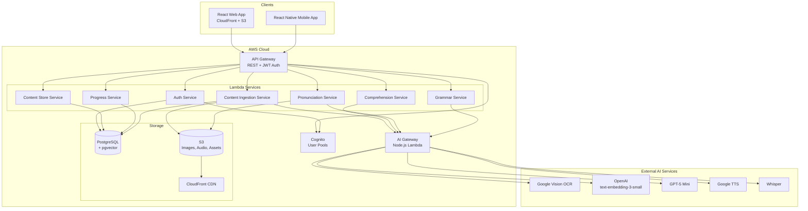
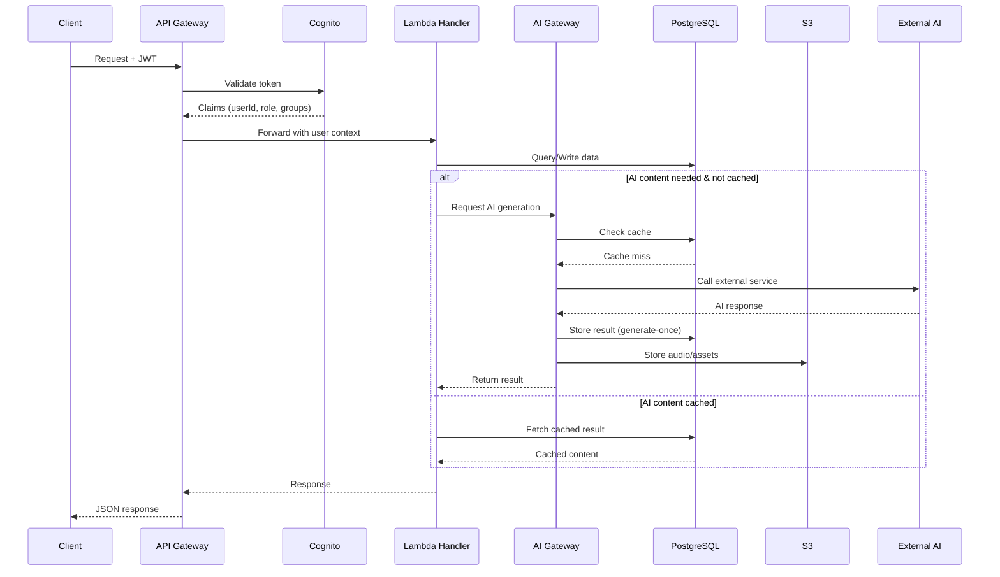
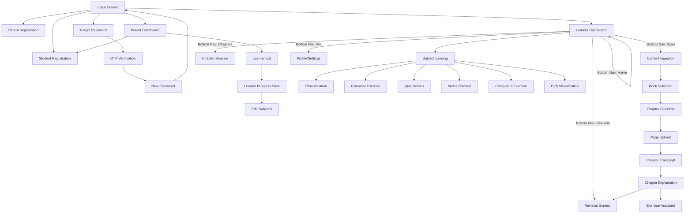
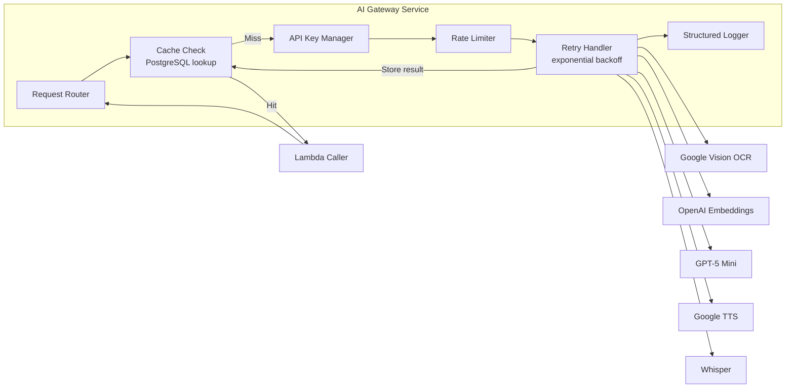

# Design Document: ChikuMiku LearnVerse Learning Platform

## Overview

ChikuMiku LearnVerse is a multi-subject educational platform for children (grades LKG–12) covering Kannada, English, Hindi, Maths, Computers, EVS, and Science — with support for parent-defined custom subjects. The platform delivers interactive learning through pronunciation practice, grammar exercises, timed quizzes, math visual aids, code matching, and science visualizations, backed by AI-powered content ingestion (OCR), chapter explanations, and exercise assistance.

The system is built as a monorepo with:
- **React web app** (packages/platform-web) served via CloudFront
- **React Native mobile app** (packages/platform-mobile) for iOS/Android
- **Node.js Lambda services** (packages/services) grouped by domain
- **AWS CDK infrastructure** (infra/cdk) defining all cloud resources
- **Shared contracts** (packages/platform-contracts) for type-safe API boundaries

### Key Design Decisions

| Decision | Rationale |
|----------|-----------|
| PostgreSQL + pgvector (not DynamoDB) | Relational data, vector similarity search, ACID transactions |
| Generate-once-store-permanently | Reduces AI costs by ~70%; all AI outputs cached after first generation |
| RAG with top-5 paragraphs | Never sends full chapters to LLM; controls token cost and latency |
| Subject Module Framework | Per-subject config objects; adding subjects = configuration, not code |
| Custom AI Gateway | Single point for API key management, caching, rate limiting |
| CDK (TypeScript) | Type-safe infrastructure matching the service language |

## Architecture

### High-Level System Architecture



### Request Flow



## Components and Interfaces

### Backend Service Domains (Lambda Handlers)

| Service | Package | Responsibilities |
|---------|---------|-----------------|
| Auth | `packages/services/auth` | Registration (parent/student), login, password recovery, OTP, JWT refresh |
| Content Store | `packages/services/content-store` | CRUD for subjects, books, chapters, exercises; pagination and filtering |
| Content Ingestion | `packages/services/content-ingestion` | Page upload to S3, OCR via AI Gateway, transcript management, exercise classification |
| Comprehension | `packages/services/comprehension` | Chapter explanations, summaries, revision questions, translations (all generate-once) |
| Progress | `packages/services/sync` | Streak tracking, exercise results, quiz sessions, per-subject progress |
| Pronunciation | `packages/services/pronunciation` | Audio upload, Whisper transcription, scoring, TTS generation |
| Grammar | `packages/services/grammar` | Grammar exercise validation, GPT-5 Mini feedback |
| API Core | `packages/services/core` | Shared middleware: logging, error handling, validation, auth context |

### React Web App Component Hierarchy

```
App
├── AuthProvider (Cognito session, JWT management)
├── ThemeProvider (Design System tokens)
├── NavigationShell
│   ├── TopNavigation (logo, links, avatar)
│   └── Sidebar (subject list + progress indicators)
├── Routes
│   ├── /login → LoginScreen (role selector, credentials)
│   ├── /register/parent → ParentRegistrationForm
│   ├── /register/student → StudentRegistrationForm
│   ├── /forgot-password → PasswordRecoveryFlow
│   ├── /dashboard → Dashboard
│   │   ├── GreetingHeader (name, date, streak)
│   │   ├── SubjectCardGrid (2-col mobile / 3-col web)
│   │   └── RecentActivityPanel
│   ├── /subjects/:subjectId → SubjectLanding
│   ├── /ingest → ContentIngestionScreen
│   │   ├── SubjectSelector
│   │   ├── BookList (+ AddBookDialog)
│   │   └── ChapterList (+ AddChapterDialog)
│   ├── /ingest/:chapterId/upload → PageUploadUI
│   │   ├── CameraCapture / FilePicker / DropZone
│   │   ├── PageThumbnailGrid
│   │   └── ExtractTextButton
│   ├── /chapters/:chapterId/transcript → ChapterTranscript
│   ├── /chapters/:chapterId/explain → ChapterExplanationScreen
│   │   ├── ReadModePanel / ListenModeToggle
│   │   ├── PageNavigation
│   │   ├── RevisionQuestionsButton
│   │   └── SummaryButton
│   ├── /chapters/:chapterId/exercises → ExerciseAssistant
│   ├── /exercises/pronunciation → PronunciationScreen
│   ├── /exercises/grammar → GrammarExerciseScreen
│   ├── /exercises/quiz → QuizScreen
│   ├── /exercises/maths → MathsPracticeScreen
│   ├── /exercises/computers → ComputersExerciseScreen
│   ├── /exercises/evs → EVSVisualizationScreen
│   ├── /parent → ParentDashboard
│   │   ├── LearnerList
│   │   ├── LearnerProgressView
│   │   └── EditSubjectsDialog
│   └── /revision → RevisionScreen
└── ErrorBoundary (global error handling)
```

### Mobile App Screen Flow



### API Endpoint Specifications

| Method | Path | Service | Description |
|--------|------|---------|-------------|
| POST | `/auth/register/parent` | Auth | Register parent account |
| POST | `/auth/register/student` | Auth | Register student under parent |
| POST | `/auth/login` | Auth | Login with role + credentials |
| POST | `/auth/refresh` | Auth | Refresh JWT token |
| POST | `/auth/forgot-password` | Auth | Initiate password recovery |
| POST | `/auth/verify-otp` | Auth | Verify email + phone OTP |
| POST | `/auth/reset-password` | Auth | Set new password after OTP |
| POST | `/auth/logout` | Auth | Persist state and logout |
| GET | `/subjects` | Content Store | List subjects for user |
| GET | `/subjects/:id/books` | Content Store | List books for subject |
| POST | `/subjects/:id/books` | Content Store | Create new book |
| GET | `/books/:id/chapters` | Content Store | List chapters for book |
| POST | `/books/:id/chapters` | Content Store | Create new chapter |
| GET | `/exercises` | Content Store | List exercises (paginated, filtered) |
| POST | `/exercises` | Content Store | Create exercise |
| PUT | `/exercises/:id` | Content Store | Update exercise |
| DELETE | `/exercises/:id` | Content Store | Delete exercise |
| POST | `/chapters/:id/pages` | Content Ingestion | Upload page images |
| POST | `/chapters/:id/extract` | Content Ingestion | Trigger OCR extraction |
| PUT | `/chapters/:id/transcript` | Content Ingestion | Save/edit transcript |
| POST | `/chapters/:id/classify-pages` | Content Ingestion | Confirm exercise pages |
| GET | `/chapters/:id/explanation` | Comprehension | Get/generate explanation |
| POST | `/chapters/:id/explanation/audio` | Comprehension | Generate TTS for explanation |
| POST | `/chapters/:id/revision-questions` | Comprehension | Generate revision questions |
| GET | `/chapters/:id/revision-questions` | Comprehension | Fetch stored revision Qs |
| POST | `/chapters/:id/summary` | Comprehension | Generate chapter summary |
| GET | `/chapters/:id/summary` | Comprehension | Fetch stored summary |
| POST | `/chapters/:id/translate` | Comprehension | Translate explanation |
| POST | `/exercises/:id/hint` | Comprehension | Get RAG-based hint |
| POST | `/exercises/:id/evaluate` | Comprehension | Evaluate student answer |
| GET | `/progress/:studentId` | Progress | Get progress summary |
| GET | `/progress/:studentId/streak` | Progress | Get streak data |
| POST | `/progress/:studentId/exercise-result` | Progress | Record exercise result |
| POST | `/quiz/sessions` | Progress | Create quiz session |
| POST | `/quiz/sessions/:id/answer` | Progress | Submit quiz answer |
| POST | `/quiz/sessions/:id/skip` | Progress | Skip quiz question |
| GET | `/quiz/sessions/:id/result` | Progress | Get session result |
| POST | `/pronunciation/record` | Pronunciation | Upload recording + score |
| GET | `/pronunciation/reference/:wordId` | Pronunciation | Get reference audio URL |
| GET | `/parent/learners` | Auth | List parent's learners |
| PUT | `/parent/learners/:id/subjects` | Auth | Edit learner subjects |

### AI Gateway Architecture



The AI Gateway enforces the **generate-once-store-permanently** pattern:
1. Every AI request includes a deterministic cache key (e.g., `chapter:{id}:page:{n}:explanation`)
2. Gateway checks PostgreSQL `ai_cache` table before calling external services
3. On cache miss: call external service → store response in DB + S3 (for audio) → return
4. On cache hit: return stored result directly
5. Audio assets are stored in S3 and served via CloudFront CDN URLs

## Data Models

### PostgreSQL Database Schema

```sql
-- Users & Authentication
CREATE TABLE parents (
    id UUID PRIMARY KEY DEFAULT gen_random_uuid(),
    username VARCHAR(15) UNIQUE NOT NULL,
    name VARCHAR(20) NOT NULL,
    email VARCHAR(30) UNIQUE NOT NULL,
    phone VARCHAR(10) UNIQUE NOT NULL,
    cognito_sub VARCHAR(128) UNIQUE NOT NULL,
    created_at TIMESTAMPTZ DEFAULT NOW(),
    updated_at TIMESTAMPTZ DEFAULT NOW()
);

CREATE TABLE students (
    id UUID PRIMARY KEY DEFAULT gen_random_uuid(),
    parent_id UUID NOT NULL REFERENCES parents(id),
    username VARCHAR(15) UNIQUE NOT NULL,
    name VARCHAR(20) NOT NULL,
    grade VARCHAR(10) NOT NULL, -- LKG, UKG, First..Twelfth
    school_name VARCHAR(30) NOT NULL,
    cognito_sub VARCHAR(128) UNIQUE NOT NULL,
    created_at TIMESTAMPTZ DEFAULT NOW(),
    updated_at TIMESTAMPTZ DEFAULT NOW()
);

-- Subjects (7 defaults + custom)
CREATE TABLE subjects (
    id UUID PRIMARY KEY DEFAULT gen_random_uuid(),
    name VARCHAR(50) NOT NULL,
    is_default BOOLEAN DEFAULT false,
    color VARCHAR(7) NOT NULL, -- hex color
    icon_name VARCHAR(50),
    created_by UUID REFERENCES parents(id), -- NULL for defaults
    created_at TIMESTAMPTZ DEFAULT NOW()
);

CREATE TABLE student_subjects (
    student_id UUID REFERENCES students(id) ON DELETE CASCADE,
    subject_id UUID REFERENCES subjects(id) ON DELETE CASCADE,
    assigned_at TIMESTAMPTZ DEFAULT NOW(),
    PRIMARY KEY (student_id, subject_id)
);

-- Content hierarchy: Subject → Book → Chapter → Page
CREATE TABLE books (
    id UUID PRIMARY KEY DEFAULT gen_random_uuid(),
    subject_id UUID NOT NULL REFERENCES subjects(id),
    student_id UUID NOT NULL REFERENCES students(id),
    name VARCHAR(200) NOT NULL,
    sequence_number INT NOT NULL,
    created_at TIMESTAMPTZ DEFAULT NOW()
);

CREATE TABLE chapters (
    id UUID PRIMARY KEY DEFAULT gen_random_uuid(),
    book_id UUID NOT NULL REFERENCES books(id) ON DELETE CASCADE,
    name VARCHAR(200) NOT NULL,
    sequence_number INT NOT NULL,
    has_content BOOLEAN DEFAULT false,
    page_count INT DEFAULT 0,
    total_word_count INT DEFAULT 0,
    created_at TIMESTAMPTZ DEFAULT NOW(),
    updated_at TIMESTAMPTZ DEFAULT NOW()
);

CREATE TABLE chapter_pages (
    id UUID PRIMARY KEY DEFAULT gen_random_uuid(),
    chapter_id UUID NOT NULL REFERENCES chapters(id) ON DELETE CASCADE,
    page_number INT NOT NULL,
    s3_image_key VARCHAR(500) NOT NULL,
    extracted_text TEXT,
    word_count INT DEFAULT 0,
    is_exercise_page BOOLEAN DEFAULT false,
    ocr_status VARCHAR(20) DEFAULT 'pending', -- pending, processing, completed, failed
    created_at TIMESTAMPTZ DEFAULT NOW(),
    UNIQUE (chapter_id, page_number)
);
```

```sql
-- Embeddings for RAG
CREATE EXTENSION IF NOT EXISTS vector;

CREATE TABLE chapter_embeddings (
    id UUID PRIMARY KEY DEFAULT gen_random_uuid(),
    chapter_id UUID NOT NULL REFERENCES chapters(id) ON DELETE CASCADE,
    page_number INT NOT NULL,
    paragraph_index INT NOT NULL,
    text_content TEXT NOT NULL,
    embedding vector(1536) NOT NULL, -- text-embedding-3-small dimension
    created_at TIMESTAMPTZ DEFAULT NOW()
);

CREATE INDEX idx_embeddings_vector ON chapter_embeddings 
    USING ivfflat (embedding vector_cosine_ops) WITH (lists = 100);

-- AI Cache (generate-once-store-permanently)
CREATE TABLE ai_cache (
    id UUID PRIMARY KEY DEFAULT gen_random_uuid(),
    cache_key VARCHAR(500) UNIQUE NOT NULL, -- e.g., chapter:{id}:page:{n}:explanation
    service_type VARCHAR(50) NOT NULL, -- ocr, explanation, summary, revision, tts, translation
    request_hash VARCHAR(64) NOT NULL,
    response_json JSONB NOT NULL,
    s3_asset_key VARCHAR(500), -- for audio/binary assets
    created_at TIMESTAMPTZ DEFAULT NOW()
);

-- Exercises & Content
CREATE TABLE exercises (
    id UUID PRIMARY KEY DEFAULT gen_random_uuid(),
    subject_id UUID NOT NULL REFERENCES subjects(id),
    chapter_id UUID REFERENCES chapters(id),
    exercise_type VARCHAR(30) NOT NULL, -- pronunciation, grammar, quiz, maths, code, evs, fill_blank, match, true_false, short_answer
    difficulty_level VARCHAR(10) DEFAULT 'medium', -- easy, medium, hard
    sequence_number INT NOT NULL,
    content JSONB NOT NULL, -- flexible structure per exercise type
    correct_answer JSONB NOT NULL,
    explanation TEXT,
    created_at TIMESTAMPTZ DEFAULT NOW(),
    updated_at TIMESTAMPTZ DEFAULT NOW()
);

-- Pronunciation assets
CREATE TABLE pronunciation_words (
    id UUID PRIMARY KEY DEFAULT gen_random_uuid(),
    subject_id UUID NOT NULL REFERENCES subjects(id),
    word TEXT NOT NULL,
    phonetic_transcription TEXT,
    syllables JSONB, -- ["ka", "nna", "da"]
    reference_audio_s3_key VARCHAR(500),
    language VARCHAR(20) NOT NULL, -- kannada, english, hindi
    created_at TIMESTAMPTZ DEFAULT NOW()
);

-- Progress tracking
CREATE TABLE student_progress (
    id UUID PRIMARY KEY DEFAULT gen_random_uuid(),
    student_id UUID NOT NULL REFERENCES students(id),
    subject_id UUID NOT NULL REFERENCES subjects(id),
    completed_exercises INT DEFAULT 0,
    total_exercises INT DEFAULT 0,
    progress_percentage INT DEFAULT 0, -- 0-100
    updated_at TIMESTAMPTZ DEFAULT NOW(),
    UNIQUE (student_id, subject_id)
);

CREATE TABLE exercise_results (
    id UUID PRIMARY KEY DEFAULT gen_random_uuid(),
    student_id UUID NOT NULL REFERENCES students(id),
    exercise_id UUID NOT NULL REFERENCES exercises(id),
    subject_id UUID NOT NULL REFERENCES subjects(id),
    is_correct BOOLEAN NOT NULL,
    score DECIMAL(5,2),
    answer_given JSONB,
    completed_at TIMESTAMPTZ DEFAULT NOW()
);

CREATE TABLE streaks (
    student_id UUID PRIMARY KEY REFERENCES students(id),
    current_streak INT DEFAULT 0,
    last_activity_date DATE,
    streak_reset_date DATE, -- date when streak was last reset
    updated_at TIMESTAMPTZ DEFAULT NOW()
);

-- Quiz sessions
CREATE TABLE quiz_sessions (
    id UUID PRIMARY KEY DEFAULT gen_random_uuid(),
    student_id UUID NOT NULL REFERENCES students(id),
    subject_id UUID NOT NULL REFERENCES subjects(id),
    question_ids UUID[] NOT NULL,
    timer_duration_seconds INT NOT NULL, -- 30-3600
    started_at TIMESTAMPTZ NOT NULL DEFAULT NOW(),
    ended_at TIMESTAMPTZ,
    total_questions INT NOT NULL,
    correct_answers INT DEFAULT 0,
    score_percentage DECIMAL(5,2),
    status VARCHAR(20) DEFAULT 'active' -- active, completed, abandoned
);

CREATE TABLE quiz_answers (
    id UUID PRIMARY KEY DEFAULT gen_random_uuid(),
    session_id UUID NOT NULL REFERENCES quiz_sessions(id) ON DELETE CASCADE,
    question_id UUID NOT NULL REFERENCES exercises(id),
    selected_option VARCHAR(1), -- A, B, C, D or NULL if skipped
    is_correct BOOLEAN,
    answered_at TIMESTAMPTZ DEFAULT NOW(),
    UNIQUE (session_id, question_id)
);
```

### TypeScript Data Models (Shared Contracts)

```typescript
// packages/platform-contracts/src/models.ts

// === Authentication ===
export interface Parent {
  id: string;
  username: string;
  name: string;
  email: string;
  phone: string;
  createdAt: string;
}

export interface Student {
  id: string;
  parentId: string;
  username: string;
  name: string;
  grade: Grade;
  schoolName: string;
  subjects: SubjectAssignment[];
  createdAt: string;
}

export type Grade = 
  | 'LKG' | 'UKG' | 'First' | 'Second' | 'Third' | 'Fourth'
  | 'Fifth' | 'Sixth' | 'Seventh' | 'Eighth' | 'Ninth' 
  | 'Tenth' | 'Eleventh' | 'Twelfth';

export type Role = 'parent' | 'student';

// === Subjects ===
export interface Subject {
  id: string;
  name: string;
  isDefault: boolean;
  color: string; // hex
  iconName: string;
  createdBy?: string; // parent ID for custom subjects
}

export interface SubjectAssignment {
  subjectId: string;
  subjectName: string;
  color: string;
  assignedAt: string;
}

export const DEFAULT_SUBJECTS: Omit<Subject, 'id'>[] = [
  { name: 'Kannada', isDefault: true, color: '#9B59B6', iconName: 'kannada' },
  { name: 'English', isDefault: true, color: '#5DADE2', iconName: 'english' },
  { name: 'Hindi', isDefault: true, color: '#F7C948', iconName: 'hindi' },
  { name: 'Maths', isDefault: true, color: '#E94F9B', iconName: 'maths' },
  { name: 'Computers', isDefault: true, color: '#4A6CF7', iconName: 'computers' },
  { name: 'EVS', isDefault: true, color: '#27AE60', iconName: 'evs' },
  { name: 'Science', isDefault: true, color: '#4ECDC4', iconName: 'science' },
];

// === Content ===
export interface Book {
  id: string;
  subjectId: string;
  studentId: string;
  name: string;
  sequenceNumber: number;
  chapterCount: number;
}

export interface Chapter {
  id: string;
  bookId: string;
  name: string;
  sequenceNumber: number;
  hasContent: boolean;
  pageCount: number;
  totalWordCount: number;
}

export interface ChapterPage {
  id: string;
  chapterId: string;
  pageNumber: number;
  s3ImageKey: string;
  extractedText?: string;
  wordCount: number;
  isExercisePage: boolean;
  ocrStatus: 'pending' | 'processing' | 'completed' | 'failed';
}

// === AI Content (generate-once) ===
export interface ChapterExplanation {
  chapterId: string;
  pageNumber: number;
  summary: string;
  keyWords: KeyWord[];
  concepts: string;
  audioS3Key?: string;
  audioCdnUrl?: string;
}

export interface KeyWord {
  word: string;
  romanization?: string;
  meaning: string;
  language: string;
}

export interface RevisionQuestion {
  id: string;
  chapterId: string;
  questionType: 'mcq' | 'short_answer' | 'fill_blank';
  questionText: string;
  options?: string[]; // for MCQ
  correctAnswer: string;
  explanation: string;
}

export interface ChapterSummary {
  chapterId: string;
  keyPoints: string[];
  importantConcepts: string[];
  examPreparationNotes: string[];
  generatedAt: string;
}

// === Exercises ===
export type ExerciseType = 
  | 'pronunciation' | 'grammar' | 'quiz' | 'maths' 
  | 'code' | 'evs' | 'fill_blank' | 'match' 
  | 'true_false' | 'short_answer';

export interface Exercise {
  id: string;
  subjectId: string;
  chapterId?: string;
  exerciseType: ExerciseType;
  difficultyLevel: 'easy' | 'medium' | 'hard';
  sequenceNumber: number;
  content: Record<string, unknown>; // type-specific
  correctAnswer: Record<string, unknown>;
  explanation?: string;
}

// === Progress ===
export interface StudentProgress {
  studentId: string;
  subjectId: string;
  completedExercises: number;
  totalExercises: number;
  progressPercentage: number; // 0-100
}

export interface Streak {
  studentId: string;
  currentStreak: number;
  lastActivityDate: string | null;
}

// === Quiz ===
export interface QuizSession {
  id: string;
  studentId: string;
  subjectId: string;
  questionIds: string[];
  timerDurationSeconds: number;
  startedAt: string;
  endedAt?: string;
  totalQuestions: number;
  correctAnswers: number;
  scorePercentage?: number;
  status: 'active' | 'completed' | 'abandoned';
}

export interface QuizAnswer {
  sessionId: string;
  questionId: string;
  selectedOption: 'A' | 'B' | 'C' | 'D' | null;
  isCorrect: boolean;
  answeredAt: string;
}

// === Pronunciation ===
export interface PronunciationWord {
  id: string;
  subjectId: string;
  word: string;
  phoneticTranscription?: string;
  syllables: string[];
  referenceAudioUrl: string;
  language: 'kannada' | 'english' | 'hindi';
}

export interface PronunciationResult {
  wordId: string;
  accuracyScore: number; // 0-100
  syllableResults: SyllableResult[];
}

export interface SyllableResult {
  syllable: string;
  isCorrect: boolean;
}

// === Pagination ===
export interface PaginatedResponse<T> {
  data: T[];
  total: number;
  page: number;
  pageSize: number;
  hasMore: boolean;
}

// === Subject Module Framework ===
export interface SubjectModuleConfig {
  subjectId: string;
  ocrRules: OcrRuleSet;
  promptTemplates: PromptTemplateSet;
  questionTemplates: QuestionTemplate[];
  answerTemplates: AnswerTemplate[];
  revisionTemplates: RevisionTemplate[];
}
```

### Logging Data Model

```typescript
// packages/services/core/src/logging.ts

export type LogSeverity = 'INFO' | 'WARN' | 'ERROR';

export interface StructuredLogEntry {
  timestamp: string; // ISO 8601
  severity: LogSeverity;
  userId: string; // parent or student username
  operationType: string; // login, logout, registration, page_upload, etc.
  resourceType?: string; // subject, book, chapter, page, exercise
  resourceId?: string;
  result: 'success' | 'failure';
  requestPath?: string;
  errorMessage?: string;
  errorStack?: string; // only for ERROR severity
  aiServiceName?: string; // for AI Gateway logs
  retryCount?: number;
  durationMs?: number;
}

// Sensitive data masking rules:
// - Passwords: never logged
// - JWT tokens: never logged
// - OTP values: never logged
// - Emails: masked as "d***@email.com"
```

## Correctness Properties

*A property is a characteristic or behavior that should hold true across all valid executions of a system — essentially, a formal statement about what the system should do. Properties serve as the bridge between human-readable specifications and machine-verifiable correctness guarantees.*

### Property 1: JWT Parsing and Claim Extraction

*For any* valid JWT token containing a user identifier claim, the authentication middleware SHALL extract the correct user identifier; *for any* expired, malformed, or tampered JWT, the middleware SHALL reject the request with a 401 status.

**Validates: Requirements 1.1, 1.5, 18.5**

### Property 2: Registration Input Validation

*For any* registration input (parent or student), the validation logic SHALL accept inputs matching the defined rules (username: 8-15 chars alphanumeric/hyphens/underscores; name: 5-20 chars alphabets/spaces; phone: exactly 10 digits; email: ≤30 chars valid format; password: 8-20 chars with uppercase+lowercase+number+special; school: 5-30 chars; custom subject: 1-50 chars) and SHALL reject all inputs violating any rule, returning field-specific error messages.

**Validates: Requirements 1.14, 1.15, 1.16, 1.17, 1.18, 1.19, 1.20, 1.21, 1.22, 1.23, 1.24, 1.25, 1.26, 1.27, 1.28, 1.29, 1.30**

### Property 3: Form Error State Preservation

*For any* registration form submission that produces validation errors, the form state SHALL preserve all valid field values unchanged and SHALL only display error indicators adjacent to the invalid fields.

**Validates: Requirements 1.44, 1.45, 1.46, 1.47, 1.48, 1.49**

### Property 4: Role-Based Navigation Routing

*For any* authenticated user with a role of "parent", login SHALL navigate to the Parent Dashboard; *for any* authenticated user with a role of "student", login SHALL navigate to the Learner Dashboard.

**Validates: Requirements 1.11, 22.1**

### Property 5: Logout State Round-Trip

*For any* student state (progress percentages, streak count, last viewed chapter/page), persisting state on logout and restoring on re-login SHALL produce an equivalent state.

**Validates: Requirements 1.41, 1.42, 1.43**

### Property 6: Custom Subject Color Non-Conflict

*For any* custom subject created by a parent, the assigned color SHALL NOT equal any of the 7 default subject colors (purple, sky blue, gold, pink, indigo, green, teal) nor any other custom subject color already assigned to that parent's students.

**Validates: Requirements 3.4**

### Property 7: Streak Calculation

*For any* sequence of student activity days, the streak counter SHALL equal the length of the most recent consecutive daily run ending at the current day; *if* the student has not completed any exercise for two consecutive calendar days, the streak SHALL reset to zero on the second missed day; the streak SHALL always be a non-negative integer.

**Validates: Requirements 5.1, 5.2, 5.4, 6.2, 19.3, 19.4**

### Property 8: Subject Filtering — Only Assigned Subjects Displayed

*For any* student with N assigned subjects, the Dashboard and Content Ingestion screens SHALL display exactly N subject entries matching only the assigned subjects, with no unassigned subjects appearing.

**Validates: Requirements 6.3, 7.1**

### Property 9: Dashboard Name Truncation and Date Formatting

*For any* student name, the greeting SHALL display at most 30 characters (truncated if longer); *for any* date, the format SHALL be "Day, DD Month" (e.g., "Monday, 15 January").

**Validates: Requirements 6.1**

### Property 10: Content Name Validation

*For any* book or chapter name, the system SHALL accept names between 1 and 200 characters and SHALL reject names that are empty or exceed 200 characters.

**Validates: Requirements 7.3, 7.5**

### Property 11: Upload Validation Constraints

*For any* uploaded image file, the system SHALL reject files exceeding 10 MB; *for any* chapter, the total page count SHALL never exceed 50; attempts to upload beyond 50 pages SHALL be rejected.

**Validates: Requirements 8.4, 8.5, 8.6**

### Property 12: Word Count Calculation

*For any* extracted text, the per-page word count SHALL equal the count of whitespace-separated tokens; *for any* set of chapter pages, the total word count SHALL equal the sum of all per-page word counts.

**Validates: Requirements 9.3, 9.4**

### Property 13: Transcript Round-Trip

*For any* chapter transcript (original or edited), saving and then retrieving the transcript SHALL produce content identical to what was saved.

**Validates: Requirements 9.5, 9.6**

### Property 14: Generate-Once Idempotence

*For any* AI-generated content request (chapter explanation, TTS audio, revision questions, summary, translation, reference pronunciation), the first request SHALL generate and store the result; all subsequent requests for the same content SHALL return the stored result without invoking the external AI service again.

**Validates: Requirements 10.1, 10.4, 10.10, 10.11, 10.12, 10.13, 10.14, 10.15, 10.16, 12.3, 20.5**

### Property 15: RAG Retrieval Returns Top-5

*For any* hint request with a query embedding, the vector similarity search SHALL return exactly the top 5 most similar paragraphs from the chapter's embeddings, ordered by descending cosine similarity.

**Validates: Requirements 11.5**

### Property 16: Exercise Completion Score Calculation

*For any* set of exercise results containing C correct answers out of T total exercises, the displayed score SHALL equal C and total SHALL equal T.

**Validates: Requirements 11.10, 13.1**

### Property 17: Pronunciation Scoring

*For any* expected word with N syllables and any transcription, the pronunciation score SHALL be a value between 0 and 100 inclusive, and the syllable results array SHALL contain exactly N entries each marked correct or incorrect.

**Validates: Requirements 12.5, 12.6**

### Property 18: Recording Duration Validation

*For any* audio recording with duration less than 0.5 seconds or greater than 15 seconds, the system SHALL return an error indicating invalid recording duration; recordings between 0.5 and 15 seconds (inclusive) SHALL be accepted.

**Validates: Requirements 12.4, 20.6**

### Property 19: Grammar Exercise Progress Format

*For any* grammar exercise at question index N out of total T (where 1 ≤ N ≤ T and 1 ≤ T ≤ 30), the progress display SHALL show "N/T" and the progress bar SHALL show percentage N/T × 100.

**Validates: Requirements 13.1, 13.2**

### Property 20: Quiz Score Calculation

*For any* quiz session where a student answers questions (submitting or skipping), the running score SHALL equal (correct answers / total answered) × 100 as a percentage; the final score SHALL equal (total correct / total questions) × 100; skipped questions SHALL have no recorded answer.

**Validates: Requirements 14.5, 14.6, 14.8, 21.2, 21.3**

### Property 21: Quiz Answer Uniqueness

*For any* quiz session, submitting an answer for a question that has already been answered in that session SHALL be rejected with an error; no question SHALL have more than one recorded answer per session.

**Validates: Requirements 21.4**

### Property 22: Pagination Bounds

*For any* paginated list request, the effective page size SHALL be the requested size clamped to the range [1, 100] with a default of 20 when not specified; the response SHALL contain at most pageSize items.

**Validates: Requirements 18.2**

### Property 23: API Request Validation and Filtering

*For any* API request with missing or invalid required fields, the response SHALL be HTTP 400 with an error identifying the invalid fields; *for any* filter combination applied to exercises, all returned results SHALL match every specified filter criterion; *for any* filter matching zero results, the response SHALL be HTTP 200 with an empty list.

**Validates: Requirements 18.4, 18.6, 18.7**

### Property 24: Progress Percentage Calculation

*For any* student-subject pair where the student has completed C exercises out of T total available, the progress percentage SHALL equal floor(C / T × 100) clamped to the range [0, 100].

**Validates: Requirements 19.2**

### Property 25: Historical Quiz Scores Date Range

*For any* date range query, all returned quiz session results SHALL have timestamps falling within the specified start and end dates, ordered by date descending.

**Validates: Requirements 19.6, 21.5**

### Property 26: Audio Upload Key Uniqueness

*For any* pronunciation recording upload, the generated S3 key SHALL be unique (derived from student ID + subject + timestamp) and SHALL never collide with existing keys.

**Validates: Requirements 20.1**

### Property 27: Parent-Learner Association

*For any* parent with N registered students, the parent dashboard learner list SHALL display exactly N entries; editing subjects for a learner SHALL enforce a minimum of 1 subject remaining selected.

**Validates: Requirements 22.2, 22.6, 22.7**

### Property 28: Structured Logging with Sensitive Data Masking

*For any* log entry produced by the system, it SHALL contain all required fields (timestamp ISO 8601, userId, operationType, result); *for any* log entry, passwords, JWT tokens, and OTP values SHALL never appear in the output; email addresses SHALL be masked in the format "d***@domain.com".

**Validates: Requirements 23.1, 23.2, 23.3, 23.4, 23.5, 23.7**

### Property 29: Maths Input Validation

*For any* numerator or denominator input, the system SHALL accept integer values between 0 and 99 inclusive; *for any* empty, non-integer, or out-of-range input, the system SHALL display a validation message and prevent submission.

**Validates: Requirements 15.2, 15.4**

### Property 30: Computers Exercise Match Validation

*For any* matching exercise with P pairs (3 ≤ P ≤ 8), submitting before completing all matches SHALL report the remaining count (P - matched); after all matches are submitted, each pair SHALL be marked correct (green) or incorrect (red) based on comparison with the correct solution.

**Validates: Requirements 16.2, 16.3, 16.4, 16.5**

### Property 31: EVS Ordering Validation

*For any* EVS ordering exercise with S stages (3 ≤ S ≤ 8), the initial presentation SHALL be in a randomized order different from the correct sequence; after submission, each item SHALL be marked as correctly or incorrectly positioned by comparison with the known correct sequence.

**Validates: Requirements 17.3, 17.4, 17.5, 17.6**

## Error Handling

### Error Handling Strategy

The platform uses a layered error handling approach:

```
┌─────────────────────────────────────────────────────┐
│ Layer 1: Client-Side (React/React Native)           │
│ • Form validation errors (inline, field-adjacent)   │
│ • Network timeout/offline handling                  │
│ • Error boundaries for component crashes            │
│ • Retry with exponential backoff for transient      │
└─────────────────────────────────────────────────────┘
┌─────────────────────────────────────────────────────┐
│ Layer 2: API Gateway                                │
│ • JWT validation failures → 401                     │
│ • Rate limiting → 429                               │
│ • Request validation → 400                          │
│ • CORS policy enforcement                           │
└─────────────────────────────────────────────────────┘
┌─────────────────────────────────────────────────────┐
│ Layer 3: Lambda Handlers (packages/services/core)   │
│ • Input validation → 400 with field details         │
│ • Authorization (role/ownership check) → 403        │
│ • Resource not found → 404                          │
│ • Business logic errors → 422                       │
│ • Unhandled exceptions → 500 (generic message)      │
└─────────────────────────────────────────────────────┘
┌─────────────────────────────────────────────────────┐
│ Layer 4: AI Gateway                                 │
│ • External service timeout → retry (3 attempts)     │
│ • Rate limit from AI provider → queue + backoff     │
│ • Service unavailable → graceful degradation        │
│ • Invalid response → log + return user-friendly err │
└─────────────────────────────────────────────────────┘
┌─────────────────────────────────────────────────────┐
│ Layer 5: Database                                   │
│ • Unique constraint violations → 409 Conflict       │
│ • Connection pool exhaustion → 503 + circuit break  │
│ • Transaction deadlocks → automatic retry (1x)      │
└─────────────────────────────────────────────────────┘
```

### Error Response Format

```typescript
interface ApiErrorResponse {
  statusCode: number;
  error: string;       // machine-readable code: 'VALIDATION_ERROR', 'NOT_FOUND', etc.
  message: string;     // human-readable message
  details?: {
    field?: string;    // which field is invalid
    reason?: string;   // why it's invalid
  }[];
  requestId: string;   // for support/debugging
}
```

### Specific Error Scenarios

| Scenario | Status | Client Behavior |
|----------|--------|-----------------|
| Invalid credentials | 401 | Show error, preserve username, clear password |
| Duplicate username/email/phone | 409 | Show field-specific error message |
| Server error during registration | 500 | Show "try again" message, preserve all fields |
| OTP expired (>10 min) | 400 | Show "OTP expired", offer resend |
| File exceeds 10MB | N/A (client) | Show size error, exclude file |
| Page limit reached (50) | N/A (client) | Disable upload, show limit message |
| OCR fails for one page | 200 (partial) | Show error icon on failed page, display others |
| AI service unavailable | 503 | Show "temporarily unavailable", allow retry |
| Quiz duplicate answer | 409 | Reject silently (answer already recorded) |
| Network offline | N/A (client) | Queue operations, sync on reconnect |

### AI Gateway Resilience

- **Retry policy**: 3 attempts with exponential backoff (1s, 2s, 4s)
- **Circuit breaker**: Opens after 5 consecutive failures to same service; half-open after 30s
- **Timeout**: 30s for OCR, 15s for text generation, 10s for embeddings, 60s for TTS
- **Fallback**: For non-critical paths (translation, summary), return "generation pending" and queue for background processing

## Testing Strategy

### Testing Pyramid

```
         ┌───────────┐
         │  E2E (5%) │  Cypress/Detox: critical user flows
         ├───────────┤
         │Integration│  API tests with real DB, mocked AI
         │   (15%)   │
         ├───────────┤
         │  Property │  fast-check: universal properties (100+ iterations)
         │   (30%)   │
         ├───────────┤
         │   Unit    │  vitest: specific examples, edge cases
         │   (50%)   │
         └───────────┘
```

### Testing Tools

| Tool | Purpose |
|------|---------|
| vitest | Unit test runner (already configured in workspace) |
| fast-check | Property-based testing library (already in devDependencies) |
| happy-dom | DOM simulation for component tests |
| Cypress | E2E web testing |
| Detox | E2E mobile testing |

### Property-Based Testing Configuration

- **Library**: fast-check (v3.22.0, already installed)
- **Minimum iterations**: 100 per property test
- **Tag format**: `Feature: learning-platform-full, Property {N}: {title}`
- **Test location**: `__tests__/*.property.test.ts` in each package

Each of the 31 correctness properties maps to one or more property-based tests:

| Property | Test File Location | Key Generators |
|----------|-------------------|----------------|
| 1: JWT Parsing | `packages/services/auth/__tests__/jwt.property.test.ts` | Random JWT payloads, expired timestamps, malformed strings |
| 2: Registration Validation | `packages/services/auth/__tests__/registration.property.test.ts` | Random strings at boundary lengths, character sets |
| 3: Form Error State | `packages/platform-web/app/__tests__/formState.property.test.ts` | Random form field values with mixed valid/invalid |
| 4: Role Routing | `packages/platform-web/app/__tests__/routing.property.test.ts` | Random users with parent/student roles |
| 5: Logout Round-Trip | `packages/services/sync/__tests__/stateSync.property.test.ts` | Random progress state objects |
| 6: Color Non-Conflict | `packages/services/content-store/__tests__/subjectColors.property.test.ts` | Random color palettes and existing assignments |
| 7: Streak Calculation | `packages/services/sync/__tests__/streak.property.test.ts` | Random activity day sequences |
| 8: Subject Filtering | `packages/services/content-store/__tests__/subjectFilter.property.test.ts` | Random student-subject assignments |
| 9: Name/Date Formatting | `packages/platform-web/app/__tests__/formatting.property.test.ts` | Random names (1-100 chars), random dates |
| 10: Content Name Validation | `packages/services/content-store/__tests__/contentNames.property.test.ts` | Random strings (0-500 chars) |
| 11: Upload Validation | `packages/services/content-ingestion/__tests__/uploadValidation.property.test.ts` | Random file sizes, page counts |
| 12: Word Count | `packages/services/content-ingestion/__tests__/wordCount.property.test.ts` | Random text strings with various whitespace patterns |
| 13: Transcript Round-Trip | `packages/services/content-ingestion/__tests__/transcript.property.test.ts` | Random unicode text content |
| 14: Generate-Once | `packages/services/comprehension/__tests__/caching.property.test.ts` | Random chapter/page IDs, mock AI service |
| 15: RAG Top-5 | `packages/services/comprehension/__tests__/rag.property.test.ts` | Random embedding vectors, varying corpus sizes |
| 16: Exercise Score | `packages/services/sync/__tests__/exerciseScore.property.test.ts` | Random correct/incorrect sequences |
| 17: Pronunciation Scoring | `packages/services/pronunciation/__tests__/scoring.property.test.ts` | Random syllable arrays and transcriptions |
| 18: Recording Duration | `packages/services/pronunciation/__tests__/duration.property.test.ts` | Random durations (0-30s) |
| 19: Grammar Progress | `packages/platform-web/app/__tests__/grammarProgress.property.test.ts` | Random N and T values (1-30) |
| 20: Quiz Score | `packages/services/sync/__tests__/quizScore.property.test.ts` | Random answer sequences with correct/incorrect/skip |
| 21: Answer Uniqueness | `packages/services/sync/__tests__/quizUniqueness.property.test.ts` | Random answer submission sequences with duplicates |
| 22: Pagination | `packages/services/content-store/__tests__/pagination.property.test.ts` | Random page sizes (0-200), data set sizes |
| 23: API Validation | `packages/services/content-store/__tests__/apiValidation.property.test.ts` | Random request payloads with missing/invalid fields |
| 24: Progress Percentage | `packages/services/sync/__tests__/progressCalc.property.test.ts` | Random completed/total pairs |
| 25: Date Range Query | `packages/services/sync/__tests__/dateRange.property.test.ts` | Random date ranges and quiz timestamps |
| 26: Audio Key Uniqueness | `packages/services/pronunciation/__tests__/audioKeys.property.test.ts` | Random student/subject/timestamp combos |
| 27: Parent-Learner | `packages/services/auth/__tests__/parentLearner.property.test.ts` | Random parent-student relationships |
| 28: Logging Masking | `packages/services/core/__tests__/logging.property.test.ts` | Random log entries with embedded sensitive data |
| 29: Maths Input | `packages/platform-web/app/__tests__/mathsInput.property.test.ts` | Random numeric and non-numeric strings |
| 30: Match Validation | `packages/services/content-store/__tests__/matchExercise.property.test.ts` | Random pair orderings (3-8 pairs) |
| 31: EVS Ordering | `packages/services/content-store/__tests__/evsOrdering.property.test.ts` | Random stage sequences (3-8 stages) |

### Unit Testing Strategy

Unit tests focus on:
- **Specific examples**: Concrete test cases for each exercise type rendering
- **Edge cases**: Empty inputs, boundary values (0, 99, max lengths), single-item lists
- **Error conditions**: Network failures, invalid API responses, permission denials
- **UI components**: Snapshot tests for design system compliance, interaction tests

### Integration Testing Strategy

Integration tests verify:
- API endpoints with real PostgreSQL (test container)
- Auth flow with Cognito (local emulator or test pool)
- S3 upload/download (LocalStack)
- AI Gateway with mocked external services
- End-to-end quiz session lifecycle
- Content ingestion pipeline (upload → OCR → transcript → explanation)

### Logging Architecture Testing

```typescript
// Verify structured logging compliance
// packages/services/core/__tests__/logging.property.test.ts

// Property: All log entries have required fields
// Property: Sensitive data never appears in logs
// Property: Severity levels correctly assigned
```

### CI/CD Integration

Tests run in the existing Turborepo pipeline:
- `npm run test:unit` — all unit tests (vitest)
- `npm run test:property` — all property-based tests (vitest + fast-check)
- `npm run test:integration` — integration tests (requires Docker for PostgreSQL)

Property tests are configured with 100 iterations in CI and 1000 iterations for nightly runs.

