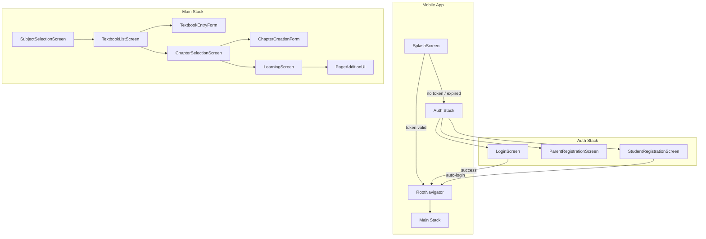
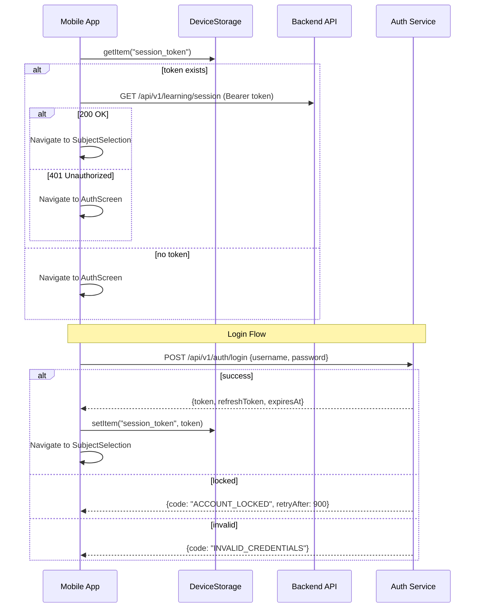

# Design Document: Mobile App UX Improvements

## Overview

This design addresses critical UX gaps in the ChikuMiku LearnVerse mobile and web applications: authentication gating, textbook/chapter content hierarchy, camera-based page capture, and consistent branding. The implementation builds on the existing React Native 0.74 mobile app with React Navigation 6, the Express-style API router, the `@learnverse/service-auth` package (JWT sessions, lockout logic, parental linking), and the `@learnverse/platform-contracts` interfaces (CameraInterface, FileSystemInterface, DeviceStorageInterface).

### Key Design Decisions

1. **Auth-first navigation** — The navigator conditionally renders an auth stack or the main stack based on token presence in `DeviceStorageInterface`, avoiding deep-link conflicts.
2. **Textbook as an intermediate entity** — Subjects own textbooks; textbooks own chapters. This mirrors physical study material organization and enables future multi-textbook support per subject.
3. **Platform contracts for camera/gallery** — Page capture uses `CameraInterface` and `FileSystemInterface` from `@learnverse/platform-contracts`, keeping the learning screen platform-agnostic.
4. **Splash screen with timeout safety** — A 1–5 second branded splash handles token validation; if initialization fails within 5 seconds, the app falls through to the auth screen gracefully.

## Architecture





## Components and Interfaces

### 1. Authentication Components

| Component | Location | Responsibility |
|-----------|----------|---------------|
| `SplashScreen` | `rn-app/src/screens/SplashScreen.tsx` | Display logo, validate stored token, route to auth or main |
| `LoginScreen` | `rn-app/src/screens/LoginScreen.tsx` | Username/password login form with lockout display |
| `ParentRegistrationScreen` | `rn-app/src/screens/ParentRegistrationScreen.tsx` | Parent account creation (name, username, phone, email) |
| `StudentRegistrationScreen` | `rn-app/src/screens/StudentRegistrationScreen.tsx` | Student account creation linked to parent username |
| `AuthContext` | `rn-app/src/context/AuthContext.tsx` | React context managing token state and auth API calls |
| `useAuth` hook | `rn-app/src/hooks/useAuth.ts` | Exposes login, register, logout, isAuthenticated |

### 2. Textbook & Chapter Components

| Component | Location | Responsibility |
|-----------|----------|---------------|
| `TextbookListScreen` | `rn-app/src/screens/TextbookListScreen.tsx` | List textbooks for a subject; option to add new |
| `TextbookEntryForm` | `rn-app/src/components/TextbookEntryForm.tsx` | Modal/form for entering textbook name (max 200 chars) |
| `ChapterCreationForm` | `rn-app/src/components/ChapterCreationForm.tsx` | Modal/form for entering chapter name (max 200 chars) |

### 3. Page Addition Components

| Component | Location | Responsibility |
|-----------|----------|---------------|
| `PageAdditionUI` | `rn-app/src/components/PageAdditionUI.tsx` | Camera + gallery buttons in LearningScreen |
| `ImagePreview` | `rn-app/src/components/ImagePreview.tsx` | Preview captured/selected image with accept/retake |
| `CameraCapture` | Uses `CameraInterface` from platform-contracts | Opens native camera, returns JPEG data |
| `GalleryPicker` | Uses `FileSystemInterface` from platform-contracts | Opens file picker filtered to JPEG/PNG, max 10 MB |

### 4. Branding Components

| Component | Location | Responsibility |
|-----------|----------|---------------|
| `SplashScreen` | (shared with auth) | Centered logo on white background |
| `HeaderLogo` | `rn-app/src/components/HeaderLogo.tsx` | Logo in navigation bar header |
| `WebHeaderLogo` | `platform-web/app/src/components/HeaderLogo.tsx` | Logo in web navigation/header |
| Android app icon | `rn-app/android/app/src/main/res/` | Generated from `LearnVerse-LearnVerse-Logo.png` |
| Web favicon | `platform-web/app/public/favicon.ico` | Generated from `LearnVerse-LearnVerse-Logo.png` |

### 5. New API Endpoints

| Method | Path | Auth | Description |
|--------|------|------|-------------|
| POST | `/api/v1/auth/login` | No | Login with username + password |
| POST | `/api/v1/auth/register/parent` | No | Register parent account |
| POST | `/api/v1/auth/register/student` | No | Register student account (links to parent) |
| POST | `/api/v1/auth/forgot-password` | No | Initiate password recovery |
| GET | `/api/v1/auth/validate` | Yes | Validate current token |
| GET | `/api/v1/subjects/:subjectId/textbooks` | Yes | List textbooks for a subject |
| POST | `/api/v1/subjects/:subjectId/textbooks` | Yes | Create a textbook under a subject |
| GET | `/api/v1/textbooks/:textbookId/chapters` | Yes | List chapters for a textbook |
| POST | `/api/v1/textbooks/:textbookId/chapters` | Yes | Create a chapter under a textbook |
| POST | `/api/v1/chapters/:chapterId/pages` | Yes | Upload a page image to a chapter |

### 6. Updated Navigation Structure

```typescript
// RootNavigator decision logic
type RootStackParamList = {
  Splash: undefined;
  Auth: undefined;
  Main: undefined;
};

type AuthStackParamList = {
  Login: undefined;
  ParentRegistration: undefined;
  StudentRegistration: undefined;
  ForgotPassword: undefined;
};

type MainStackParamList = {
  SubjectSelection: undefined;
  TextbookList: { subjectId: string };
  ChapterSelection: { subjectId: string; textbookId: string; chapters: ChapterSummary[] };
  Learning: { subjectId: string; textbookId: string; chapterId: string | null };
};
```

## Data Models

### Authentication Models

```typescript
interface ParentAccount {
  id: string;                    // UUID
  name: string;                  // max 100 chars
  username: string;              // 5-15 chars, alphanumeric + underscores + hyphens
  phoneNumber: string;           // exactly 10 digits, no country code
  email: string;                 // valid email, max 254 chars
  passwordHash: string;
  linkedStudentIds: string[];
  createdAt: Date;
  updatedAt: Date;
}

interface StudentAccount {
  id: string;                    // UUID
  name: string;                  // max 100 chars
  username: string;              // 5-15 chars, alphanumeric + underscores + hyphens
  passwordHash: string;
  grade: number;                 // 1-12
  parentUsername: string;        // references ParentAccount.username
  parentAccountId: string;       // references ParentAccount.id
  createdAt: Date;
  updatedAt: Date;
}

interface SessionToken {
  token: string;                 // JWT
  refreshToken: string;
  expiresAt: Date;               // minimum 30 days from issuance
  userId: string;                // parent or student ID
  userType: 'parent' | 'student';
}
```

### Content Hierarchy Models

```typescript
interface Textbook {
  id: string;                    // UUID
  subjectId: string;             // references enrolled subject
  learnerId: string;             // owner
  name: string;                  // 1-200 chars, non-empty after trim
  chapters: Chapter[];
  createdAt: Date;
  updatedAt: Date;
}

interface Chapter {
  id: string;                    // UUID
  textbookId: string;            // references Textbook.id
  name: string;                  // 1-200 chars, non-empty after trim
  pages: Page[];
  chapterNumber: number;         // auto-incremented within textbook
  createdAt: Date;
  updatedAt: Date;
}

interface Page {
  id: string;                    // UUID
  chapterId: string;             // references Chapter.id
  imageUri: string;              // stored image path/URL
  imageSizeBytes: number;        // max 10 MB (10_485_760 bytes)
  imageFormat: 'jpeg' | 'png';
  pageNumber: number;            // auto-incremented within chapter
  createdAt: Date;
}
```

### Validation Rules Summary

| Field | Rule |
|-------|------|
| Username | 5-15 chars, `/^[a-zA-Z0-9_-]+$/` |
| Password | 8-20 chars, at least 1 uppercase + 1 lowercase + 1 special char + 1 digit |
| Name | 1-100 chars, non-empty after trim |
| Phone | exactly 10 digits, no country code |
| Email | max 254 chars, contains `@` and domain |
| Textbook name | 1-200 chars, non-empty after trim |
| Chapter name | 1-200 chars, non-empty after trim |
| Page image | JPEG or PNG, max 10 MB |


## Correctness Properties

*A property is a characteristic or behavior that should hold true across all valid executions of a system — essentially, a formal statement about what the system should do. Properties serve as the bridge between human-readable specifications and machine-verifiable correctness guarantees.*

### Property 1: Invalid auth state routes to auth screen

*For any* token state that is missing, expired, or invalid (including network validation failure), the navigator resolution logic SHALL return the auth screen as the target route.

**Validates: Requirements 1.1, 1.3**

### Property 2: Username validation

*For any* string input, the username validator SHALL accept the input if and only if it matches the pattern `/^[a-zA-Z0-9_-]{5,15}$/` (alphanumeric, underscores, and hyphens, 5 to 15 characters inclusive).

**Validates: Requirements 3.2, 3.9**

### Property 3: Password validation

*For any* string input, the password validator SHALL accept the input if and only if its length is between 8 and 20 characters inclusive, it contains at least one uppercase letter (`[A-Z]`), at least one lowercase letter (`[a-z]`), at least one digit (`[0-9]`), and at least one special character (not alphanumeric and not whitespace).

**Validates: Requirements 3.8**

### Property 4: Email and phone number validation

*For any* string input, the email validator SHALL accept if and only if the string contains an `@` symbol followed by a domain with at least one dot, the total length does not exceed 254 characters, and it is non-empty. The phone validator SHALL accept if and only if the string contains exactly 10 digits (no country code, no other characters).

**Validates: Requirements 3.3**

### Property 5: Content name validation (textbook and chapter names)

*For any* string input, the content name validator SHALL accept the input if and only if the trimmed string has a length between 1 and 200 characters inclusive.

**Validates: Requirements 4.2, 4.6**

### Property 6: Successful authentication routes to main screen

*For any* successful authentication result (whether from login or student registration auto-login), the navigator SHALL resolve to the subject selection screen as the next route.

**Validates: Requirements 2.3, 3.11**

### Property 7: Login error preserves username and clears password

*For any* login attempt that results in an authentication error (invalid credentials, lockout, or server error), the form state SHALL preserve the entered username value, clear the password field to an empty string, and contain a non-empty error message.

**Validates: Requirements 2.4**

### Property 8: Registration validation produces field-specific errors

*For any* set of registration form inputs where at least one field fails validation, the validation result SHALL contain an error entry for each invalid field identifying that specific field, while all valid field values are preserved in the result.

**Validates: Requirements 3.6, 3.14**

### Property 9: Form preservation on backend or validation error

*For any* textbook or chapter creation form submission that results in a backend error or client-side validation failure, all previously entered field values SHALL be preserved in the form state and the form SHALL remain visible (not dismissed).

**Validates: Requirements 4.9, 4.10**

### Property 10: Accepting a valid image adds exactly one page

*For any* valid image (JPEG or PNG format, size ≤ 10 MB) that is accepted by the learner after preview, the chapter's page collection SHALL increase in length by exactly one, and the new page SHALL reference the accepted image data.

**Validates: Requirements 5.5**

### Property 11: Invalid image operations do not modify chapter pages

*For any* image upload that fails (backend error, network timeout) or any file selection that exceeds the 10 MB size limit, the chapter's page collection SHALL remain unchanged (same length and same contents as before the operation).

**Validates: Requirements 5.12, 5.14**

### Property 12: Splash screen duration is clamped between 1 and 5 seconds

*For any* app initialization duration `d` (in seconds), the splash screen visibility duration SHALL equal `max(1, min(d, 5))` — never less than 1 second and never more than 5 seconds.

**Validates: Requirements 6.2**

### Property 13: File size gate for image selection

*For any* file selected from the gallery, if the file size is ≤ 10 MB (10,485,760 bytes) and the format is JPEG or PNG, the system SHALL display a preview. If the file size exceeds 10 MB, the system SHALL reject the selection with an error message and not display a preview.

**Validates: Requirements 5.11, 5.14**

## Error Handling

### Authentication Errors

| Error Condition | User-Facing Behavior | Recovery |
|----------------|---------------------|----------|
| Invalid credentials | Show "Invalid username or password", preserve username, clear password | User re-enters password |
| Account locked (3 failures) | Show lockout message with 15-minute timer, disable submit | Auto-re-enable after lockout expires |
| Network unavailable (login) | Show "Network connection required", preserve all fields | User retries when connected |
| Token expired mid-session | Redirect to auth screen with "Session ended" message; attempt to save unsaved input | User re-authenticates |
| Network error (token validation) | Show auth screen with "Connection problem" message | User retries |

### Registration Errors

| Error Condition | User-Facing Behavior | Recovery |
|----------------|---------------------|----------|
| Duplicate username/email/phone | Show field-specific error identifying duplicate, preserve other fields | User changes duplicate field |
| Parent username not found | Show "Parent username does not exist", preserve other fields | User corrects parent username |
| Network timeout (30s) | Show connectivity error, re-enable submit, preserve all fields | User retries |
| Validation failure | Show per-field error messages adjacent to invalid fields | User corrects invalid fields |

### Content Creation Errors

| Error Condition | User-Facing Behavior | Recovery |
|----------------|---------------------|----------|
| Textbook/chapter name empty or >200 chars | Inline validation error, form stays open | User corrects input |
| Backend creation failure | Show error message, form stays open with values preserved | User retries or cancels |
| Image capture hardware failure | Show error, return to learning screen, existing pages intact | User retries or uses gallery |
| Image upload failure | Remove local page association, show upload error | User retries capture/selection |
| File exceeds 10 MB | Show "File exceeds 10 MB limit" error, return to learning screen | User selects smaller file |
| Camera permission denied | Show message with guidance to enable in device settings | User enables in settings |
| Gallery permission denied | Show message with guidance to enable in device settings | User enables in settings |

### Branding Errors

| Error Condition | User-Facing Behavior | Recovery |
|----------------|---------------------|----------|
| Logo fails to load (web) | Display "ChikuMiku LearnVerse" text fallback | Automatic fallback |
| Initialization timeout (5s) | Transition to auth screen with loading error message | User retries or proceeds |

## Testing Strategy

### Property-Based Tests (using fast-check)

Property-based tests validate universal correctness properties across randomized inputs. Each test runs a minimum of **100 iterations** using the `fast-check` library (already compatible with the project's TypeScript + Vitest setup).

**Configuration:**
- Library: `fast-check` (TypeScript PBT library)
- Runner: Vitest
- Minimum iterations: 100 per property
- Tag format: `Feature: mobile-app-ux-improvements, Property N: <title>`

**Properties to implement:**

| # | Property | Target Module |
|---|----------|---------------|
| 1 | Invalid auth state → auth screen | `rn-app/src/navigation/routeResolver.ts` |
| 2 | Username validation | `services/auth/src/registration.ts` |
| 3 | Password validation | `services/auth/src/registration.ts` |
| 4 | Email and phone validation | `services/auth/src/registration.ts` |
| 5 | Content name validation | `services/core/src/textbook.ts` |
| 6 | Successful auth → main screen | `rn-app/src/navigation/routeResolver.ts` |
| 7 | Login error preserves username, clears password | `rn-app/src/screens/LoginScreen.tsx` (state logic) |
| 8 | Registration validation field-specific errors | `services/auth/src/registration.ts` |
| 9 | Form preservation on error | `rn-app/src/components/TextbookEntryForm.tsx` (state logic) |
| 10 | Accepting valid image adds one page | `services/core/src/pageManagement.ts` |
| 11 | Invalid image operations don't modify chapter | `services/core/src/pageManagement.ts` |
| 12 | Splash duration clamped | `rn-app/src/screens/SplashScreen.tsx` (timer logic) |
| 13 | File size gate | `rn-app/src/components/PageAdditionUI.tsx` (validation logic) |

### Unit Tests (example-based)

Unit tests cover specific scenarios, edge cases, and UI component rendering:

- **Auth flow**: Default login mode rendering, forgot password link presence, lockout timer display
- **Registration**: Form field rendering with max lengths, grade picker options 1-12
- **Textbook/chapter flow**: List rendering when textbooks exist, "Add Chapter" button behavior, cancel behavior
- **Page addition**: Camera button hidden when unavailable, permission request on tap, preview display
- **Branding**: Logo centered on splash, logo in nav header, text fallback on image error

### Integration Tests

- **End-to-end auth flow**: Register parent → register student → auto-login → subject selection
- **Content hierarchy**: Create textbook → create chapter → add page via camera → verify page stored
- **Session expiry**: Active session → token expires → redirect to auth → re-login → state restored
- **API contract tests**: Verify each new endpoint returns correct response shapes and error codes
