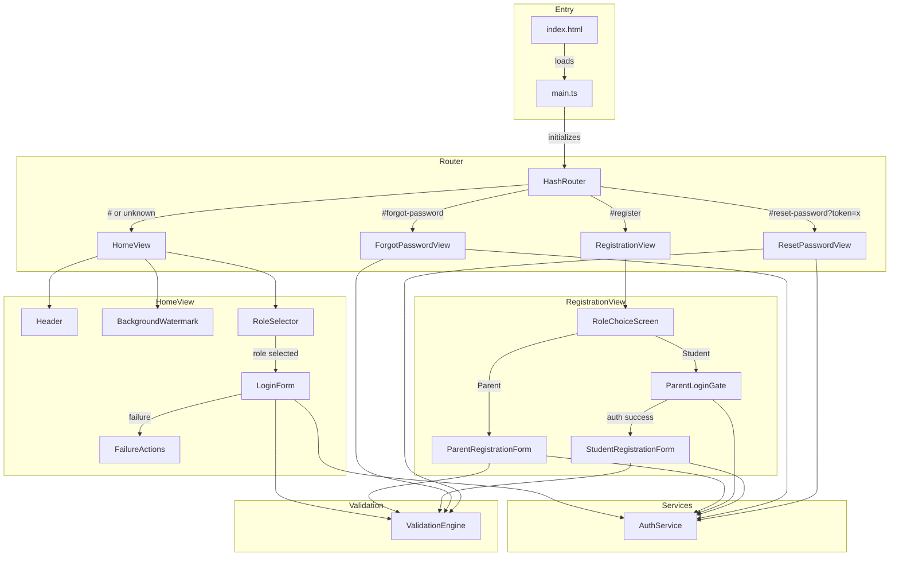

# Design Document: Registration and Password Reset

## Overview

This design extends the ChikuMiku LearnVerse web application with role-based login, conditional registration (parent-direct, student-via-parent), and password reset flows. All new views integrate with the existing hash-based routing and factory-function component pattern (vanilla TypeScript + DOM manipulation).

Key design decisions:
1. **Hash-based router** — A lightweight router listening to `hashchange` events replaces the current inline rendering in `main.ts`, swapping view elements in a single mount point.
2. **Declarative validation engine** — A reusable module accepting an array of field rules, returning structured error results. Keeps validation logic separate from UI.
3. **Multi-step registration state** — Managed via a simple state object held in closure by the registration view factory; no external store needed.
4. **Mock-ready service layer** — New `AuthService` functions return `Promise` results with a consistent shape, defaulting to simulated responses until the backend is ready.

## Architecture



### Design Decisions

| Decision | Rationale |
|----------|-----------|
| Single mount-point router | Keeps `main.ts` minimal; views are swapped in a container element. Avoids full page reloads. |
| Validation engine as pure functions | Testable without DOM, reusable across all forms, easy to property-test. |
| Registration state in closure | No global store needed for a linear flow with at most one parent token to carry forward. |
| AuthService returns `Result` objects | Avoids throwing in async paths; callers handle success/error uniformly. |
| Existing `escapeHtml` for all dynamic text | Prevents XSS when rendering API error messages or user-derived values. |

## Components and Interfaces

### HashRouter

```typescript
interface Route {
  pattern: RegExp;
  handler: (params: Record<string, string>) => HTMLElement;
}

interface RouterOptions {
  mountPoint: HTMLElement;
  routes: Route[];
  fallback: () => HTMLElement;
}

function createRouter(options: RouterOptions): { destroy: () => void };
```

Responsibilities:
- Listens to `hashchange` and initial `DOMContentLoaded`
- Matches `window.location.hash` against route patterns
- Clears mount point and appends the matched handler's returned element
- Falls back to home view for unrecognized hashes

### HomeView

```typescript
function createHomeView(): HTMLElement;
```

Assembles Header, BackgroundWatermark, RoleSelector → LoginForm → FailureActions.

### RoleSelector

```typescript
type UserRole = 'parent' | 'student';

interface RoleSelectorOptions {
  onRoleSelected: (role: UserRole) => void;
}

function createRoleSelector(options: RoleSelectorOptions): HTMLElement;
```

Responsibilities:
- Renders a fieldset with two radio buttons ("Parent", "Student") and a visible legend
- Fires `onRoleSelected` on change

### LoginForm (refactored)

```typescript
interface LoginFormOptions {
  role: UserRole;
  onSubmit: (username: string, password: string, role: UserRole) => Promise<void>;
  onForgotPassword: () => void;
  onRegister: () => void;
}

function createLoginForm(options: LoginFormOptions): HTMLElement;
```

Responsibilities:
- Username + password inputs with labels
- Submit button with loading state
- On submission failure: shows error message + FailureActions ("Register", "Reset Password" links)
- FailureActions hidden until first failure

### RegistrationView

```typescript
function createRegistrationView(): HTMLElement;
```

Manages internal state machine:
1. RoleChoiceScreen → user picks Parent or Student
2. If Parent → ParentRegistrationForm
3. If Student → ParentLoginGate → (on success) → StudentRegistrationForm

### RoleChoiceScreen

```typescript
interface RoleChoiceScreenOptions {
  onChoice: (choice: 'parent' | 'student') => void;
}

function createRoleChoiceScreen(options: RoleChoiceScreenOptions): HTMLElement;
```

### ParentRegistrationForm

```typescript
interface ParentRegistrationFormOptions {
  onSuccess: () => void;
}

function createParentRegistrationForm(options: ParentRegistrationFormOptions): HTMLElement;
```

Fields: username, name, phone, email, password. Submit → validate → call `registerParent` → show success → navigate to `#` after 3s.

### ParentLoginGate

```typescript
interface ParentLoginGateOptions {
  onAuthenticated: (parentUsername: string, token: string) => void;
}

function createParentLoginGate(options: ParentLoginGateOptions): HTMLElement;
```

Minimal login form (username + password). On success, passes parent credentials to callback.

### StudentRegistrationForm

```typescript
interface StudentRegistrationFormOptions {
  parentUsername: string;
  parentToken: string;
  onSuccess: () => void;
}

function createStudentRegistrationForm(options: StudentRegistrationFormOptions): HTMLElement;
```

Fields: parent username (read-only), student username, name, grade dropdown, school name. Submit → validate → call `registerStudent` with auth token → show success → navigate to `#` after 3s.

### ForgotPasswordView

```typescript
function createForgotPasswordView(): HTMLElement;
```

Single input ("Parent Username or Email"), helper text, submit. Calls `forgotPassword`. Shows confirmation on success.

### ResetPasswordView

```typescript
function createResetPasswordView(token: string): HTMLElement;
```

New Password + Confirm Password. Validates match + strength. Calls `resetPassword` with token.

## Data Models

### Shared Types

```typescript
type UserRole = 'parent' | 'student';

interface ServiceResult<T = void> {
  success: boolean;
  data?: T;
  error?: string;
}
```

### Login

```typescript
interface LoginRequest {
  username: string;
  password: string;
  role: UserRole;
}

interface LoginSuccessData {
  token: string;
  username: string;
}
```

### Parent Registration

```typescript
interface ParentRegistrationRequest {
  username: string;
  name: string;
  phone: string;
  email: string;
  password: string;
}
```

### Student Registration

```typescript
interface StudentRegistrationRequest {
  parentUsername: string;
  studentUsername: string;
  name: string;
  grade: string;
  schoolName: string;
}
```

### Forgot Password

```typescript
interface ForgotPasswordRequest {
  identifier: string; // parent username or email
}
```

### Reset Password

```typescript
interface ResetPasswordRequest {
  token: string;
  newPassword: string;
}
```

### Validation

```typescript
type ValidatorFn = (value: string) => string | null; // null = valid, string = error message

interface FieldRule {
  fieldName: string;
  validators: ValidatorFn[];
}

interface ValidationResult {
  valid: boolean;
  errors: Record<string, string>; // fieldName → first error message
}

function validate(rules: FieldRule[], values: Record<string, string>): ValidationResult;
```

### AuthService Extensions

```typescript
// Existing
function loginUser(username: string, password: string): Promise<LoginResult>;

// New functions
function loginWithRole(username: string, password: string, role: UserRole): Promise<ServiceResult<LoginSuccessData>>;
function registerParent(data: ParentRegistrationRequest): Promise<ServiceResult>;
function registerStudent(data: StudentRegistrationRequest, token: string): Promise<ServiceResult>;
function forgotPassword(identifier: string): Promise<ServiceResult>;
function resetPassword(token: string, newPassword: string): Promise<ServiceResult>;
```

All new functions will return mock success responses until the backend is implemented, with a configurable delay to simulate network latency.


## Correctness Properties

*A property is a characteristic or behavior that should hold true across all valid executions of a system — essentially, a formal statement about what the system should do. Properties serve as the bridge between human-readable specifications and machine-verifiable correctness guarantees.*

### Property 1: Length validator accepts if and only if string length is within bounds

*For any* string `s` and any valid bounds `[min, max]` where `min <= max`, the length validator configured with `(min, max)` SHALL return `null` (valid) if and only if `min <= s.length <= max`, and SHALL return a non-null error message otherwise.

**Validates: Requirements 4.1, 4.3, 4.5, 4.7, 8.1, 8.3, 8.5, 11.2**

### Property 2: Character-set validator accepts if and only if all characters match the allowed pattern

*For any* string `s` and any allowed-character regex pattern `p`, the charset validator configured with pattern `p` SHALL return `null` (valid) if and only if every character in `s` matches `p`, and SHALL return a non-null error message if any character does not match.

**Validates: Requirements 4.2, 4.4, 4.8, 8.2, 8.4, 8.6, 11.3**

### Property 3: Email validator rejects strings that exceed max length or lack valid email structure

*For any* string `s`, the email validator SHALL return `null` (valid) if and only if `s.length <= 30` AND `s` matches a valid email format (contains exactly one `@` with non-empty local and domain parts). Otherwise it SHALL return a non-null error message.

**Validates: Requirements 4.6**

### Property 4: Password match validator rejects if and only if the two strings differ

*For any* two strings `a` and `b`, the password-match validator SHALL return `null` (valid) if and only if `a === b`, and SHALL return a non-null error message if `a !== b`.

**Validates: Requirements 11.4**

### Property 5: Router renders fallback view for any unrecognized hash

*For any* hash string that does not match the defined route patterns (`#register`, `#forgot-password`, `#reset-password?token=...`), the router SHALL render the Home_Page (fallback) view.

**Validates: Requirements 12.4**

### Property 6: Validation engine returns errors only for fields that fail rules

*For any* set of field rules and any values map, the `validate` function SHALL return `valid: true` with an empty errors record if and only if all validators pass for all fields. If any validator fails, `valid` SHALL be `false` and `errors` SHALL contain exactly the fields whose first failing validator produced a message.

**Validates: Requirements 4.1, 4.2, 4.3, 4.4, 4.5, 4.6, 4.7, 4.8, 4.9, 8.1, 8.2, 8.3, 8.4, 8.5, 8.6, 8.7, 8.8, 11.2, 11.3, 11.4**

### Property 7: Phone number validator accepts exactly 10-digit strings

*For any* string `s`, the phone validator SHALL return `null` (valid) if and only if `s` matches the pattern `/^\d{10}$/` (exactly 10 numeric digits with no other characters).

**Validates: Requirements 4.5**

## Error Handling

| Scenario | Behavior | Priority |
|----------|----------|----------|
| Empty/invalid fields on submit | Inline validation errors shown per-field with `aria-describedby` | Lowest |
| API returns 4xx (business error) | Display API error message below form; hide any inline validation errors | Highest |
| API returns 5xx (server error) | Display "Something went wrong. Please try again." | Highest |
| Network failure (fetch throws) | Display "Unable to connect. Please check your internet connection." | Highest |
| Token missing/invalid on reset-password route | Display error message from API when form is submitted | — |
| Navigation after success fails (hash change blocked) | Show "Go to Login" fallback link | — |

**Error priority rule**: API errors always take precedence over inline validation errors. When an API error is displayed and the user resubmits with invalid input, the API error is cleared and inline validation errors are shown. When the API responds with an error, any visible inline validation errors are hidden.

**Error message rendering**: All error messages (from API or validation) are passed through `escapeHtml()` before DOM insertion to prevent XSS.

**Loading state contract**: While any async operation is in progress, the submit button is disabled and shows a loading indicator. The loading state persists until the Promise resolves or rejects — no early cancellation.

## Testing Strategy

### Unit Tests (Vitest + jsdom)

Unit tests verify specific DOM structure, interactions, and integration points:

**Router tests:**
- Known routes render correct views
- Hash changes swap views without page reload
- Token parameter is extracted from reset-password hash

**HomeView tests:**
- Role selector renders with two radio buttons inside fieldset/legend
- Selecting a role shows the login form
- Login form shows username/password inputs with labels
- Submit triggers API call with correct payload (username, password, role)
- Loading state disables button
- Failed login shows error message + failure actions
- Failure actions navigate to correct hashes

**Registration tests:**
- Role choice screen renders two options
- Parent selection shows parent registration form
- Student selection shows parent login gate
- Parent form has all required fields with labels
- Student form has read-only parent username with aria-readonly
- Success responses show message + navigate after 3s with fallback link
- Error responses display below form
- Parent login gate stores token and transitions to student form

**Password reset tests:**
- Forgot password view renders input + helper text + submit button
- Reset password view renders two password fields
- Success messages and navigation work correctly
- API error hides inline validation errors (error priority)

**Accessibility tests:**
- All inputs have labels with matching for/id
- Error messages linked via aria-describedby
- Radio groups use fieldset/legend
- Read-only field has aria-readonly="true"
- Tab order is logical across all views

### Property-Based Tests (Vitest + fast-check)

Property-based tests verify universal correctness of the validation engine and router logic. Each test runs a minimum of 100 iterations.

**Test file:** `src/validation/ValidationEngine.property.test.ts`

| Property | Test Description | Tag |
|----------|-----------------|-----|
| 1 | Generate random strings and bounds, verify length validator accepts iff within bounds | **Feature: registration-and-password-reset, Property 1: Length validator accepts if and only if string length is within bounds** |
| 2 | Generate random strings and charset patterns, verify charset validator accepts iff all chars match | **Feature: registration-and-password-reset, Property 2: Character-set validator accepts if and only if all characters match the allowed pattern** |
| 3 | Generate random strings, verify email validator accepts iff ≤30 chars AND valid format | **Feature: registration-and-password-reset, Property 3: Email validator rejects strings that exceed max length or lack valid email structure** |
| 4 | Generate random string pairs, verify match validator accepts iff strings are equal | **Feature: registration-and-password-reset, Property 4: Password match validator rejects if and only if the two strings differ** |
| 5 | Generate random hash strings (excluding known patterns), verify router renders fallback | **Feature: registration-and-password-reset, Property 5: Router renders fallback view for any unrecognized hash** |
| 6 | Generate random field values with known rules, verify validate() output correctness | **Feature: registration-and-password-reset, Property 6: Validation engine returns errors only for fields that fail rules** |
| 7 | Generate random strings, verify phone validator accepts iff exactly 10 digits | **Feature: registration-and-password-reset, Property 7: Phone number validator accepts exactly 10-digit strings** |

**Test file:** `src/router/HashRouter.property.test.ts` (for Property 5)

### Test Configuration

- Library: `fast-check` for property-based testing
- Runner: Vitest with `@vitest/environment-jsdom`
- Minimum iterations: 100 per property test
- Each property test tagged with a comment referencing its design property
- Validation engine tests are pure-function tests (no DOM required for Properties 1–4, 6–7)
- Router test (Property 5) requires jsdom for DOM mounting
