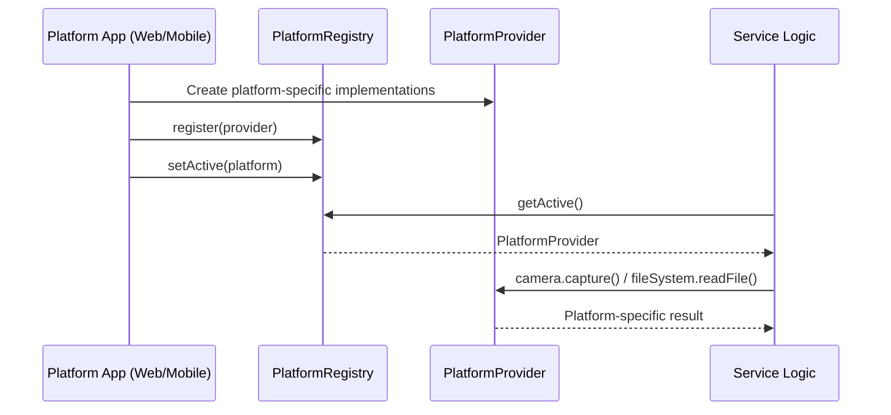
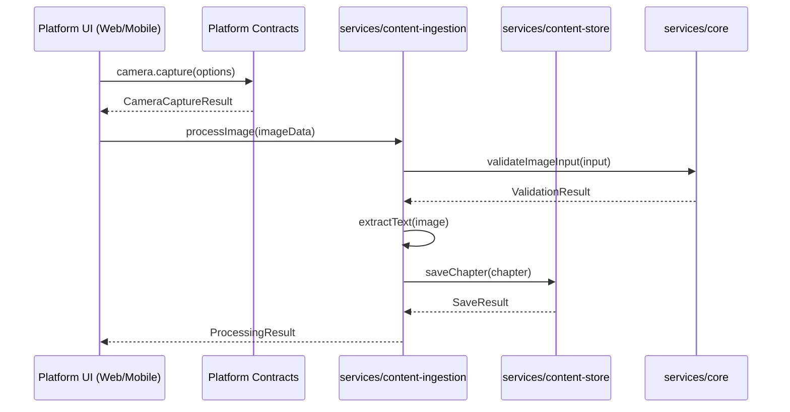

# Design Document: Source Code Restructuring

## Overview

This design restructures the LearnVerse LearnVerse monorepo to clearly segregate web-specific code, mobile-specific code, and platform-agnostic service logic. The current codebase has 9 packages (`api`, `auth`, `comprehension`, `content-ingestion`, `content-store`, `core`, `grammar`, `pronunciation`, `sync`) that are largely platform-agnostic but lack explicit boundaries for platform-specific implementations. The existing `PlatformProvider` interface in `@learnverse/api` already defines abstractions for camera, file system, notifications, and audio — but platform implementations (web, mobile) don't yet exist as separate packages.

The restructuring introduces a layered architecture with three top-level package groups: `packages/services/*` for domain logic, `packages/platform-web/*` for web-specific implementations, and `packages/platform-mobile/*` for mobile-specific implementations. A shared `packages/platform-contracts` package defines the interface boundary between service logic and platform code.

## Architecture

```mermaid
graph TD
    subgraph "Platform Layer - Web"
        PW[platform-web/app]
        PWC[platform-web/camera]
        PWF[platform-web/filesystem]
        PWN[platform-web/notifications]
        PWA[platform-web/audio]
        PWUI[platform-web/ui]
    end

    subgraph "Platform Layer - Mobile"
        PM[platform-mobile/app]
        PMC[platform-mobile/camera]
        PMF[platform-mobile/filesystem]
        PMN[platform-mobile/notifications]
        PMA[platform-mobile/audio]
        PMUI[platform-mobile/ui]
    end

    subgraph "Platform Contracts"
        PC[platform-contracts]
    end

    subgraph "Services Layer"
        CORE[services/core]
        AUTH[services/auth]
        COMP[services/comprehension]
        CI[services/content-ingestion]
        CS[services/content-store]
        GRAM[services/grammar]
        PRON[services/pronunciation]
        SYNC[services/sync]
        API[services/api]
    end

    PW --> PC
    PWC --> PC
    PWF --> PC
    PWN --> PC
    PWA --> PC
    PWUI --> PC

    PM --> PC
    PMC --> PC
    PMF --> PC
    PMN --> PC
    PMA --> PC
    PMUI --> PC

    PC --> CORE

    API --> AUTH
    API --> CS
    API --> CI
    API --> PRON
    API --> GRAM
    API --> COMP
    API --> SYNC

    AUTH --> CORE
    COMP --> CORE
    CI --> CORE
    CS --> CORE
    GRAM --> CORE
    PRON --> CORE
    SYNC --> CORE
```



## Sequence Diagrams

### Platform Initialization Flow



### Content Ingestion Cross-Platform Flow



## Components and Interfaces

### Component 1: Platform Contracts (`packages/platform-contracts`)

**Purpose**: Defines the interface boundary between service logic and platform-specific code. Extracted from the current `@learnverse/api/platformInterface.ts`.

**Interface**:
```typescript
// Re-exports all platform interfaces as the single source of truth
export interface PlatformProvider {
  platform: 'android' | 'web' | 'ios';
  camera: CameraInterface;
  fileSystem: FileSystemInterface;
  notifications: PushNotificationInterface;
  audio: AudioInterface;
  navigation: NavigationInterface;
  storage: DeviceStorageInterface;
}

// New: Navigation abstraction for platform-specific routing
export interface NavigationInterface {
  navigate(route: string, params?: Record<string, string>): void;
  goBack(): void;
  getCurrentRoute(): string;
  canGoBack(): boolean;
}

// New: Device storage abstraction (localStorage vs AsyncStorage vs SQLite)
export interface DeviceStorageInterface {
  getItem(key: string): Promise<string | null>;
  setItem(key: string, value: string): Promise<void>;
  removeItem(key: string): Promise<void>;
  clear(): Promise<void>;
  getAllKeys(): Promise<string[]>;
}
```

**Responsibilities**:
- Define all platform abstraction interfaces
- Provide the `PlatformRegistry` for runtime provider lookup
- Export type-only contracts (no implementation code)
- Serve as the dependency inversion boundary

### Component 2: Service Packages (`packages/services/*`)

**Purpose**: Contains all platform-agnostic domain logic. These are the existing packages relocated under a `services/` namespace.

**Interface**:
```typescript
// packages/services/core - unchanged API surface
export { Learner, Chapter, Page, Question, Grade } from './types';
export { validateGrade, validateImageInput } from './validation';
export { enrollSubject, switchActiveSubject } from './enrollment';
export { SubjectModule } from './subjectModule';

// packages/services/api - depends only on other service packages
export { ApiRouter, ApiRoute, ApiRequest, ApiResponse } from './endpoints';
// PlatformInterface moved OUT to platform-contracts
```

**Responsibilities**:
- All domain logic, data models, validation, scoring
- No direct imports of browser APIs, React Native APIs, or device APIs
- Depend only on `@learnverse/platform-contracts` for platform capabilities
- Remain fully testable without platform mocks

### Component 3: Web Platform (`packages/platform-web/*`)

**Purpose**: Web-specific implementations of platform contracts using browser APIs.

**Interface**:
```typescript
// packages/platform-web/app
export function createWebPlatformProvider(): PlatformProvider;

// packages/platform-web/camera
export class WebCameraAdapter implements CameraInterface {
  // Uses MediaDevices API / getUserMedia
  async capture(options: CameraCaptureOptions): Promise<CameraCaptureResult>;
}

// packages/platform-web/filesystem
export class WebFileSystemAdapter implements FileSystemInterface {
  // Uses File API / <input type="file"> / File System Access API
  async pickFiles(options: FilePickerOptions): Promise<FileMetadata[]>;
}

// packages/platform-web/notifications
export class WebNotificationAdapter implements PushNotificationInterface {
  // Uses Notification API / Service Workers
  async showLocalNotification(payload: NotificationPayload): Promise<boolean>;
}

// packages/platform-web/audio
export class WebAudioAdapter implements AudioInterface {
  // Uses Web Audio API / MediaRecorder
  async startRecording(options: AudioRecordingOptions): Promise<void>;
}

// packages/platform-web/ui
// Web-specific UI components, layouts, responsive design utilities
export { WebAppShell, WebNavigation, ResponsiveLayout } from './components';
```

**Responsibilities**:
- Implement all `PlatformProvider` interfaces using browser APIs
- Web-specific UI shell, routing (e.g., React Router), and layout
- Service worker registration, PWA manifest handling
- Web-specific storage (localStorage, IndexedDB)

### Component 4: Mobile Platform (`packages/platform-mobile/*`)

**Purpose**: Mobile-specific implementations of platform contracts using native device APIs.

**Interface**:
```typescript
// packages/platform-mobile/app
export function createMobilePlatformProvider(): PlatformProvider;

// packages/platform-mobile/camera
export class MobileCameraAdapter implements CameraInterface {
  // Uses native camera APIs (e.g., expo-camera, react-native-camera)
  async capture(options: CameraCaptureOptions): Promise<CameraCaptureResult>;
}

// packages/platform-mobile/filesystem
export class MobileFileSystemAdapter implements FileSystemInterface {
  // Uses native file system (e.g., react-native-fs, expo-file-system)
  async pickFiles(options: FilePickerOptions): Promise<FileMetadata[]>;
}

// packages/platform-mobile/notifications
export class MobileNotificationAdapter implements PushNotificationInterface {
  // Uses native push (e.g., expo-notifications, FCM)
  async registerForPush(): Promise<string>;
}

// packages/platform-mobile/audio
export class MobileAudioAdapter implements AudioInterface {
  // Uses native audio (e.g., expo-av, react-native-audio)
  async startRecording(options: AudioRecordingOptions): Promise<void>;
}

// packages/platform-mobile/ui
// Mobile-specific UI components, navigation (React Navigation), gestures
export { MobileAppShell, MobileNavigation, GestureHandler } from './components';
```

**Responsibilities**:
- Implement all `PlatformProvider` interfaces using native mobile APIs
- Mobile-specific navigation (stack/tab navigation)
- Push notification token management (FCM/APNs)
- Mobile-specific storage (AsyncStorage, SQLite)
- Gesture handling, haptic feedback

## Data Models

### Package Manifest Structure

```typescript
// Root package.json workspace configuration
interface WorkspaceConfig {
  workspaces: [
    'packages/services/*',
    'packages/platform-contracts',
    'packages/platform-web/*',
    'packages/platform-mobile/*'
  ];
}

// Package naming convention
type ServicePackageName = `@learnverse/service-${string}`;
type PlatformContractsName = '@learnverse/platform-contracts';
type WebPackageName = `@learnverse/web-${string}`;
type MobilePackageName = `@learnverse/mobile-${string}`;
```

**Validation Rules**:
- Service packages may only depend on other service packages or `@learnverse/platform-contracts`
- Platform packages may depend on `@learnverse/platform-contracts` and service packages
- Platform packages must NOT depend on each other (web cannot import mobile, vice versa)
- `@learnverse/platform-contracts` may only depend on `@learnverse/service-core` (for shared types)

### Dependency Matrix

```typescript
interface DependencyRules {
  '@learnverse/platform-contracts': {
    allowed: ['@learnverse/service-core'];
    forbidden: ['@learnverse/web-*', '@learnverse/mobile-*'];
  };
  '@learnverse/service-*': {
    allowed: ['@learnverse/service-*', '@learnverse/platform-contracts'];
    forbidden: ['@learnverse/web-*', '@learnverse/mobile-*'];
  };
  '@learnverse/web-*': {
    allowed: ['@learnverse/platform-contracts', '@learnverse/service-*'];
    forbidden: ['@learnverse/mobile-*'];
  };
  '@learnverse/mobile-*': {
    allowed: ['@learnverse/platform-contracts', '@learnverse/service-*'];
    forbidden: ['@learnverse/web-*'];
  };
}
```

## Algorithmic Pseudocode

### Migration Algorithm

```typescript
/**
 * ALGORITHM: migratePackageStructure
 * 
 * Migrates existing flat package structure to layered architecture.
 * Preserves all existing code, tests, and git history.
 */

// Step 1: Create new directory structure
function createDirectoryStructure(): void {
  // Create services layer directories
  const servicePackages = ['core', 'auth', 'comprehension', 'content-ingestion',
    'content-store', 'grammar', 'pronunciation', 'sync', 'api'];
  
  for (const pkg of servicePackages) {
    // Move packages/{pkg} → packages/services/{pkg}
    moveDirectory(`packages/${pkg}`, `packages/services/${pkg}`);
  }

  // Create platform-contracts from extracted interfaces
  createDirectory('packages/platform-contracts');
  
  // Create platform implementation directories
  createDirectory('packages/platform-web/app');
  createDirectory('packages/platform-web/camera');
  createDirectory('packages/platform-web/filesystem');
  createDirectory('packages/platform-web/notifications');
  createDirectory('packages/platform-web/audio');
  createDirectory('packages/platform-web/ui');
  
  createDirectory('packages/platform-mobile/app');
  createDirectory('packages/platform-mobile/camera');
  createDirectory('packages/platform-mobile/filesystem');
  createDirectory('packages/platform-mobile/notifications');
  createDirectory('packages/platform-mobile/audio');
  createDirectory('packages/platform-mobile/ui');
}

// Step 2: Extract platform contracts
function extractPlatformContracts(): void {
  // Move platformInterface.ts from packages/api/src/ to packages/platform-contracts/src/
  // Update all imports across the codebase
  // Remove platform-specific code from service packages
}

// Step 3: Update package.json files
function updatePackageManifests(): void {
  // Rename packages: @learnverse/core → @learnverse/service-core
  // Update all internal dependency references
  // Update workspace glob patterns in root package.json
}

// Step 4: Update TypeScript project references
function updateTsConfigs(): void {
  // Update tsconfig.json references for new paths
  // Ensure composite builds still work
}
```

**Preconditions:**
- All existing tests pass before migration begins
- No uncommitted changes in the working tree
- Node.js >= 18.0.0 available

**Postconditions:**
- All existing tests still pass after migration
- No circular dependencies introduced
- Build (`tsc --build`) succeeds
- Package dependency rules are satisfied (no cross-platform imports)

**Loop Invariants:**
- At each step, the project remains buildable
- No source code logic is modified, only file locations and import paths

### Dependency Validation Algorithm

```typescript
/**
 * ALGORITHM: validateDependencyBoundaries
 * 
 * Validates that no package violates the layered dependency rules.
 * Run as a lint step in CI.
 */
function validateDependencyBoundaries(
  packages: PackageInfo[]
): ValidationResult {
  const violations: DependencyViolation[] = [];

  for (const pkg of packages) {
    const layer = classifyPackageLayer(pkg.name);
    const allowedDeps = getDependencyRules(layer).allowed;
    const forbiddenDeps = getDependencyRules(layer).forbidden;

    for (const dep of pkg.dependencies) {
      const depLayer = classifyPackageLayer(dep);
      
      // Check if dependency is in forbidden list
      if (matchesPattern(dep, forbiddenDeps)) {
        violations.push({
          package: pkg.name,
          dependency: dep,
          reason: `${layer} packages cannot depend on ${depLayer} packages`,
        });
      }
    }
  }

  return {
    valid: violations.length === 0,
    violations,
  };
}

function classifyPackageLayer(name: string): 'services' | 'contracts' | 'web' | 'mobile' {
  if (name.includes('service-')) return 'services';
  if (name.includes('platform-contracts')) return 'contracts';
  if (name.includes('web-')) return 'web';
  if (name.includes('mobile-')) return 'mobile';
  throw new Error(`Unknown package layer: ${name}`);
}
```

**Preconditions:**
- All package.json files are parseable
- Package names follow the naming convention

**Postconditions:**
- Returns empty violations array if all boundaries are respected
- Each violation includes the offending package, dependency, and reason

## Key Functions with Formal Specifications

### Function 1: createWebPlatformProvider()

```typescript
function createWebPlatformProvider(): PlatformProvider
```

**Preconditions:**
- Running in a browser environment (window, navigator available)
- Required browser APIs are available (MediaDevices, Notification, etc.)

**Postconditions:**
- Returns a valid `PlatformProvider` with `platform === 'web'`
- All interface methods are callable (may throw if permission denied)
- No side effects on construction (permissions requested lazily)

### Function 2: createMobilePlatformProvider()

```typescript
function createMobilePlatformProvider(): PlatformProvider
```

**Preconditions:**
- Running in a React Native or native mobile environment
- Required native modules are linked and available

**Postconditions:**
- Returns a valid `PlatformProvider` with `platform === 'android' | 'ios'`
- All interface methods are callable
- Device token registration deferred until `registerForPush()` is called

### Function 3: validateDependencyBoundaries()

```typescript
function validateDependencyBoundaries(packages: PackageInfo[]): ValidationResult
```

**Preconditions:**
- `packages` array is non-empty
- Each `PackageInfo` has a valid `name` and `dependencies` array

**Postconditions:**
- `result.valid === true` if and only if `result.violations.length === 0`
- Every violation identifies the exact package and forbidden dependency
- Function is pure (no side effects)

## Example Usage

```typescript
// === Platform Registration (Web) ===
import { createWebPlatformProvider } from '@learnverse/web-app';
import { PlatformRegistry } from '@learnverse/platform-contracts';

const registry = new PlatformRegistry();
const webProvider = createWebPlatformProvider();
registry.register(webProvider);
registry.setActive('web');

// === Service Logic Using Platform Abstraction ===
import { PlatformRegistry } from '@learnverse/platform-contracts';

async function captureTextbookPage(registry: PlatformRegistry) {
  const provider = registry.getActive();
  
  // Service logic doesn't know if this is web or mobile
  const hasCamera = await provider.camera.isAvailable();
  if (!hasCamera) {
    // Fall back to file picker
    const files = await provider.fileSystem.pickFiles({
      acceptedTypes: ['image/jpeg', 'image/png'],
      multiple: false,
      maxSizeBytes: 10 * 1024 * 1024,
    });
    return files[0];
  }
  
  const photo = await provider.camera.capture({
    format: 'jpeg',
    quality: 85,
    maxWidth: 2048,
    maxHeight: 2048,
  });
  return photo;
}

// === Dependency Validation in CI ===
import { validateDependencyBoundaries } from '@learnverse/build-tools';

const result = validateDependencyBoundaries(allPackages);
if (!result.valid) {
  console.error('Dependency boundary violations:');
  for (const v of result.violations) {
    console.error(`  ${v.package} → ${v.dependency}: ${v.reason}`);
  }
  process.exit(1);
}
```

## Correctness Properties

*A property is a characteristic or behavior that should hold true across all valid executions of a system — essentially, a formal statement about what the system should do. Properties serve as the bridge between human-readable specifications and machine-verifiable correctness guarantees.*

### Property 1: Package naming matches layer convention

*For any* package in the monorepo, its `name` field in `package.json` matches the naming pattern for its layer: service packages use `@learnverse/service-{name}`, web packages use `@learnverse/web-{name}`, and mobile packages use `@learnverse/mobile-{name}`.

**Validates: Requirements 2.1, 2.3, 2.4**

### Property 2: Dependency boundary validator detects forbidden imports

*For any* randomly generated dependency graph where a package has a dependency in its forbidden list (service importing web/mobile, web importing mobile, mobile importing web), the Dependency_Boundary_Validator SHALL report a violation for that dependency.

**Validates: Requirements 3.1, 3.2, 3.3**

### Property 3: Dependency boundary validator accepts valid imports

*For any* randomly generated dependency graph where all packages only depend on their allowed targets (services on services/contracts, web on contracts/services, mobile on contracts/services, contracts on service-core only), the Dependency_Boundary_Validator SHALL report zero violations.

**Validates: Requirements 3.4, 3.5, 3.6, 3.7**

### Property 4: Violation reports contain required information

*For any* dependency boundary violation detected by the validator, the violation report SHALL include the offending package name, the forbidden dependency name, and a non-empty human-readable reason string.

**Validates: Requirements 3.8**

### Property 5: Migration updates all import paths

*For any* source file in the migrated codebase, no import statement SHALL reference old package names (e.g., `@learnverse/core`, `@learnverse/auth`). All internal imports SHALL use the new naming convention (`@learnverse/service-core`, `@learnverse/service-auth`, etc.).

**Validates: Requirements 4.3**

### Property 6: Migration preserves file content

*For any* source file that existed before migration, an equivalent file SHALL exist after migration with identical content except for import path changes. No service logic or test assertions SHALL be modified.

**Validates: Requirements 4.4, 4.5**

### Property 7: Platform-contracts contains no platform-specific code

*For any* source file in the `platform-contracts` package, the file SHALL contain no references to browser APIs (window, document, navigator, localStorage, IndexedDB) or native mobile APIs (React Native modules, Expo modules).

**Validates: Requirements 5.4**

### Property 8: TypeScript project references respect layer boundaries

*For any* package's `tsconfig.json`, its `references` array SHALL only point to packages that are in the allowed dependency set for that package's layer (services references services/contracts, platform references contracts/services).

**Validates: Requirements 6.2, 6.3**

### Property 9: PlatformRegistry throws without active provider

*For any* sequence of PlatformRegistry operations that does not include a successful `setActive()` call, invoking `getActive()` SHALL throw an error with the message 'No active platform provider. Call setActive() first.'

**Validates: Requirements 8.3**

### Property 10: Service packages contain no platform API references

*For any* source file in any service package, the file SHALL contain no direct imports or references to browser APIs (window, document, navigator, localStorage) or native mobile APIs (React Native modules, Expo modules). All platform access SHALL go through the PlatformProvider interface.

**Validates: Requirements 9.1, 9.2, 9.4**

## Error Handling

### Error Scenario 1: Circular Dependency Introduced During Migration

**Condition**: Moving a package creates a circular reference in the dependency graph
**Response**: TypeScript composite build (`tsc --build`) will fail with a clear error indicating the cycle
**Recovery**: Identify the shared code causing the cycle and extract it into `services/core` or `platform-contracts`

### Error Scenario 2: Missing Platform Implementation at Runtime

**Condition**: Service logic calls `registry.getActive()` but no provider has been registered
**Response**: `PlatformRegistry.getActive()` throws `Error('No active platform provider')`
**Recovery**: Ensure platform app entry point registers and activates a provider before any service logic executes

### Error Scenario 3: Import Path Breakage After Move

**Condition**: A file references an old import path (e.g., `@learnverse/core` instead of `@learnverse/service-core`)
**Response**: TypeScript compiler error at build time — module not found
**Recovery**: Run a codemod/find-replace to update all import paths. Use TypeScript path aliases during transition.

## Testing Strategy

### Unit Testing Approach

- All existing unit tests remain in their respective packages (moved alongside source)
- Service logic tests require zero platform mocks (they don't import platform code)
- Platform implementation tests mock browser/native APIs
- Dependency boundary validation runs as a unit test

### Property-Based Testing Approach

**Property Test Library**: fast-check (already in devDependencies)

- **Boundary validation property**: For any randomly generated dependency graph respecting naming conventions, `validateDependencyBoundaries` correctly identifies all violations
- **Migration idempotency**: Running the migration algorithm twice produces the same result as running it once
- **Platform provider completeness**: For any `PlatformProvider` implementation, all interface methods are defined and callable

### Integration Testing Approach

- Build the entire monorepo with `tsc --build` after restructuring
- Run `vitest run` across all packages to verify no behavioral regressions
- Verify workspace resolution with `npm ls` to confirm no broken internal links

## Performance Considerations

- **Build time**: Layered structure enables parallel builds within each layer. Service packages build first, then platform packages build in parallel
- **Bundle size**: Web and mobile bundles only include their respective platform implementations. Tree-shaking eliminates unused platform code
- **TypeScript project references**: Composite builds with `--build` flag enable incremental compilation — only changed packages rebuild

## Security Considerations

- Platform contracts define permission-gated interfaces (camera, notifications, file system). Implementations must request permissions before access
- Service logic never directly accesses device capabilities — all access goes through the auditable `PlatformProvider` interface
- No secrets or API keys in service packages; platform-specific configuration lives in platform packages only

## Dependencies

| Package | Purpose | Layer |
|---------|---------|-------|
| typescript 5.6.3 | Build system | All |
| vitest 2.1.8 | Test runner | All |
| fast-check 3.22.0 | Property-based testing | All |
| eslint 8.57.1 | Linting | All |
| (future) Web Audio API | Audio recording/playback | Web |
| (future) MediaDevices API | Camera access | Web |
| (future) expo-camera / react-native-camera | Camera access | Mobile |
| (future) expo-file-system / react-native-fs | File system | Mobile |
| (future) expo-notifications | Push notifications | Mobile |
