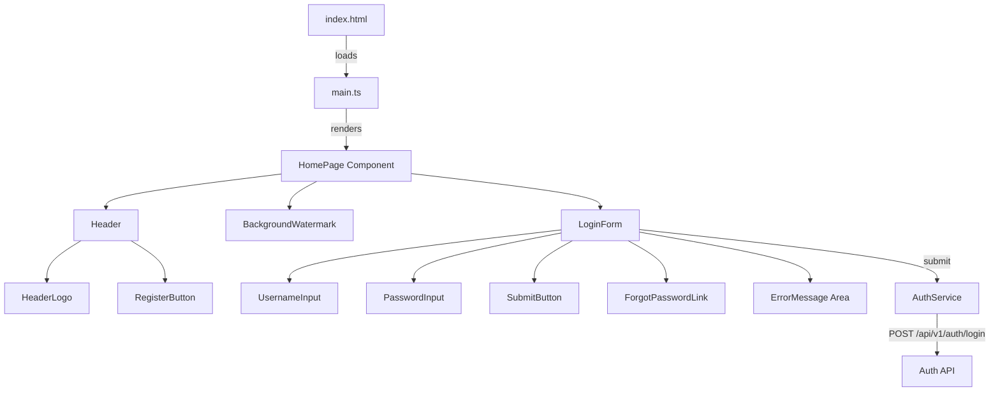

# Design Document: Web Home Page

## Overview

This design describes the architecture and implementation of the LearnVerse web application home page. The feature transforms the current minimal, unstyled sign-in page into a fully branded landing page with a header (logo + register button), a centered login form with validation and error handling, a forgot-password link, and a background watermark — all built using vanilla TypeScript with DOM manipulation and CSS styling.

The implementation leverages the existing component pattern established by `HeaderLogo.ts` (factory functions returning `HTMLElement` instances) and the Vite + plain TypeScript stack already in place.

## Architecture



### Design Decisions

1. **Component factory pattern**: Each UI piece is a function that returns an `HTMLElement`. This matches the existing `createHeaderLogo` pattern and keeps components testable without a framework.

2. **CSS in a separate stylesheet**: Styles will live in `src/styles/home.css` imported by `main.ts`. This keeps concerns separated and lets the browser cache CSS independently. The existing inline `<style>` block in `index.html` will be replaced with a link to the external stylesheet.

3. **No client-side router**: Navigation to register and forgot-password views will use simple hash-based routing (`window.location.hash`) or direct page manipulation. This avoids adding a router dependency for three views.

4. **API base URL from environment**: The `API_BASE` constant will be configurable, defaulting to the Vercel deployment's API proxy path (`/api/v1`) in production.

## Components and Interfaces

### Component: `createHomePage()`

Entry point that assembles the full page.

```typescript
function createHomePage(): HTMLElement
```

Responsibilities:
- Creates the root layout container
- Appends `createHeader()`, `createBackgroundWatermark()`, and `createLoginCard()`

### Component: `createHeader()`

```typescript
interface HeaderOptions {
  onRegisterClick: () => void;
}

function createHeader(options: HeaderOptions): HTMLElement
```

Responsibilities:
- Renders a flex header with logo on the left, register button on the right
- Uses existing `createHeaderLogo({ logoSrc: '/ChikuMiku-LearnVerse-Logo.png', maxHeight: 40 })`
- Renders a styled register button that triggers `onRegisterClick`

### Component: `createBackgroundWatermark()`

```typescript
function createBackgroundWatermark(): HTMLElement
```

Responsibilities:
- Creates a fixed-position, centered container behind all content (z-index: -1)
- Renders the logo image at 50%+ viewport width with opacity 0.05
- Non-interactive (pointer-events: none)

### Component: `createLoginCard()`

```typescript
interface LoginCardOptions {
  onForgotPassword: () => void;
  onSubmit: (username: string, password: string) => Promise<void>;
}

function createLoginCard(options: LoginCardOptions): HTMLElement
```

Responsibilities:
- Renders a card container with rounded corners and shadow
- Contains username input (with label), password input (with label), submit button
- Contains forgot-password link below the form
- Manages form submission state (loading, error display)
- Validates inputs before submission
- Associates error messages with inputs via `aria-describedby`

### Service: `AuthService`

```typescript
interface LoginResult {
  success: boolean;
  error?: string;
}

async function loginUser(username: string, password: string): Promise<LoginResult>
```

Responsibilities:
- POST to `/api/v1/auth/login` with JSON body
- Returns `{ success: true }` on 2xx response
- Returns `{ success: false, error: message }` on 4xx/5xx, extracting message from `response.message || response.error || fallback`
- Returns `{ success: false, error: networkMessage }` on fetch failure

### Utility: `escapeHtml()`

```typescript
function escapeHtml(text: string): string
```

Existing utility that escapes user-provided or API-provided strings before inserting into DOM, preventing XSS.

## Data Models

### Login Request

```typescript
interface LoginRequest {
  username: string;
  password: string;
}
```

### Login Response (Success)

```typescript
interface LoginSuccessResponse {
  token: string;
  user: {
    id: string;
    username: string;
  };
}
```

### Login Response (Error)

```typescript
interface LoginErrorResponse {
  message?: string;
  error?: string;
  statusCode?: number;
}
```

### Component State

```typescript
interface LoginFormState {
  isSubmitting: boolean;
  errorMessage: string | null;
}
```

## Correctness Properties

*A property is a characteristic or behavior that should hold true across all valid executions of a system — essentially, a formal statement about what the system should do. Properties serve as the bridge between human-readable specifications and machine-verifiable correctness guarantees.*

### Property 1: Error message extraction preserves API response content

*For any* API error response object containing a `message` or `error` field with a non-empty string value, the login error handler SHALL extract and display that exact string value (after HTML escaping) in the error message area.

**Validates: Requirements 5.2**

### Property 2: HTML escaping round-trip preserves text content

*For any* arbitrary string, escaping it with `escapeHtml` and then reading the `textContent` of a DOM element whose `innerHTML` was set to the escaped value SHALL yield the original string.

**Validates: Requirements 5.2, 5.4**

## Error Handling

| Scenario | Behavior |
|----------|----------|
| Empty username or password on submit | Display inline validation error, associate via `aria-describedby`, do not call API |
| API returns 4xx (invalid credentials) | Display error message from response body below the form |
| API returns 5xx (server error) | Display generic "Something went wrong. Please try again." message |
| Network failure (fetch throws) | Display "Unable to connect. Please check your internet connection." |
| Logo image fails to load | Existing fallback: display text "ChikuMiku LearnVerse" |
| Watermark image fails to load | Hide watermark element silently (decorative only) |

All error messages are escaped via `escapeHtml()` before DOM insertion to prevent XSS.

## Testing Strategy

### Unit Tests (Vitest + jsdom)

Unit tests verify specific DOM structure, styling, and behavior:

- **Header**: Logo present with correct src/alt/maxHeight, register button present and clickable
- **Background watermark**: Element exists, has correct opacity, width, z-index, pointer-events
- **Login form structure**: Inputs with labels (matching for/id), submit button labeled "Log In", card styles
- **Form submission**: Loading state (button disabled, text change), success navigation, error display
- **Network error handling**: Fetch failure shows appropriate message
- **Accessibility**: `aria-describedby` linked on validation error, all inputs have labels
- **Responsive**: Max-width styles and media query classes applied

### Property-Based Tests (Vitest + fast-check)

Property-based tests verify universal correctness guarantees:

- **Error message extraction**: For any random error response shape (`{ message: string }`, `{ error: string }`, `{}`, etc.), the extraction logic produces the expected display string. Minimum 100 iterations.
  - Tag: **Feature: web-home-page, Property 1: Error message extraction preserves API response content**

- **HTML escaping round-trip**: For any random string (including special characters, HTML tags, unicode), `escapeHtml(input)` inserted as innerHTML and read back as textContent equals the original input. Minimum 100 iterations.
  - Tag: **Feature: web-home-page, Property 2: HTML escaping round-trip preserves text content**

### Test Configuration

- Library: `fast-check` for property-based testing
- Runner: Vitest with `@vitest-environment jsdom` directive
- Minimum iterations: 100 per property test
- Files:
  - `src/components/HomePage.test.ts` — unit tests for all components
  - `src/components/HomePage.property.test.ts` — property-based tests
